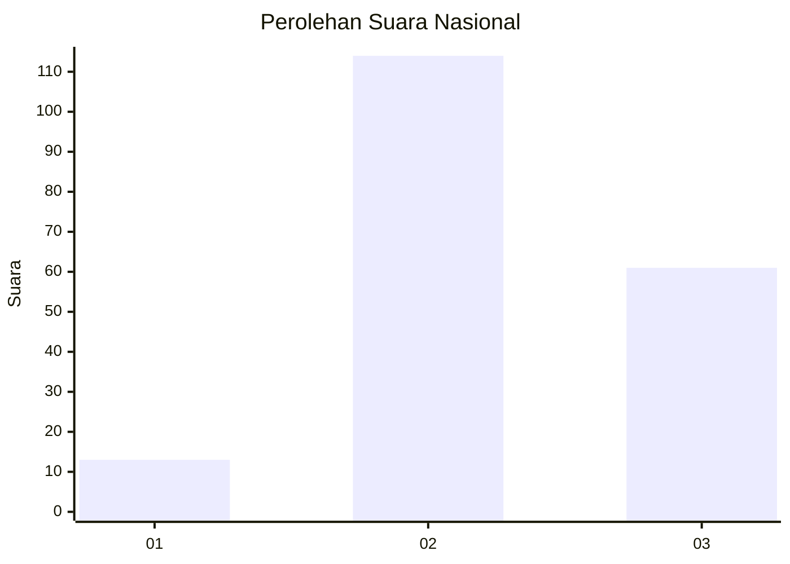
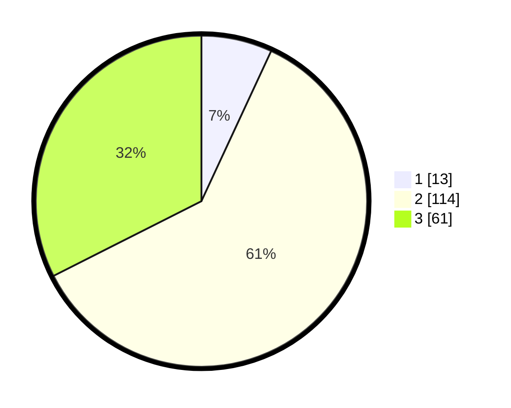

# Hasil

## Grafik

## Tabel

| No. | Nama Paslon    | Suara | Suara (raw) | Persentase |
|:--- |:-------------- | -----:| -----------:| ----------:|
| 1   | ANIES MUHAIMIN | 13    | [13][p-1]   | 6,91       |
| 2   | PRABOWO GIBRAN | 114   | [114][p-2]  | 60,64      |
| 3   | GANJAR MAHFUD  | 61    | [61][p-3]   | 32,45      |

[p-1]: https://github.com/gigit-pemilu/pemilu-2024/blob/main/pilpres/hitung-suara/sub/51-bali/sub/08-buleleng/sub/06-buleleng/sub/2004-pemaron/sub/014-tps/sub/paslon-1.txt
[p-2]: https://github.com/gigit-pemilu/pemilu-2024/blob/main/pilpres/hitung-suara/sub/51-bali/sub/08-buleleng/sub/06-buleleng/sub/2004-pemaron/sub/014-tps/sub/paslon-2.txt
[p-3]: https://github.com/gigit-pemilu/pemilu-2024/blob/main/pilpres/hitung-suara/sub/51-bali/sub/08-buleleng/sub/06-buleleng/sub/2004-pemaron/sub/014-tps/sub/paslon-3.txt

## Foto C Plano

https://sirekap-obj-formc.kpu.go.id/e35a/pemilu/ppwp/51/08/06/20/04/5108062004014-20240214-223238--1e025359-c5e5-49b6-b4af-b1183179b751.jpg

https://sirekap-obj-formc.kpu.go.id/e35a/pemilu/ppwp/51/08/06/20/04/5108062004014-20240214-223405--2c3e8163-0198-4d41-aec9-c1bbaefda66e.jpg

https://sirekap-obj-formc.kpu.go.id/e35a/pemilu/ppwp/51/08/06/20/04/5108062004014-20240214-223615--cdd10656-bb87-412a-9a23-3ce08c78c1dd.jpg

## Metadata

| Key        | Value               |
| ---------- | ------------------- |
| Time Stamp | 2024-02-24 22:31:28 |

