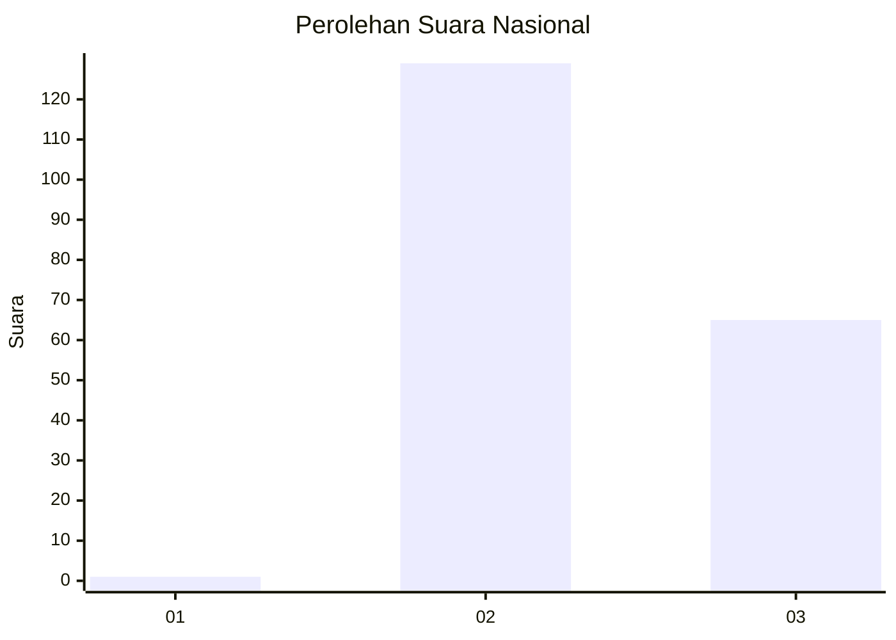
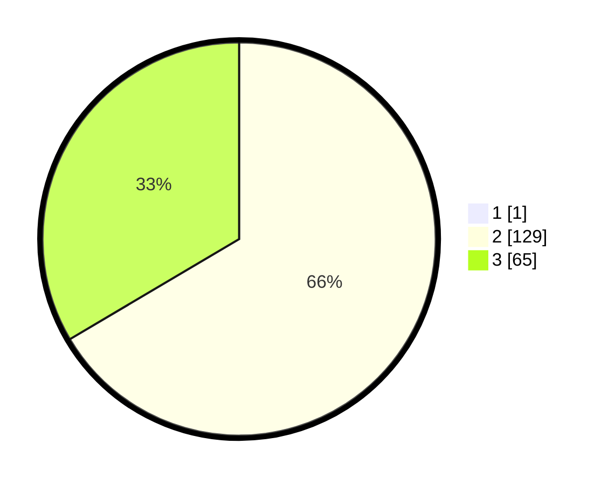

# Hasil

## Grafik

## Tabel

| No. | Nama Paslon    | Suara | Suara (raw) | Persentase |
|:--- |:-------------- | -----:| -----------:| ----------:|
| 1   | ANIES MUHAIMIN | 1     | [1][p-1]    | 0,51       |
| 2   | PRABOWO GIBRAN | 129   | [129][p-2]  | 66,15      |
| 3   | GANJAR MAHFUD  | 65    | [65][p-3]   | 33,33      |

[p-1]: https://github.com/gigit-pemilu/pemilu-2024/blob/main/pilpres/hitung-suara/sub/51-bali/sub/08-buleleng/sub/06-buleleng/sub/2005-baktiseraga/sub/002-tps/sub/paslon-1.txt
[p-2]: https://github.com/gigit-pemilu/pemilu-2024/blob/main/pilpres/hitung-suara/sub/51-bali/sub/08-buleleng/sub/06-buleleng/sub/2005-baktiseraga/sub/002-tps/sub/paslon-2.txt
[p-3]: https://github.com/gigit-pemilu/pemilu-2024/blob/main/pilpres/hitung-suara/sub/51-bali/sub/08-buleleng/sub/06-buleleng/sub/2005-baktiseraga/sub/002-tps/sub/paslon-3.txt

## Foto C Plano

https://sirekap-obj-formc.kpu.go.id/cbbe/pemilu/ppwp/51/08/06/20/05/5108062005002-20240214-230530--a6d99338-e4e0-40b5-8007-88db0604e11d.jpg

https://sirekap-obj-formc.kpu.go.id/cbbe/pemilu/ppwp/51/08/06/20/05/5108062005002-20240214-230742--d954bff4-8cb7-40a2-8c8a-84783e640239.jpg

https://sirekap-obj-formc.kpu.go.id/cbbe/pemilu/ppwp/51/08/06/20/05/5108062005002-20240214-230330--483aa1b1-3070-46b4-800e-d40deacbc9b4.jpg

## Metadata

| Key        | Value               |
| ---------- | ------------------- |
| Time Stamp | 2024-02-24 22:31:28 |

