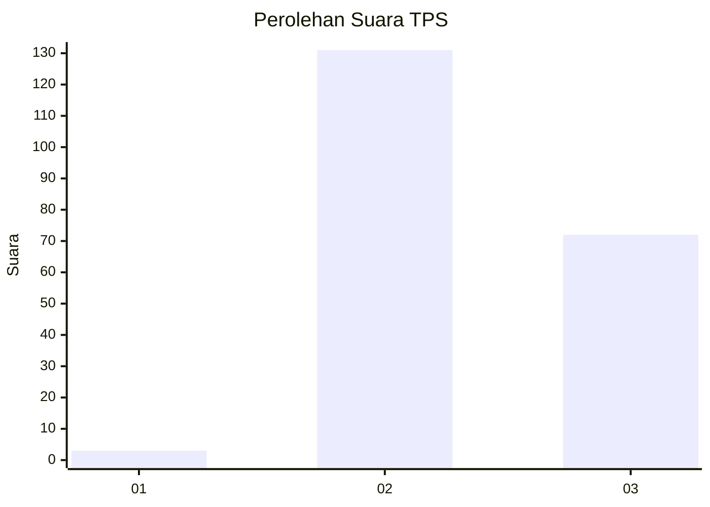
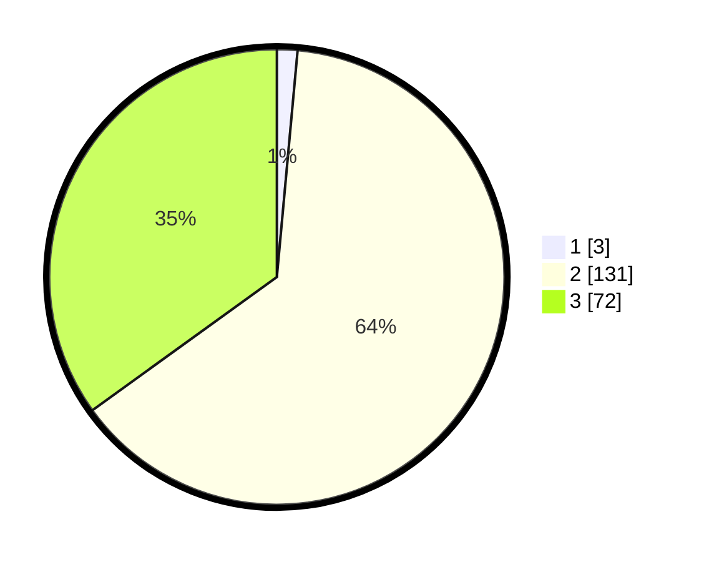

# Hasil

## Grafik

## Tabel

| No. | Nama Paslon    | Suara | Suara (raw) | Persentase |
|:--- |:-------------- | -----:| -----------:| ----------:|
| 1   | ANIES MUHAIMIN | 3     | [3][p-1]    | 1,46       |
| 2   | PRABOWO GIBRAN | 131   | [131][p-2]  | 63,59      |
| 3   | GANJAR MAHFUD  | 72    | [72][p-3]   | 34,95      |

[p-1]: https://github.com/gigit-pemilu/pemilu-2024-51-bali/blob/main/pilpres/hitung-suara/sub/51-bali/sub/08-buleleng/sub/06-buleleng/sub/2005-baktiseraga/sub/003-tps/sub/paslon-1.txt
[p-2]: https://github.com/gigit-pemilu/pemilu-2024-51-bali/blob/main/pilpres/hitung-suara/sub/51-bali/sub/08-buleleng/sub/06-buleleng/sub/2005-baktiseraga/sub/003-tps/sub/paslon-2.txt
[p-3]: https://github.com/gigit-pemilu/pemilu-2024-51-bali/blob/main/pilpres/hitung-suara/sub/51-bali/sub/08-buleleng/sub/06-buleleng/sub/2005-baktiseraga/sub/003-tps/sub/paslon-3.txt

## Foto C Plano

https://sirekap-obj-formc.kpu.go.id/fe01/pemilu/ppwp/51/08/06/20/05/5108062005003-20240214-234426--6f6943e5-a819-4a34-8fb2-82548ab78546.jpg

https://sirekap-obj-formc.kpu.go.id/fe01/pemilu/ppwp/51/08/06/20/05/5108062005003-20240215-001422--df77115f-16b3-4eb6-a821-a6bbef877f2d.jpg

https://sirekap-obj-formc.kpu.go.id/fe01/pemilu/ppwp/51/08/06/20/05/5108062005003-20240215-004032--cd549b92-8c24-4c82-8840-e7669216be46.jpg

## Metadata

| Key        | Value               |
| ---------- | ------------------- |
| Time Stamp | 2024-02-24 22:31:28 |

