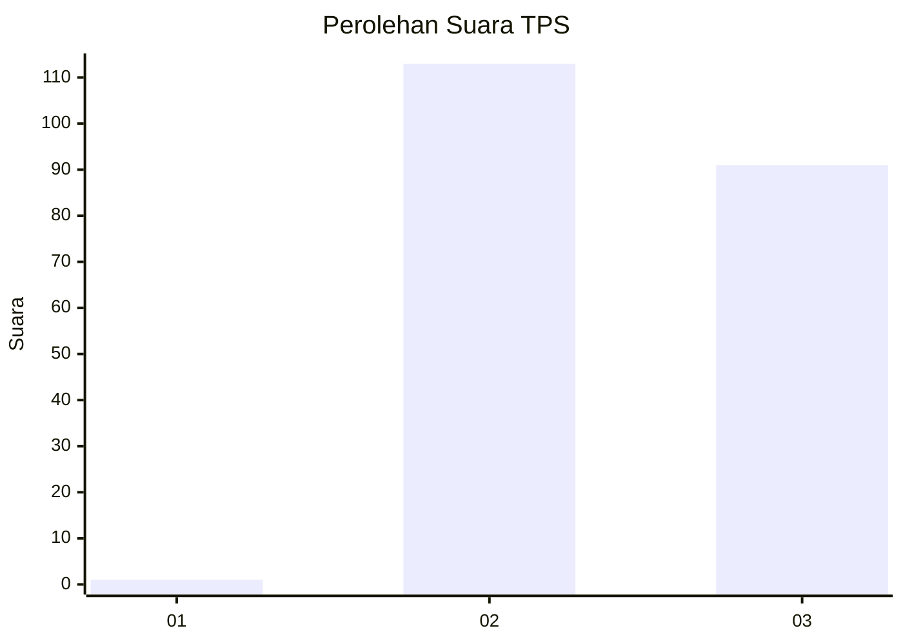
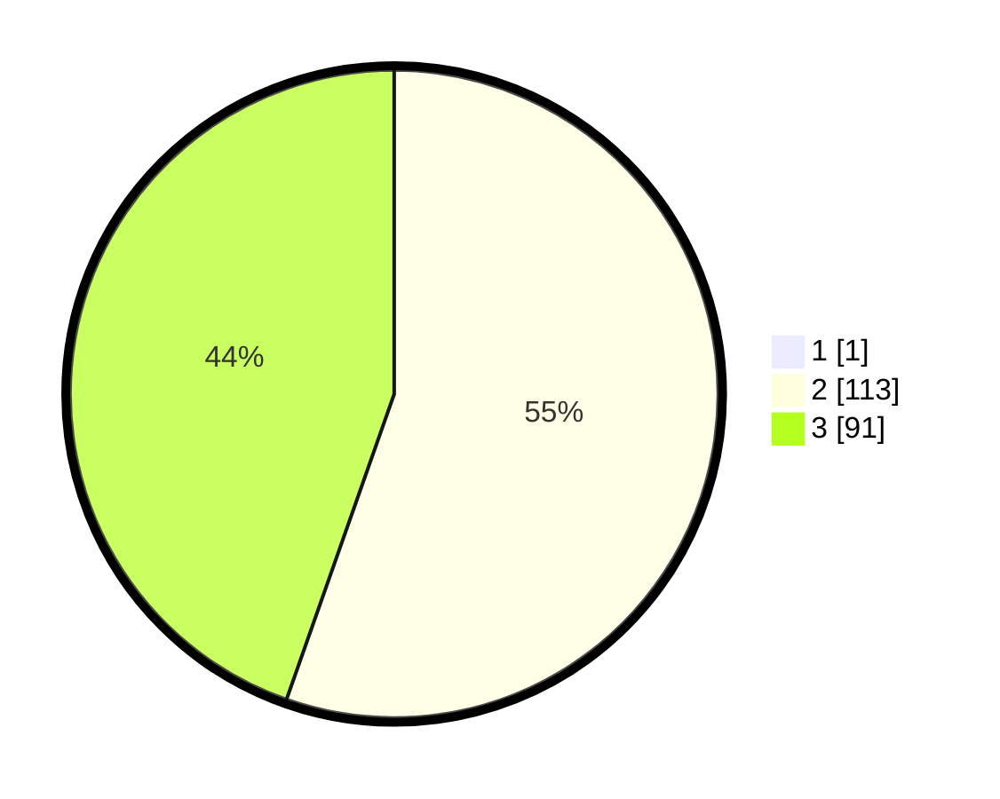

# Hasil

## Grafik

## Tabel

| No. | Nama Paslon    | Suara | Suara (raw) | Persentase |
|:--- |:-------------- | -----:| -----------:| ----------:|
| 1   | ANIES MUHAIMIN | 1     | [1][p-1]    | 0,49       |
| 2   | PRABOWO GIBRAN | 113   | [113][p-2]  | 55,12      |
| 3   | GANJAR MAHFUD  | 91    | [91][p-3]   | 44,39      |

[p-1]: https://github.com/gigit-pemilu/pemilu-2024-51-bali/blob/main/pilpres/hitung-suara/sub/51-bali/sub/08-buleleng/sub/06-buleleng/sub/2005-baktiseraga/sub/004-tps/sub/paslon-1.txt
[p-2]: https://github.com/gigit-pemilu/pemilu-2024-51-bali/blob/main/pilpres/hitung-suara/sub/51-bali/sub/08-buleleng/sub/06-buleleng/sub/2005-baktiseraga/sub/004-tps/sub/paslon-2.txt
[p-3]: https://github.com/gigit-pemilu/pemilu-2024-51-bali/blob/main/pilpres/hitung-suara/sub/51-bali/sub/08-buleleng/sub/06-buleleng/sub/2005-baktiseraga/sub/004-tps/sub/paslon-3.txt

## Foto C Plano

https://sirekap-obj-formc.kpu.go.id/d778/pemilu/ppwp/51/08/06/20/05/5108062005004-20240214-211735--299bc8c3-2524-43eb-9507-d5972c855c3b.jpg

https://sirekap-obj-formc.kpu.go.id/d778/pemilu/ppwp/51/08/06/20/05/5108062005004-20240214-211747--250bd5ba-e316-46c9-9e4a-2f62b2737431.jpg

https://sirekap-obj-formc.kpu.go.id/d778/pemilu/ppwp/51/08/06/20/05/5108062005004-20240214-211754--edd6f3ef-8fce-46ef-a494-fd019887c3b3.jpg

## Metadata

| Key        | Value               |
| ---------- | ------------------- |
| Time Stamp | 2024-02-24 22:31:28 |

