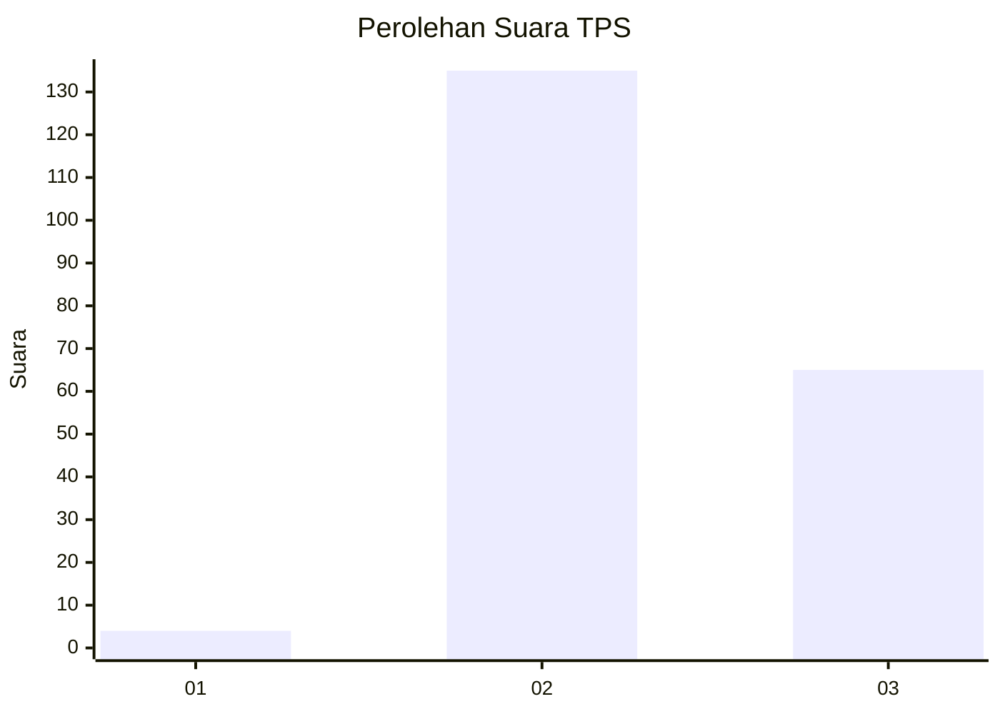
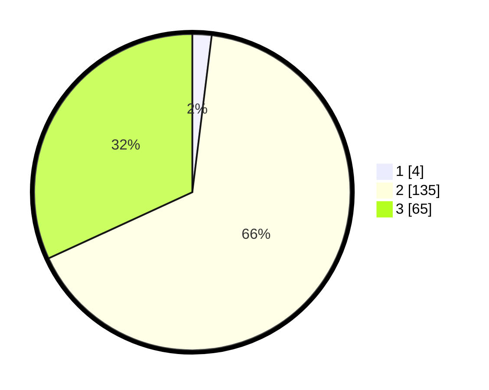

# Hasil

## Grafik

## Tabel

| No. | Nama Paslon    | Suara | Suara (raw) | Persentase |
|:--- |:-------------- | -----:| -----------:| ----------:|
| 1   | ANIES MUHAIMIN | 4     | [4][p-1]    | 1,96       |
| 2   | PRABOWO GIBRAN | 135   | [135][p-2]  | 66,18      |
| 3   | GANJAR MAHFUD  | 65    | [65][p-3]   | 31,86      |

[p-1]: https://github.com/gigit-pemilu/pemilu-2024-51-bali/blob/main/pilpres/hitung-suara/sub/51-bali/sub/08-buleleng/sub/06-buleleng/sub/2005-baktiseraga/sub/005-tps/sub/paslon-1.txt
[p-2]: https://github.com/gigit-pemilu/pemilu-2024-51-bali/blob/main/pilpres/hitung-suara/sub/51-bali/sub/08-buleleng/sub/06-buleleng/sub/2005-baktiseraga/sub/005-tps/sub/paslon-2.txt
[p-3]: https://github.com/gigit-pemilu/pemilu-2024-51-bali/blob/main/pilpres/hitung-suara/sub/51-bali/sub/08-buleleng/sub/06-buleleng/sub/2005-baktiseraga/sub/005-tps/sub/paslon-3.txt

## Foto C Plano

https://sirekap-obj-formc.kpu.go.id/84a2/pemilu/ppwp/51/08/06/20/05/5108062005005-20240214-234404--ea0ed6b9-6927-48a2-9b0b-559286edcc4b.jpg

https://sirekap-obj-formc.kpu.go.id/84a2/pemilu/ppwp/51/08/06/20/05/5108062005005-20240214-213301--0d606e35-1cdb-42ec-a510-5456426a7a6b.jpg

https://sirekap-obj-formc.kpu.go.id/84a2/pemilu/ppwp/51/08/06/20/05/5108062005005-20240214-234640--53c687ad-9fc1-4620-91b5-707eacaa4977.jpg

## Metadata

| Key        | Value               |
| ---------- | ------------------- |
| Time Stamp | 2024-02-24 22:31:28 |

