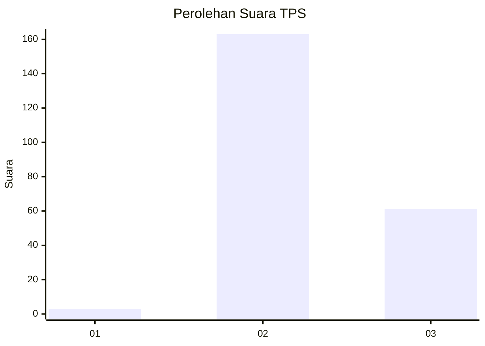
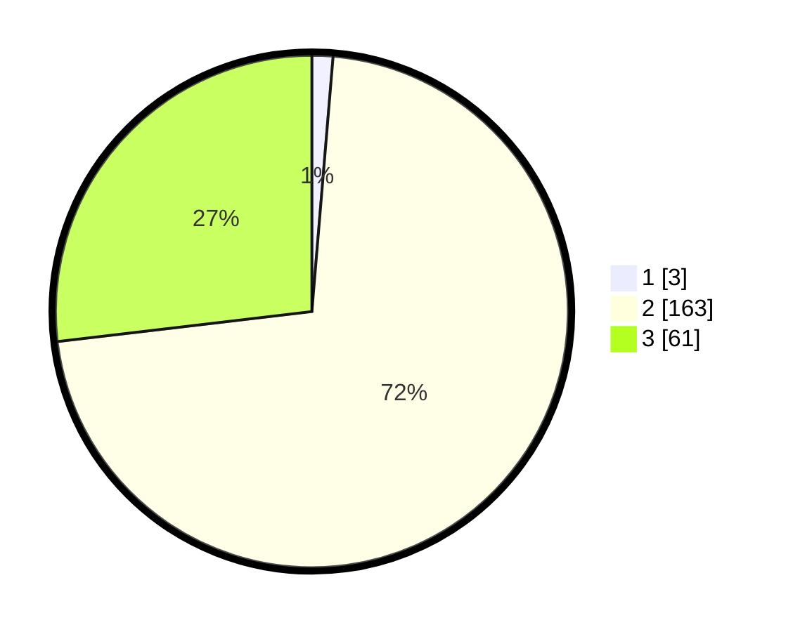

# Hasil

## Grafik

## Tabel

| No. | Nama Paslon    | Suara | Suara (raw) | Persentase |
|:--- |:-------------- | -----:| -----------:| ----------:|
| 1   | ANIES MUHAIMIN | 3     | [3][p-1]    | 1,32       |
| 2   | PRABOWO GIBRAN | 163   | [163][p-2]  | 71,81      |
| 3   | GANJAR MAHFUD  | 61    | [61][p-3]   | 26,87      |

[p-1]: https://github.com/gigit-pemilu/pemilu-2024-51-bali/blob/main/pilpres/hitung-suara/sub/51-bali/sub/08-buleleng/sub/06-buleleng/sub/2005-baktiseraga/sub/011-tps/sub/paslon-1.txt
[p-2]: https://github.com/gigit-pemilu/pemilu-2024-51-bali/blob/main/pilpres/hitung-suara/sub/51-bali/sub/08-buleleng/sub/06-buleleng/sub/2005-baktiseraga/sub/011-tps/sub/paslon-2.txt
[p-3]: https://github.com/gigit-pemilu/pemilu-2024-51-bali/blob/main/pilpres/hitung-suara/sub/51-bali/sub/08-buleleng/sub/06-buleleng/sub/2005-baktiseraga/sub/011-tps/sub/paslon-3.txt

## Foto C Plano

https://sirekap-obj-formc.kpu.go.id/730a/pemilu/ppwp/51/08/06/20/05/5108062005011-20240215-024720--8954c413-2d3e-4aa7-a5cd-19e34484650b.jpg

https://sirekap-obj-formc.kpu.go.id/730a/pemilu/ppwp/51/08/06/20/05/5108062005011-20240215-025104--55dba980-dd19-4bba-82e2-7f81c6a0b14b.jpg

https://sirekap-obj-formc.kpu.go.id/730a/pemilu/ppwp/51/08/06/20/05/5108062005011-20240215-025210--7e8db72c-aeb2-4a8d-86ed-751e6571d317.jpg

## Metadata

| Key        | Value               |
| ---------- | ------------------- |
| Time Stamp | 2024-02-24 22:31:28 |

