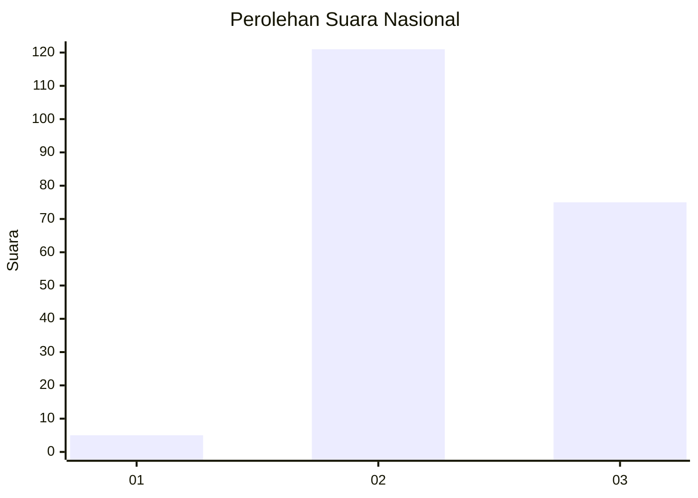
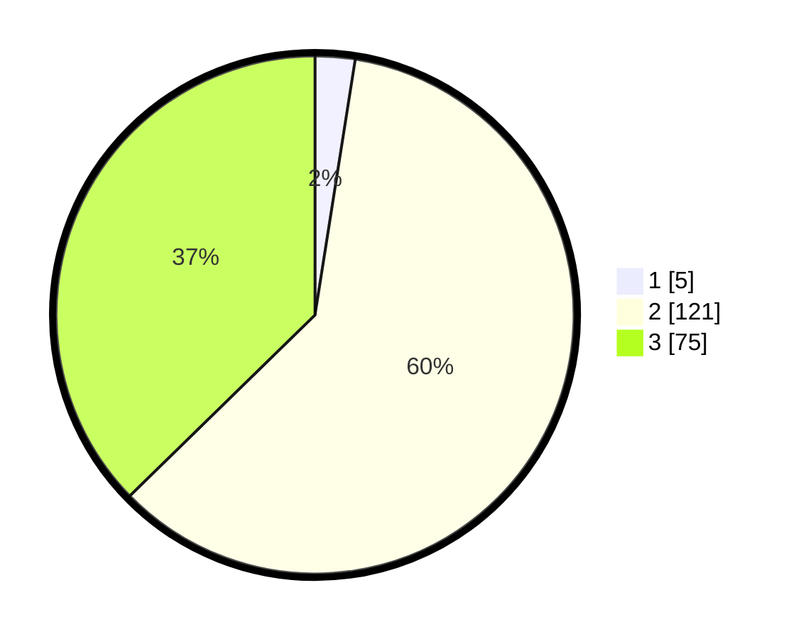

# Hasil

## Grafik

## Tabel

| No. | Nama Paslon    | Suara | Suara (raw) | Persentase |
|:--- |:-------------- | -----:| -----------:| ----------:|
| 1   | ANIES MUHAIMIN | 5     | [5][p-1]    | 2,49       |
| 2   | PRABOWO GIBRAN | 121   | [121][p-2]  | 60,20      |
| 3   | GANJAR MAHFUD  | 75    | [75][p-3]   | 37,31      |

[p-1]: https://github.com/gigit-pemilu/pemilu-2024/blob/main/pilpres/hitung-suara/sub/51-bali/sub/08-buleleng/sub/06-buleleng/sub/2005-baktiseraga/sub/013-tps/sub/paslon-1.txt
[p-2]: https://github.com/gigit-pemilu/pemilu-2024/blob/main/pilpres/hitung-suara/sub/51-bali/sub/08-buleleng/sub/06-buleleng/sub/2005-baktiseraga/sub/013-tps/sub/paslon-2.txt
[p-3]: https://github.com/gigit-pemilu/pemilu-2024/blob/main/pilpres/hitung-suara/sub/51-bali/sub/08-buleleng/sub/06-buleleng/sub/2005-baktiseraga/sub/013-tps/sub/paslon-3.txt

## Foto C Plano

https://sirekap-obj-formc.kpu.go.id/01ce/pemilu/ppwp/51/08/06/20/05/5108062005013-20240215-020536--96e1ef6c-863e-4b03-b148-5add6ec1499b.jpg

https://sirekap-obj-formc.kpu.go.id/01ce/pemilu/ppwp/51/08/06/20/05/5108062005013-20240215-020828--bff00423-a59c-457e-b42b-09ffac99e0ae.jpg

https://sirekap-obj-formc.kpu.go.id/01ce/pemilu/ppwp/51/08/06/20/05/5108062005013-20240215-021016--7d5dd1fd-4888-4b2b-a82e-aea70fe11c5f.jpg

## Metadata

| Key        | Value               |
| ---------- | ------------------- |
| Time Stamp | 2024-02-24 22:31:28 |

