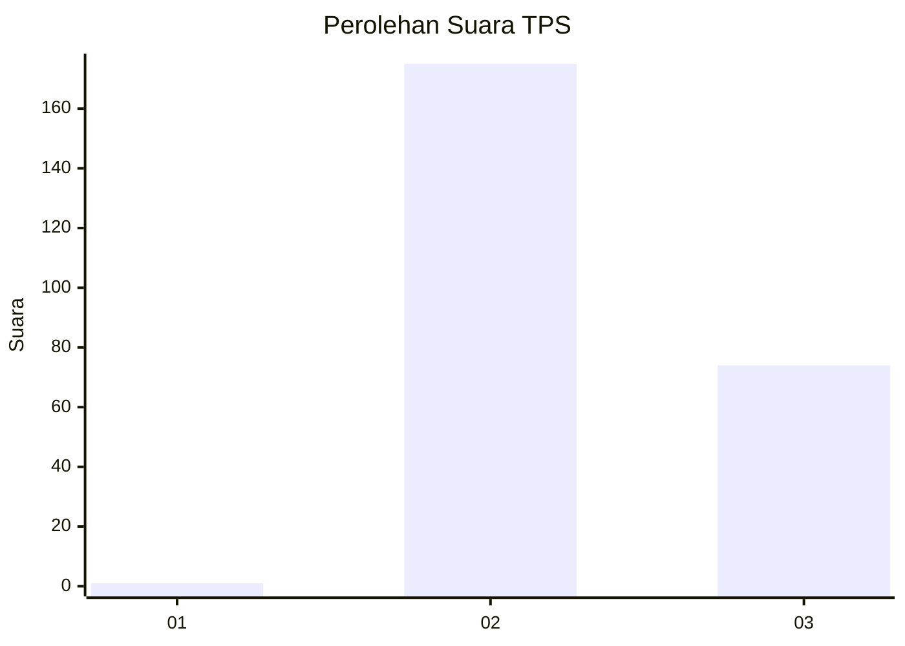
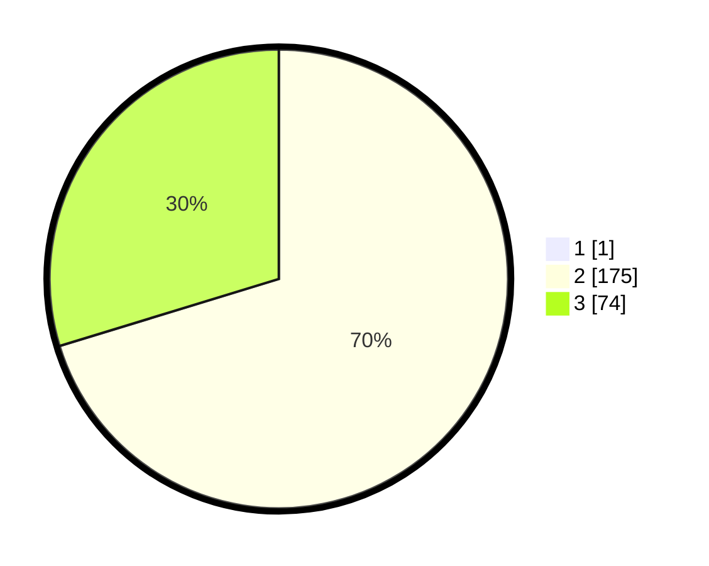

# Hasil

## Grafik

## Tabel

| No. | Nama Paslon    | Suara | Suara (raw) | Persentase |
|:--- |:-------------- | -----:| -----------:| ----------:|
| 1   | ANIES MUHAIMIN | 1     | [1][p-1]    | 0,40       |
| 2   | PRABOWO GIBRAN | 175   | [175][p-2]  | 70,00      |
| 3   | GANJAR MAHFUD  | 74    | [74][p-3]   | 29,60      |

[p-1]: https://github.com/gigit-pemilu/pemilu-2024-51-bali/blob/main/pilpres/hitung-suara/sub/51-bali/sub/08-buleleng/sub/06-buleleng/sub/2014-nagasepaha/sub/002-tps/sub/paslon-1.txt
[p-2]: https://github.com/gigit-pemilu/pemilu-2024-51-bali/blob/main/pilpres/hitung-suara/sub/51-bali/sub/08-buleleng/sub/06-buleleng/sub/2014-nagasepaha/sub/002-tps/sub/paslon-2.txt
[p-3]: https://github.com/gigit-pemilu/pemilu-2024-51-bali/blob/main/pilpres/hitung-suara/sub/51-bali/sub/08-buleleng/sub/06-buleleng/sub/2014-nagasepaha/sub/002-tps/sub/paslon-3.txt

## Foto C Plano

https://sirekap-obj-formc.kpu.go.id/82f7/pemilu/ppwp/51/08/06/20/14/5108062014002-20240216-021222--4adf347d-fe18-4fdb-b198-9e2fa05768a2.jpg

https://sirekap-obj-formc.kpu.go.id/82f7/pemilu/ppwp/51/08/06/20/14/5108062014002-20240216-021227--9192d65b-45e5-4d7d-a44d-9b92736308c4.jpg

https://sirekap-obj-formc.kpu.go.id/82f7/pemilu/ppwp/51/08/06/20/14/5108062014002-20240216-021223--000723da-bd5a-4518-87b9-a7cb111dd7bb.jpg

## Metadata

| Key        | Value               |
| ---------- | ------------------- |
| Time Stamp | 2024-02-17 19:00:04 |

## DATA PEMILIH TETAP

Jumlah pemilih dalam DPT: **250**.
 * L: **127**.
 * P: **123**.

## DATA PENGGUNA HAK PILIH

Jumlah pengguna hak pilih dalam DPT: **246**.
 * L: **126**.
 * P: **120**.

Jumlah pengguna hak pilih dalam DPTb: **1**.
 * L: **1**.
 * P: **0**.

Jumlah pengguna hak pilih dalam DPK: **3**.
 * L: **2**.
 * P: **1**.

Jumlah pengguna hak pilih: **250**.
 * L: **129**.
 * P: **121**.

## JUMLAH SUARA SAH DAN TIDAK SAH

JUMLAH SELURUH SUARA SAH: **250**.

JUMLAH SUARA TIDAK SAH: **0**.

JUMLAH SELURUH SUARA SAH DAN SUARA TIDAK SAH: **250**.

