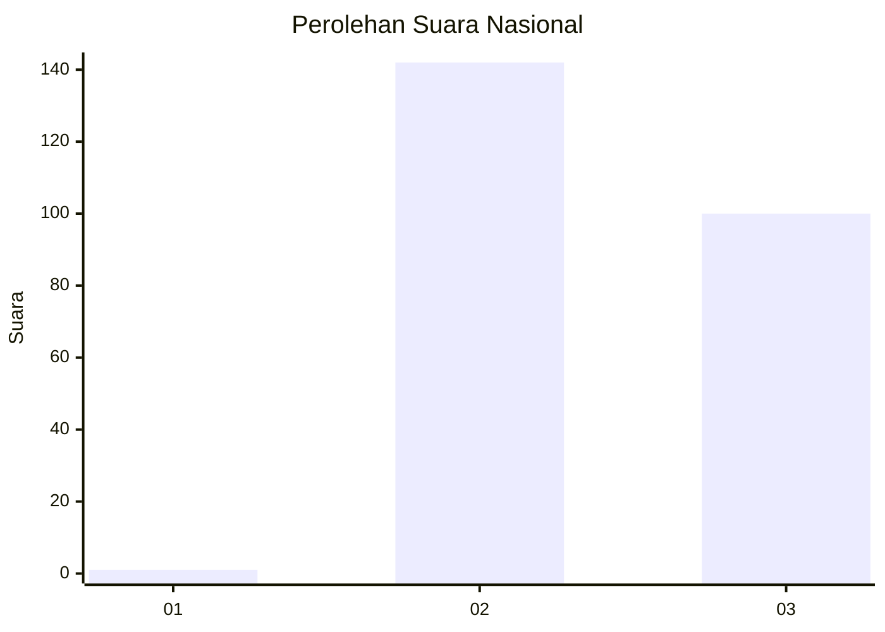
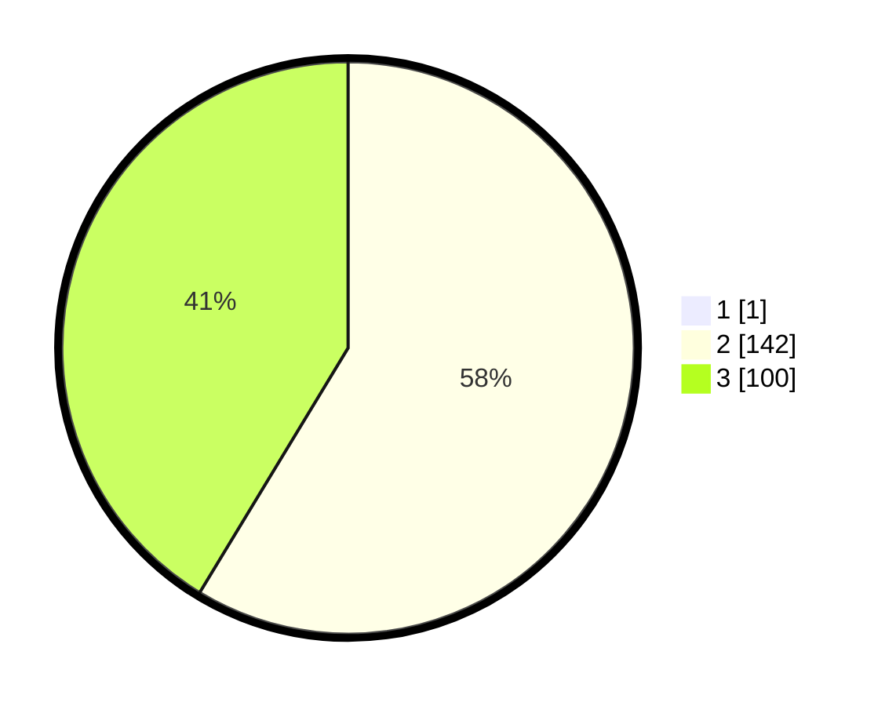

# Hasil

## Grafik

## Tabel

| No. | Nama Paslon    | Suara | Suara (raw) | Persentase |
|:--- |:-------------- | -----:| -----------:| ----------:|
| 1   | ANIES MUHAIMIN | 1     | [1][p-1]    | 0,41       |
| 2   | PRABOWO GIBRAN | 142   | [142][p-2]  | 58,44      |
| 3   | GANJAR MAHFUD  | 100   | [100][p-3]  | 41,15      |

[p-1]: https://github.com/gigit-pemilu/pemilu-2024/blob/main/pilpres/hitung-suara/sub/51-bali/sub/08-buleleng/sub/06-buleleng/sub/2014-nagasepaha/sub/003-tps/sub/paslon-1.txt
[p-2]: https://github.com/gigit-pemilu/pemilu-2024/blob/main/pilpres/hitung-suara/sub/51-bali/sub/08-buleleng/sub/06-buleleng/sub/2014-nagasepaha/sub/003-tps/sub/paslon-2.txt
[p-3]: https://github.com/gigit-pemilu/pemilu-2024/blob/main/pilpres/hitung-suara/sub/51-bali/sub/08-buleleng/sub/06-buleleng/sub/2014-nagasepaha/sub/003-tps/sub/paslon-3.txt

## Foto C Plano

https://sirekap-obj-formc.kpu.go.id/cdf8/pemilu/ppwp/51/08/06/20/14/5108062014003-20240214-141816--4c447fa4-04dc-4722-bebe-9e236bb5b85f.jpg

https://sirekap-obj-formc.kpu.go.id/cdf8/pemilu/ppwp/51/08/06/20/14/5108062014003-20240216-041409--e009c8cc-0e56-421b-bfbc-a94db8cb565c.jpg

https://sirekap-obj-formc.kpu.go.id/cdf8/pemilu/ppwp/51/08/06/20/14/5108062014003-20240216-044119--5d238347-7528-4cc5-a209-502442b55c97.jpg

## Metadata

| Key        | Value               |
| ---------- | ------------------- |
| Time Stamp | 2024-02-17 19:00:04 |

## DATA PEMILIH TETAP

Jumlah pemilih dalam DPT: **249**.
 * L: **132**.
 * P: **117**.

## DATA PENGGUNA HAK PILIH

Jumlah pengguna hak pilih dalam DPT: **244**.
 * L: **132**.
 * P: **112**.

Jumlah pengguna hak pilih dalam DPTb: **0**.
 * L: **0**.
 * P: **0**.

Jumlah pengguna hak pilih dalam DPK: **1**.
 * L: **0**.
 * P: **1**.

Jumlah pengguna hak pilih: **245**.
 * L: **132**.
 * P: **113**.

## JUMLAH SUARA SAH DAN TIDAK SAH

JUMLAH SELURUH SUARA SAH: **243**.

JUMLAH SUARA TIDAK SAH: **2**.

JUMLAH SELURUH SUARA SAH DAN SUARA TIDAK SAH: **245**.

