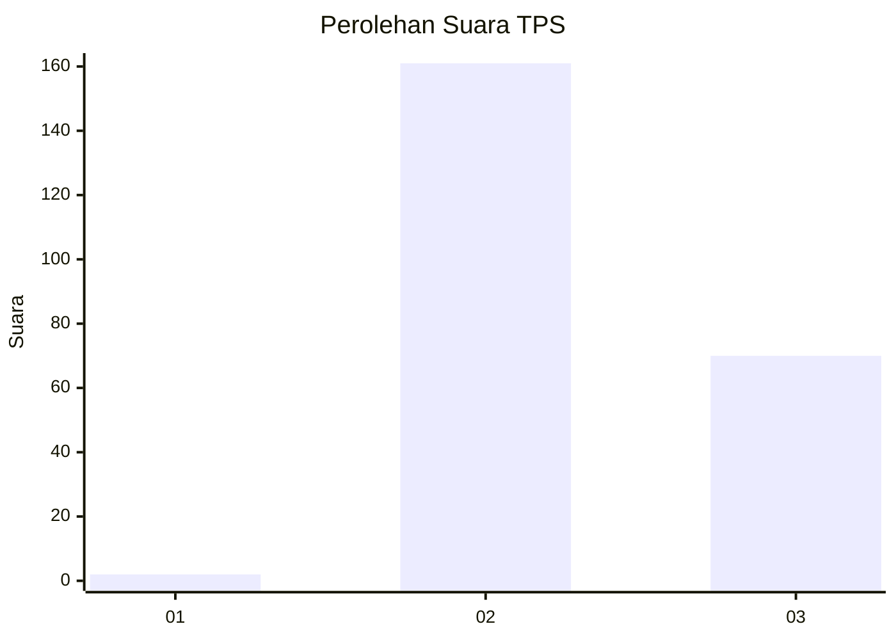
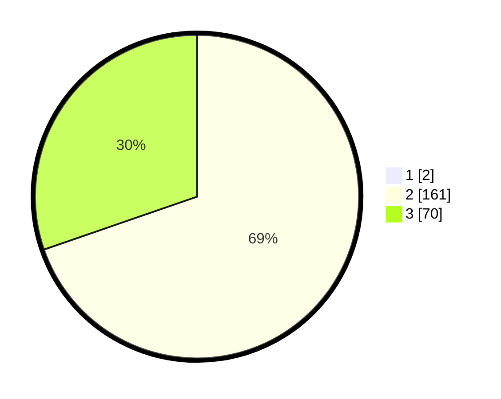

# Hasil

## Grafik

## Tabel

| No. | Nama Paslon    | Suara | Suara (raw) | Persentase |
|:--- |:-------------- | -----:| -----------:| ----------:|
| 1   | ANIES MUHAIMIN | 2     | [2][p-1]    | 0,86       |
| 2   | PRABOWO GIBRAN | 161   | [161][p-2]  | 69,10      |
| 3   | GANJAR MAHFUD  | 70    | [70][p-3]   | 30,04      |

[p-1]: https://github.com/gigit-pemilu/pemilu-2024-51-bali/blob/main/pilpres/hitung-suara/sub/51-bali/sub/08-buleleng/sub/06-buleleng/sub/2014-nagasepaha/sub/004-tps/sub/paslon-1.txt
[p-2]: https://github.com/gigit-pemilu/pemilu-2024-51-bali/blob/main/pilpres/hitung-suara/sub/51-bali/sub/08-buleleng/sub/06-buleleng/sub/2014-nagasepaha/sub/004-tps/sub/paslon-2.txt
[p-3]: https://github.com/gigit-pemilu/pemilu-2024-51-bali/blob/main/pilpres/hitung-suara/sub/51-bali/sub/08-buleleng/sub/06-buleleng/sub/2014-nagasepaha/sub/004-tps/sub/paslon-3.txt

## Foto C Plano

https://sirekap-obj-formc.kpu.go.id/76f2/pemilu/ppwp/51/08/06/20/14/5108062014004-20240216-025221--e0f1c576-e5fd-48d3-b184-a9487cc14c25.jpg

https://sirekap-obj-formc.kpu.go.id/76f2/pemilu/ppwp/51/08/06/20/14/5108062014004-20240216-025223--a79c4b11-6580-4277-a601-7ebb8bd9d351.jpg

https://sirekap-obj-formc.kpu.go.id/76f2/pemilu/ppwp/51/08/06/20/14/5108062014004-20240216-025222--3edddc37-987b-4770-b8a6-d958fc8e9047.jpg

## Metadata

| Key        | Value               |
| ---------- | ------------------- |
| Time Stamp | 2024-02-17 19:00:04 |

## DATA PEMILIH TETAP

Jumlah pemilih dalam DPT: **237**.
 * L: **119**.
 * P: **118**.

## DATA PENGGUNA HAK PILIH

Jumlah pengguna hak pilih dalam DPT: **232**.
 * L: **117**.
 * P: **115**.

Jumlah pengguna hak pilih dalam DPTb: **1**.
 * L: **0**.
 * P: **1**.

Jumlah pengguna hak pilih dalam DPK: **2**.
 * L: **1**.
 * P: **1**.

Jumlah pengguna hak pilih: **235**.
 * L: **118**.
 * P: **117**.

## JUMLAH SUARA SAH DAN TIDAK SAH

JUMLAH SELURUH SUARA SAH: **233**.

JUMLAH SUARA TIDAK SAH: **2**.

JUMLAH SELURUH SUARA SAH DAN SUARA TIDAK SAH: **235**.

