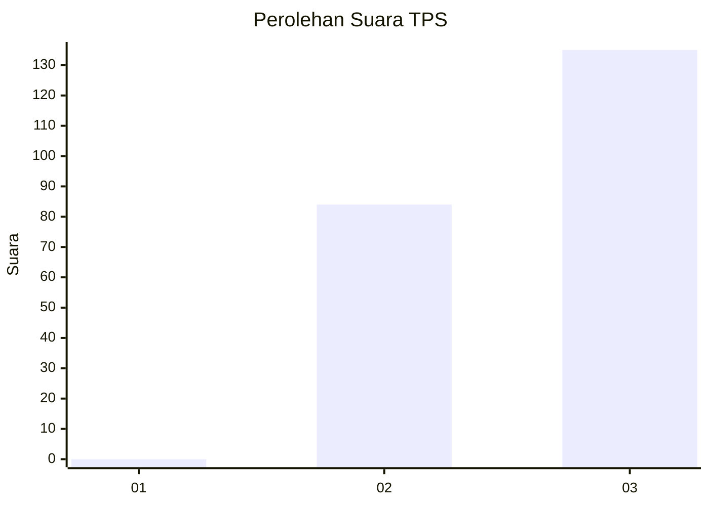
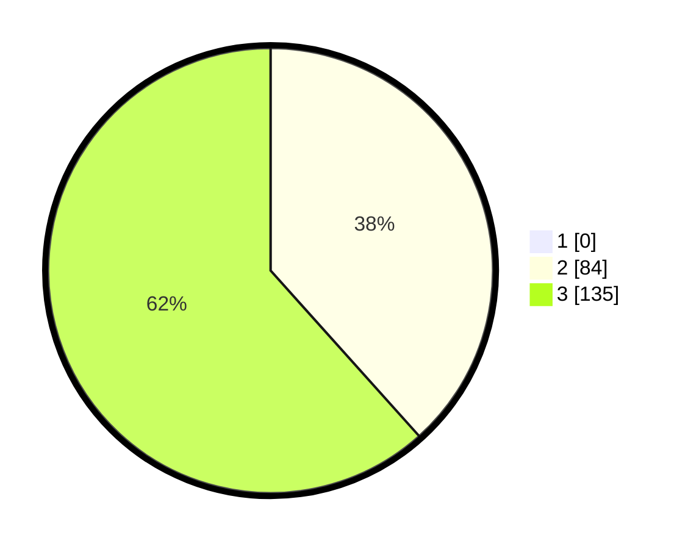

# Hasil

## Grafik

## Tabel

| No. | Nama Paslon    | Suara | Suara (raw) | Persentase |
|:--- |:-------------- | -----:| -----------:| ----------:|
| 1   | ANIES MUHAIMIN | 0     | [0][p-1]    | 0,00       |
| 2   | PRABOWO GIBRAN | 84    | [84][p-2]   | 38,36      |
| 3   | GANJAR MAHFUD  | 135   | [135][p-3]  | 61,64      |

[p-1]: https://github.com/gigit-pemilu/pemilu-2024-51-bali/blob/main/pilpres/hitung-suara/sub/51-bali/sub/08-buleleng/sub/06-buleleng/sub/2015-petandakan/sub/001-tps/sub/paslon-1.txt
[p-2]: https://github.com/gigit-pemilu/pemilu-2024-51-bali/blob/main/pilpres/hitung-suara/sub/51-bali/sub/08-buleleng/sub/06-buleleng/sub/2015-petandakan/sub/001-tps/sub/paslon-2.txt
[p-3]: https://github.com/gigit-pemilu/pemilu-2024-51-bali/blob/main/pilpres/hitung-suara/sub/51-bali/sub/08-buleleng/sub/06-buleleng/sub/2015-petandakan/sub/001-tps/sub/paslon-3.txt

## Foto C Plano

https://sirekap-obj-formc.kpu.go.id/c0a0/pemilu/ppwp/51/08/06/20/15/5108062015001-20240214-235523--ac480d84-023a-469a-a53a-4b6f3aeb6d9e.jpg

https://sirekap-obj-formc.kpu.go.id/c0a0/pemilu/ppwp/51/08/06/20/15/5108062015001-20240214-235741--928147cf-2b68-421b-a56d-487d805d37a6.jpg

https://sirekap-obj-formc.kpu.go.id/c0a0/pemilu/ppwp/51/08/06/20/15/5108062015001-20240215-000203--662b98d7-6032-44f2-a811-adea8050336d.jpg

## Metadata

| Key        | Value               |
| ---------- | ------------------- |
| Time Stamp | 2024-02-24 22:31:28 |

