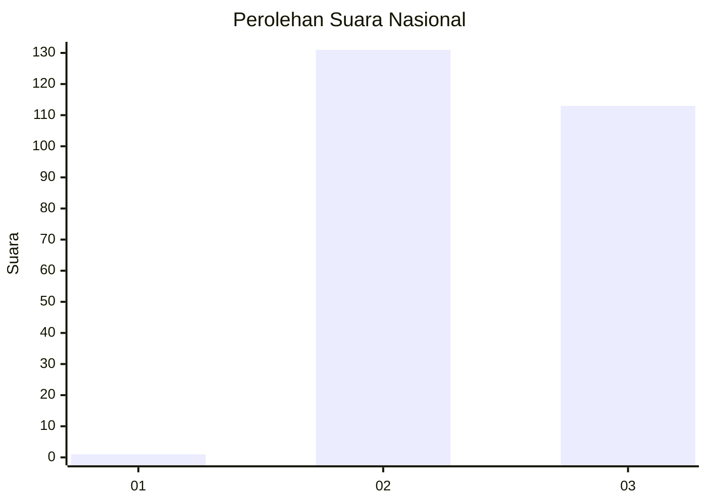
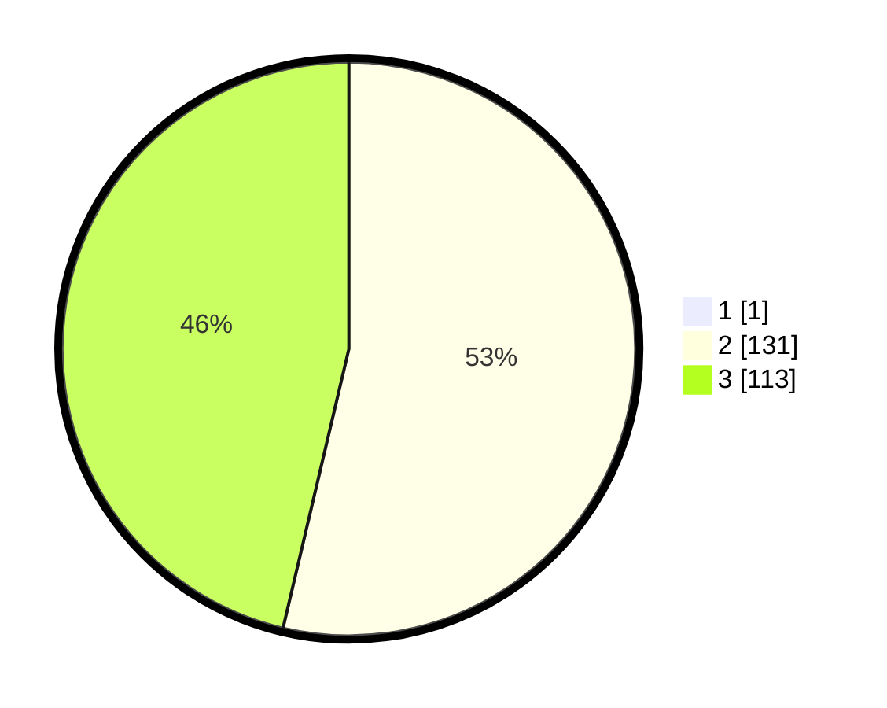

# Hasil

## Grafik

## Tabel

| No. | Nama Paslon    | Suara | Suara (raw) | Persentase |
|:--- |:-------------- | -----:| -----------:| ----------:|
| 1   | ANIES MUHAIMIN | 1     | [1][p-1]    | 0,41       |
| 2   | PRABOWO GIBRAN | 131   | [131][p-2]  | 53,47      |
| 3   | GANJAR MAHFUD  | 113   | [113][p-3]  | 46,12      |

[p-1]: https://github.com/gigit-pemilu/pemilu-2024/blob/main/pilpres/hitung-suara/sub/51-bali/sub/08-buleleng/sub/06-buleleng/sub/2015-petandakan/sub/003-tps/sub/paslon-1.txt
[p-2]: https://github.com/gigit-pemilu/pemilu-2024/blob/main/pilpres/hitung-suara/sub/51-bali/sub/08-buleleng/sub/06-buleleng/sub/2015-petandakan/sub/003-tps/sub/paslon-2.txt
[p-3]: https://github.com/gigit-pemilu/pemilu-2024/blob/main/pilpres/hitung-suara/sub/51-bali/sub/08-buleleng/sub/06-buleleng/sub/2015-petandakan/sub/003-tps/sub/paslon-3.txt

## Foto C Plano

https://sirekap-obj-formc.kpu.go.id/e9f1/pemilu/ppwp/51/08/06/20/15/5108062015003-20240215-000042--21fdd573-ab91-4e1c-a168-d119a1d33cfb.jpg

https://sirekap-obj-formc.kpu.go.id/e9f1/pemilu/ppwp/51/08/06/20/15/5108062015003-20240215-000312--4a0ab987-f61f-4c40-ac86-86c137fe2e17.jpg

https://sirekap-obj-formc.kpu.go.id/e9f1/pemilu/ppwp/51/08/06/20/15/5108062015003-20240215-000434--1145f42e-7032-49da-b0d1-7e49001ac4c3.jpg

## Metadata

| Key        | Value               |
| ---------- | ------------------- |
| Time Stamp | 2024-02-24 22:31:28 |

