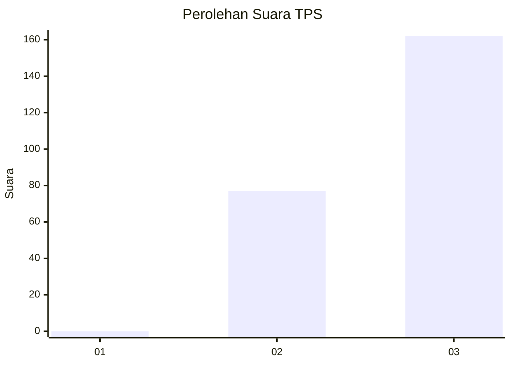
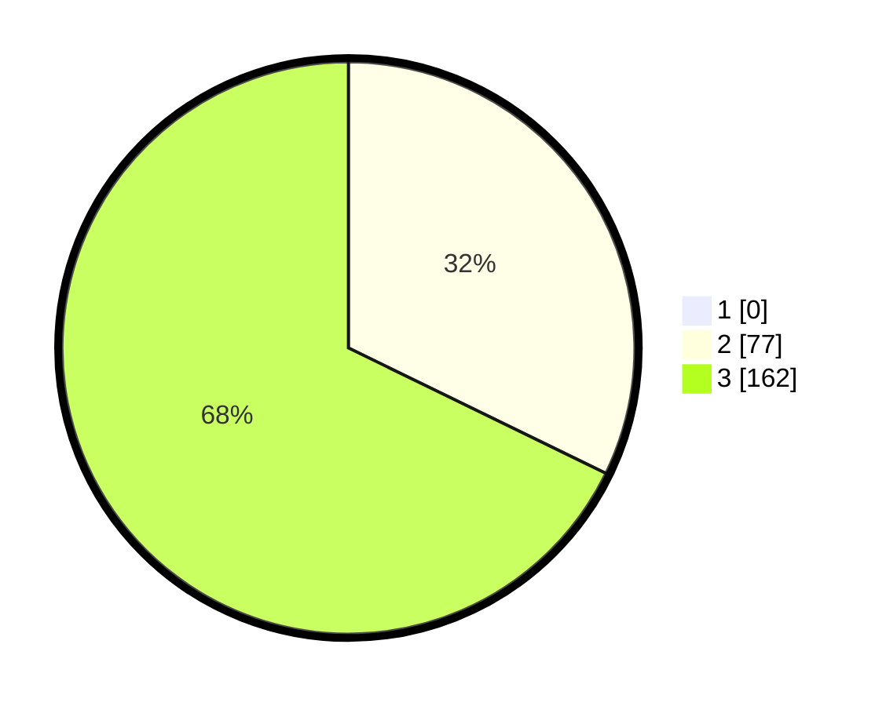

# Hasil

## Grafik

## Tabel

| No. | Nama Paslon    | Suara | Suara (raw) | Persentase |
|:--- |:-------------- | -----:| -----------:| ----------:|
| 1   | ANIES MUHAIMIN | 0     | [0][p-1]    | 0,00       |
| 2   | PRABOWO GIBRAN | 77    | [77][p-2]   | 32,22      |
| 3   | GANJAR MAHFUD  | 162   | [162][p-3]  | 67,78      |

[p-1]: https://github.com/gigit-pemilu/pemilu-2024-51-bali/blob/main/pilpres/hitung-suara/sub/51-bali/sub/08-buleleng/sub/06-buleleng/sub/2015-petandakan/sub/008-tps/sub/paslon-1.txt
[p-2]: https://github.com/gigit-pemilu/pemilu-2024-51-bali/blob/main/pilpres/hitung-suara/sub/51-bali/sub/08-buleleng/sub/06-buleleng/sub/2015-petandakan/sub/008-tps/sub/paslon-2.txt
[p-3]: https://github.com/gigit-pemilu/pemilu-2024-51-bali/blob/main/pilpres/hitung-suara/sub/51-bali/sub/08-buleleng/sub/06-buleleng/sub/2015-petandakan/sub/008-tps/sub/paslon-3.txt

## Foto C Plano

https://sirekap-obj-formc.kpu.go.id/b5af/pemilu/ppwp/51/08/06/20/15/5108062015008-20240214-212336--e5b157b9-3b57-4ad2-b3e8-c432bf1c6ad0.jpg

https://sirekap-obj-formc.kpu.go.id/b5af/pemilu/ppwp/51/08/06/20/15/5108062015008-20240214-202047--73025042-55b8-46fe-ba93-dfbd345c62d8.jpg

https://sirekap-obj-formc.kpu.go.id/b5af/pemilu/ppwp/51/08/06/20/15/5108062015008-20240214-202127--34a6b8d5-11df-4c4c-8c50-6051dc6a2aa4.jpg

## Metadata

| Key        | Value               |
| ---------- | ------------------- |
| Time Stamp | 2024-02-24 22:31:28 |

