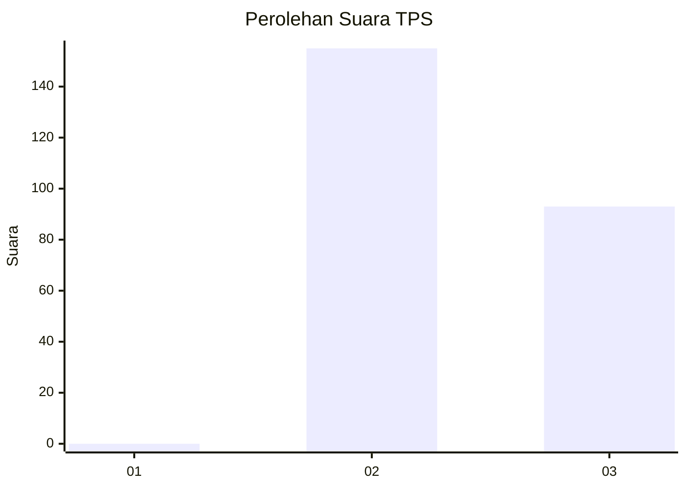
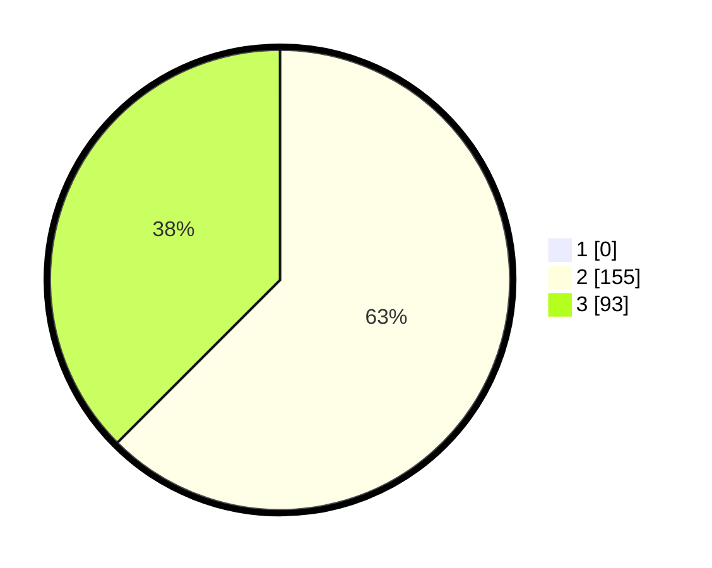

# Hasil

## Grafik

## Tabel

| No. | Nama Paslon    | Suara | Suara (raw) | Persentase |
|:--- |:-------------- | -----:| -----------:| ----------:|
| 1   | ANIES MUHAIMIN | 0     | [0][p-1]    | 0,00       |
| 2   | PRABOWO GIBRAN | 155   | [155][p-2]  | 62,50      |
| 3   | GANJAR MAHFUD  | 93    | [93][p-3]   | 37,50      |

[p-1]: https://github.com/gigit-pemilu/pemilu-2024-51-bali/blob/main/pilpres/hitung-suara/sub/51-bali/sub/08-buleleng/sub/06-buleleng/sub/2016-alasangker/sub/001-tps/sub/paslon-1.txt
[p-2]: https://github.com/gigit-pemilu/pemilu-2024-51-bali/blob/main/pilpres/hitung-suara/sub/51-bali/sub/08-buleleng/sub/06-buleleng/sub/2016-alasangker/sub/001-tps/sub/paslon-2.txt
[p-3]: https://github.com/gigit-pemilu/pemilu-2024-51-bali/blob/main/pilpres/hitung-suara/sub/51-bali/sub/08-buleleng/sub/06-buleleng/sub/2016-alasangker/sub/001-tps/sub/paslon-3.txt

## Foto C Plano

https://sirekap-obj-formc.kpu.go.id/132d/pemilu/ppwp/51/08/06/20/16/5108062016001-20240215-013102--e63e932a-5d2c-4442-8577-36cf8bd5bfae.jpg

https://sirekap-obj-formc.kpu.go.id/132d/pemilu/ppwp/51/08/06/20/16/5108062016001-20240215-013542--ae90f992-1c84-45f1-ba88-fbc3cb6b4c40.jpg

https://sirekap-obj-formc.kpu.go.id/132d/pemilu/ppwp/51/08/06/20/16/5108062016001-20240215-013916--aeda875d-8fa6-4f45-966d-626955ee238e.jpg

## Metadata

| Key        | Value               |
| ---------- | ------------------- |
| Time Stamp | 2024-02-24 22:31:28 |

