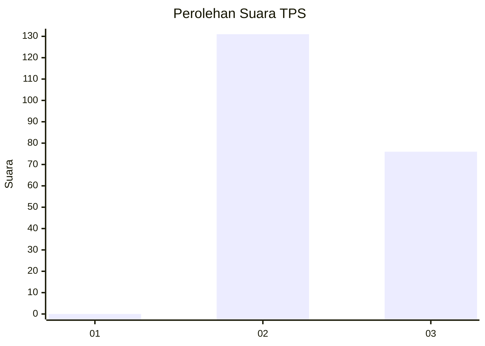
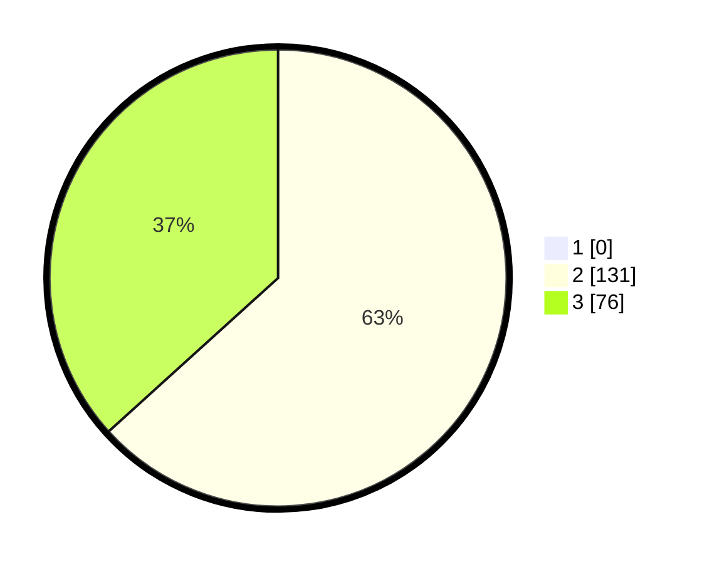

# Hasil

## Grafik

## Tabel

| No. | Nama Paslon    | Suara | Suara (raw) | Persentase |
|:--- |:-------------- | -----:| -----------:| ----------:|
| 1   | ANIES MUHAIMIN | 0     | [0][p-1]    | 0,00       |
| 2   | PRABOWO GIBRAN | 131   | [131][p-2]  | 63,29      |
| 3   | GANJAR MAHFUD  | 76    | [76][p-3]   | 36,71      |

[p-1]: https://github.com/gigit-pemilu/pemilu-2024-51-bali/blob/main/pilpres/hitung-suara/sub/51-bali/sub/08-buleleng/sub/06-buleleng/sub/2016-alasangker/sub/004-tps/sub/paslon-1.txt
[p-2]: https://github.com/gigit-pemilu/pemilu-2024-51-bali/blob/main/pilpres/hitung-suara/sub/51-bali/sub/08-buleleng/sub/06-buleleng/sub/2016-alasangker/sub/004-tps/sub/paslon-2.txt
[p-3]: https://github.com/gigit-pemilu/pemilu-2024-51-bali/blob/main/pilpres/hitung-suara/sub/51-bali/sub/08-buleleng/sub/06-buleleng/sub/2016-alasangker/sub/004-tps/sub/paslon-3.txt

## Foto C Plano

https://sirekap-obj-formc.kpu.go.id/69d1/pemilu/ppwp/51/08/06/20/16/5108062016004-20240214-222450--af7cd72c-f597-4b18-8c2d-41ebeb4d5db3.jpg

https://sirekap-obj-formc.kpu.go.id/69d1/pemilu/ppwp/51/08/06/20/16/5108062016004-20240214-222729--18a3e774-574d-4cc4-8a4f-fe324cb5702f.jpg

https://sirekap-obj-formc.kpu.go.id/69d1/pemilu/ppwp/51/08/06/20/16/5108062016004-20240214-222859--58c6224c-b78f-4709-b5b2-af94e33817bf.jpg

## Metadata

| Key        | Value               |
| ---------- | ------------------- |
| Time Stamp | 2024-02-24 22:31:28 |

