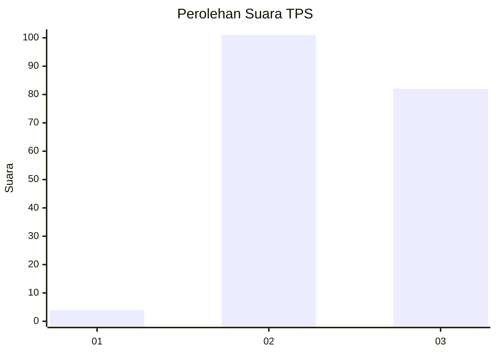
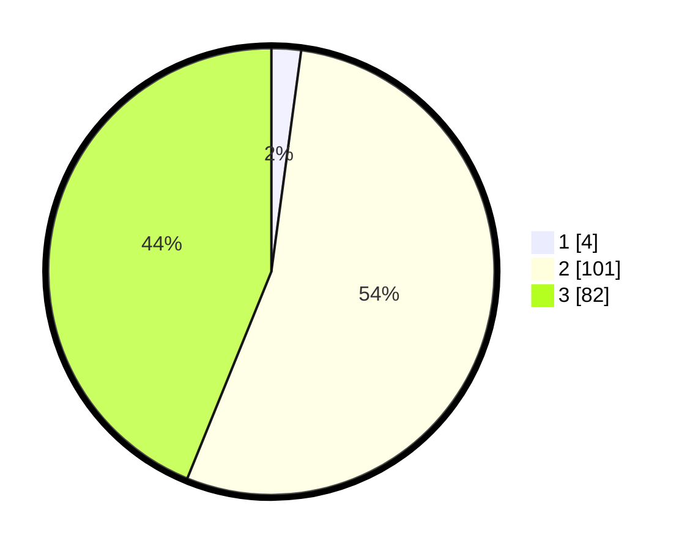

# Hasil

## Grafik

## Tabel

| No. | Nama Paslon    | Suara | Suara (raw) | Persentase |
|:--- |:-------------- | -----:| -----------:| ----------:|
| 1   | ANIES MUHAIMIN | 4     | [4][p-1]    | 2,14       |
| 2   | PRABOWO GIBRAN | 101   | [101][p-2]  | 54,01      |
| 3   | GANJAR MAHFUD  | 82    | [82][p-3]   | 43,85      |

[p-1]: https://github.com/gigit-pemilu/pemilu-2024-51-bali/blob/main/pilpres/hitung-suara/sub/51-bali/sub/08-buleleng/sub/06-buleleng/sub/2016-alasangker/sub/014-tps/sub/paslon-1.txt
[p-2]: https://github.com/gigit-pemilu/pemilu-2024-51-bali/blob/main/pilpres/hitung-suara/sub/51-bali/sub/08-buleleng/sub/06-buleleng/sub/2016-alasangker/sub/014-tps/sub/paslon-2.txt
[p-3]: https://github.com/gigit-pemilu/pemilu-2024-51-bali/blob/main/pilpres/hitung-suara/sub/51-bali/sub/08-buleleng/sub/06-buleleng/sub/2016-alasangker/sub/014-tps/sub/paslon-3.txt

## Foto C Plano

https://sirekap-obj-formc.kpu.go.id/c652/pemilu/ppwp/51/08/06/20/16/5108062016014-20240214-214344--aa92af4d-585c-40a6-8eab-0d9c9fb7fc5a.jpg

https://sirekap-obj-formc.kpu.go.id/c652/pemilu/ppwp/51/08/06/20/16/5108062016014-20240214-214421--42873bd5-db13-4e9d-b334-24479476ee11.jpg

https://sirekap-obj-formc.kpu.go.id/c652/pemilu/ppwp/51/08/06/20/16/5108062016014-20240214-214645--0a71f1cf-01f6-41fb-a517-e611f5ba642c.jpg

## Metadata

| Key        | Value               |
| ---------- | ------------------- |
| Time Stamp | 2024-02-24 22:31:28 |

