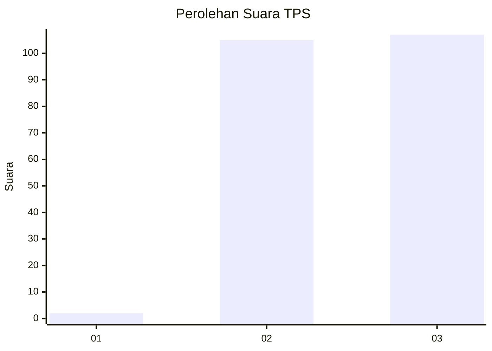
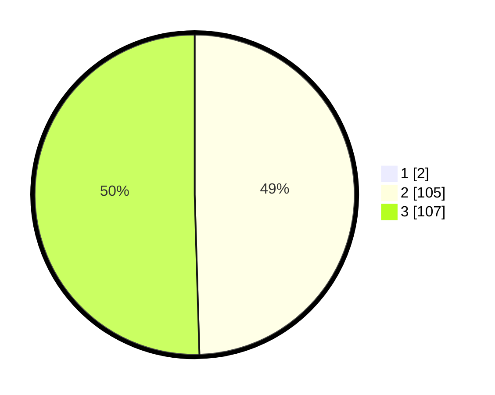

# Hasil

## Grafik

## Tabel

| No. | Nama Paslon    | Suara | Suara (raw) | Persentase |
|:--- |:-------------- | -----:| -----------:| ----------:|
| 1   | ANIES MUHAIMIN | 2     | [2][p-1]    | 0,93       |
| 2   | PRABOWO GIBRAN | 105   | [105][p-2]  | 49,07      |
| 3   | GANJAR MAHFUD  | 107   | [107][p-3]  | 50,00      |

[p-1]: https://github.com/gigit-pemilu/pemilu-2024-51-bali/blob/main/pilpres/hitung-suara/sub/51-bali/sub/08-buleleng/sub/06-buleleng/sub/2017-poh-bergong/sub/003-tps/sub/paslon-1.txt
[p-2]: https://github.com/gigit-pemilu/pemilu-2024-51-bali/blob/main/pilpres/hitung-suara/sub/51-bali/sub/08-buleleng/sub/06-buleleng/sub/2017-poh-bergong/sub/003-tps/sub/paslon-2.txt
[p-3]: https://github.com/gigit-pemilu/pemilu-2024-51-bali/blob/main/pilpres/hitung-suara/sub/51-bali/sub/08-buleleng/sub/06-buleleng/sub/2017-poh-bergong/sub/003-tps/sub/paslon-3.txt

## Foto C Plano

https://sirekap-obj-formc.kpu.go.id/4a66/pemilu/ppwp/51/08/06/20/17/5108062017003-20240214-234215--a88338d6-098c-4b60-bcac-f5b90b6d442a.jpg

https://sirekap-obj-formc.kpu.go.id/4a66/pemilu/ppwp/51/08/06/20/17/5108062017003-20240214-234821--b7c91736-95e3-47b3-8df2-3084806b2baa.jpg

https://sirekap-obj-formc.kpu.go.id/4a66/pemilu/ppwp/51/08/06/20/17/5108062017003-20240214-235054--c63d80d4-38fd-492c-bdf4-3dd21bd0eb0c.jpg

## Metadata

| Key        | Value               |
| ---------- | ------------------- |
| Time Stamp | 2024-02-24 22:31:28 |

