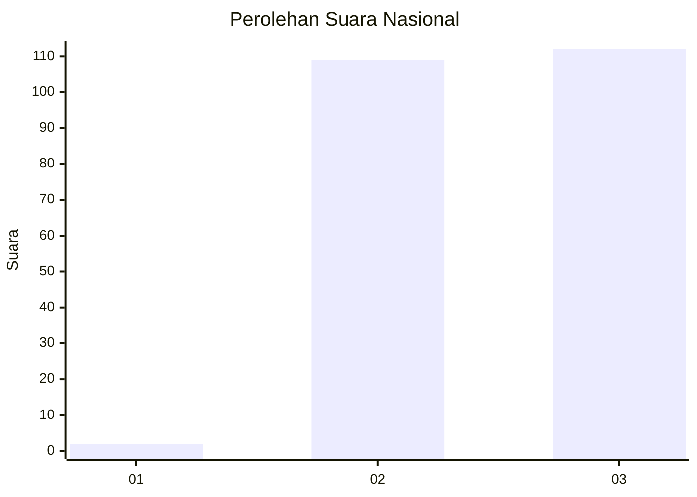
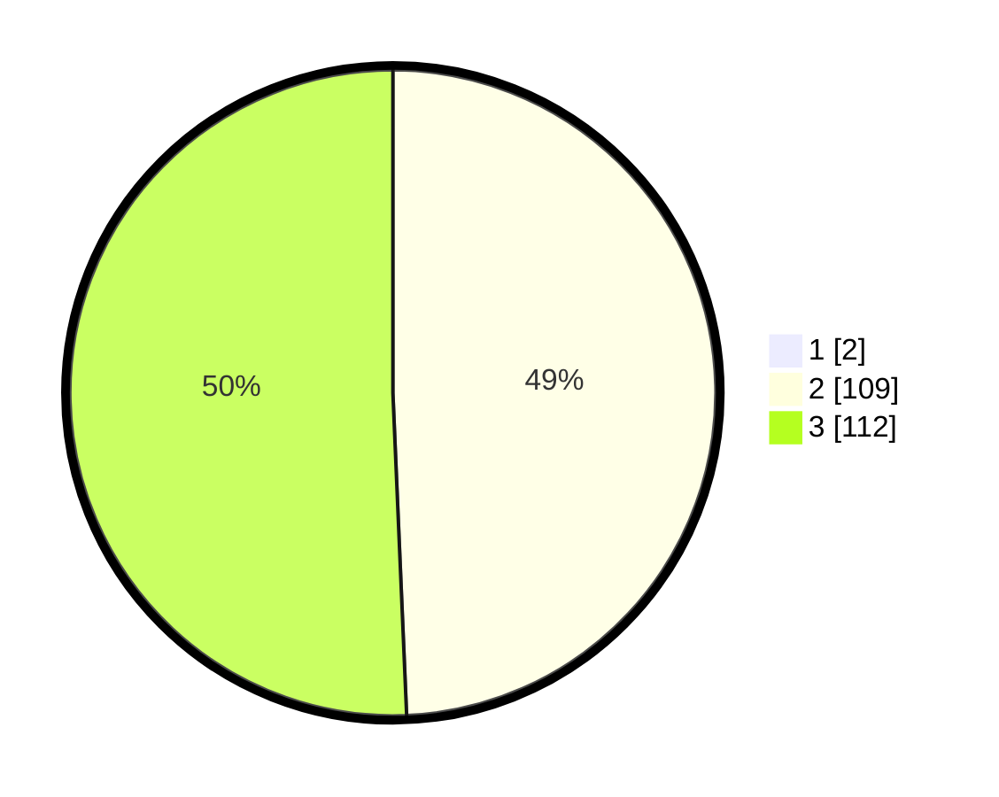

# Hasil

## Grafik

## Tabel

| No. | Nama Paslon    | Suara | Suara (raw) | Persentase |
|:--- |:-------------- | -----:| -----------:| ----------:|
| 1   | ANIES MUHAIMIN | 2     | [2][p-1]    | 0,90       |
| 2   | PRABOWO GIBRAN | 109   | [109][p-2]  | 48,88      |
| 3   | GANJAR MAHFUD  | 112   | [112][p-3]  | 50,22      |

[p-1]: https://github.com/gigit-pemilu/pemilu-2024/blob/main/pilpres/hitung-suara/sub/51-bali/sub/08-buleleng/sub/06-buleleng/sub/2018-jinengdalem/sub/006-tps/sub/paslon-1.txt
[p-2]: https://github.com/gigit-pemilu/pemilu-2024/blob/main/pilpres/hitung-suara/sub/51-bali/sub/08-buleleng/sub/06-buleleng/sub/2018-jinengdalem/sub/006-tps/sub/paslon-2.txt
[p-3]: https://github.com/gigit-pemilu/pemilu-2024/blob/main/pilpres/hitung-suara/sub/51-bali/sub/08-buleleng/sub/06-buleleng/sub/2018-jinengdalem/sub/006-tps/sub/paslon-3.txt

## Foto C Plano

https://sirekap-obj-formc.kpu.go.id/9de2/pemilu/ppwp/51/08/06/20/18/5108062018006-20240214-221655--607248d7-97d4-4b25-a720-b1c0718bef7f.jpg

https://sirekap-obj-formc.kpu.go.id/9de2/pemilu/ppwp/51/08/06/20/18/5108062018006-20240214-221744--684d5187-1aa7-4d14-ba85-a2982a9c8a4e.jpg

https://sirekap-obj-formc.kpu.go.id/9de2/pemilu/ppwp/51/08/06/20/18/5108062018006-20240214-221830--d0548469-6ce4-452c-a9d6-957ea19f930e.jpg

## Metadata

| Key        | Value               |
| ---------- | ------------------- |
| Time Stamp | 2024-02-24 22:31:28 |

