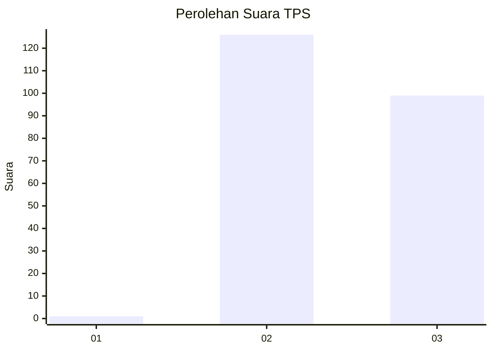
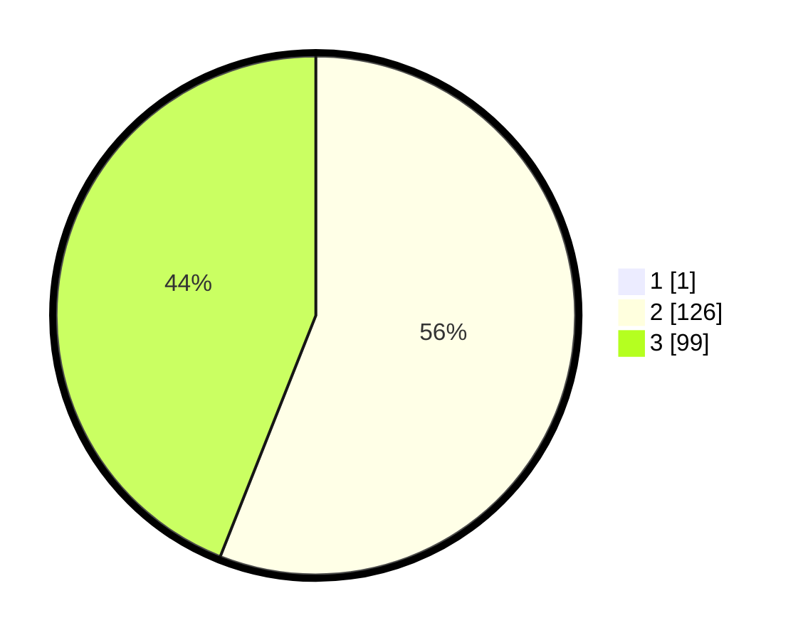

# Hasil

## Grafik

## Tabel

| No. | Nama Paslon    | Suara | Suara (raw) | Persentase |
|:--- |:-------------- | -----:| -----------:| ----------:|
| 1   | ANIES MUHAIMIN | 1     | [1][p-1]    | 0,44       |
| 2   | PRABOWO GIBRAN | 126   | [126][p-2]  | 55,75      |
| 3   | GANJAR MAHFUD  | 99    | [99][p-3]   | 43,81      |

[p-1]: https://github.com/gigit-pemilu/pemilu-2024-51-bali/blob/main/pilpres/hitung-suara/sub/51-bali/sub/08-buleleng/sub/06-buleleng/sub/2018-jinengdalem/sub/014-tps/sub/paslon-1.txt
[p-2]: https://github.com/gigit-pemilu/pemilu-2024-51-bali/blob/main/pilpres/hitung-suara/sub/51-bali/sub/08-buleleng/sub/06-buleleng/sub/2018-jinengdalem/sub/014-tps/sub/paslon-2.txt
[p-3]: https://github.com/gigit-pemilu/pemilu-2024-51-bali/blob/main/pilpres/hitung-suara/sub/51-bali/sub/08-buleleng/sub/06-buleleng/sub/2018-jinengdalem/sub/014-tps/sub/paslon-3.txt

## Foto C Plano

https://sirekap-obj-formc.kpu.go.id/a0f0/pemilu/ppwp/51/08/06/20/18/5108062018014-20240214-141352--165a2108-9e5e-49bb-a6e5-b848743b7da8.jpg

https://sirekap-obj-formc.kpu.go.id/a0f0/pemilu/ppwp/51/08/06/20/18/5108062018014-20240214-141556--9b0358da-3c54-484e-b3fa-080c9d802fb8.jpg

https://sirekap-obj-formc.kpu.go.id/a0f0/pemilu/ppwp/51/08/06/20/18/5108062018014-20240214-141708--c87b2b69-29de-43ca-b770-6963958bf1b5.jpg

## Metadata

| Key        | Value               |
| ---------- | ------------------- |
| Time Stamp | 2024-02-24 22:31:28 |

