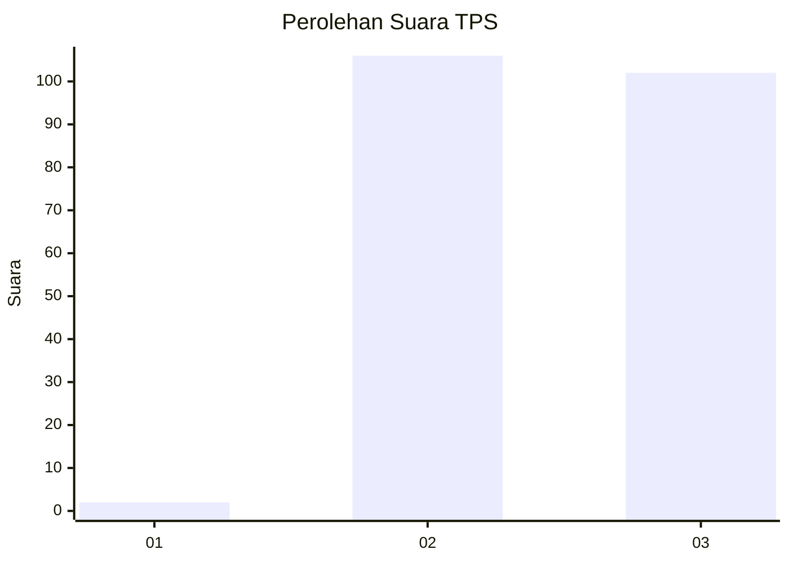
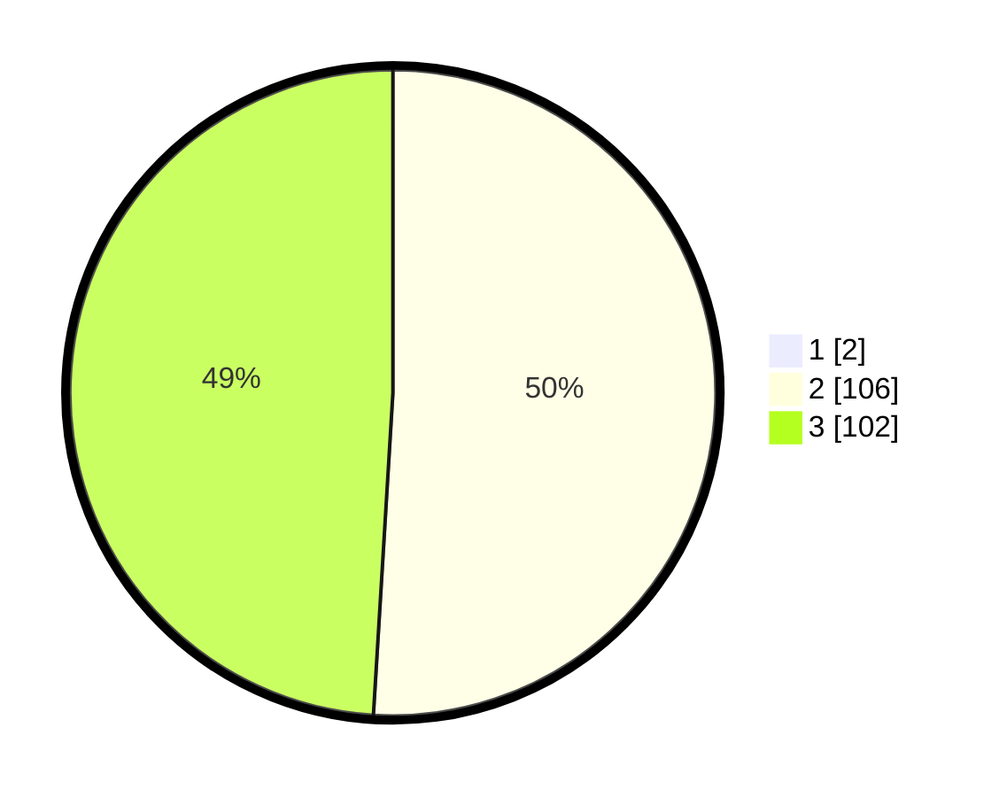

# Hasil

## Grafik

## Tabel

| No. | Nama Paslon    | Suara | Suara (raw) | Persentase |
|:--- |:-------------- | -----:| -----------:| ----------:|
| 1   | ANIES MUHAIMIN | 2     | [2][p-1]    | 0,95       |
| 2   | PRABOWO GIBRAN | 106   | [106][p-2]  | 50,48      |
| 3   | GANJAR MAHFUD  | 102   | [102][p-3]  | 48,57      |

[p-1]: https://github.com/gigit-pemilu/pemilu-2024-51-bali/blob/main/pilpres/hitung-suara/sub/51-bali/sub/08-buleleng/sub/06-buleleng/sub/2018-jinengdalem/sub/015-tps/sub/paslon-1.txt
[p-2]: https://github.com/gigit-pemilu/pemilu-2024-51-bali/blob/main/pilpres/hitung-suara/sub/51-bali/sub/08-buleleng/sub/06-buleleng/sub/2018-jinengdalem/sub/015-tps/sub/paslon-2.txt
[p-3]: https://github.com/gigit-pemilu/pemilu-2024-51-bali/blob/main/pilpres/hitung-suara/sub/51-bali/sub/08-buleleng/sub/06-buleleng/sub/2018-jinengdalem/sub/015-tps/sub/paslon-3.txt

## Foto C Plano

https://sirekap-obj-formc.kpu.go.id/18cc/pemilu/ppwp/51/08/06/20/18/5108062018015-20240214-235711--d5d1b80f-8eb5-4e74-b967-1b208c6fd815.jpg

https://sirekap-obj-formc.kpu.go.id/18cc/pemilu/ppwp/51/08/06/20/18/5108062018015-20240214-235927--4841e576-9802-4363-a445-3b547d47bd7e.jpg

https://sirekap-obj-formc.kpu.go.id/18cc/pemilu/ppwp/51/08/06/20/18/5108062018015-20240215-000221--27189473-2a45-4d11-8901-cbe056ea8e87.jpg

## Metadata

| Key        | Value               |
| ---------- | ------------------- |
| Time Stamp | 2024-02-24 22:31:28 |

