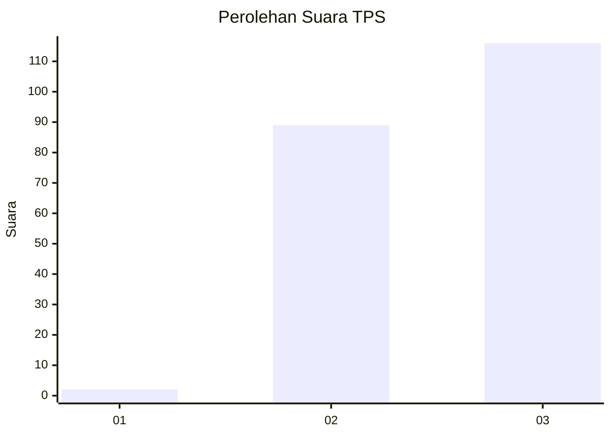
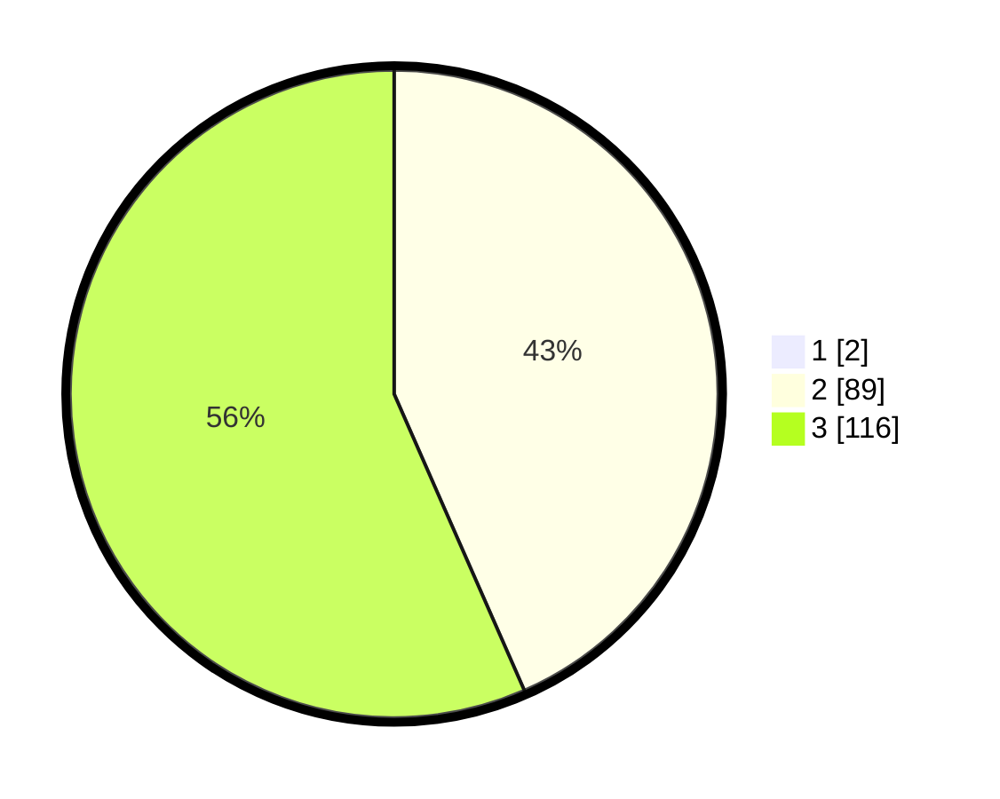

# Hasil

## Grafik

## Tabel

| No. | Nama Paslon    | Suara | Suara (raw) | Persentase |
|:--- |:-------------- | -----:| -----------:| ----------:|
| 1   | ANIES MUHAIMIN | 2     | [2][p-1]    | 0,97       |
| 2   | PRABOWO GIBRAN | 89    | [89][p-2]   | 43,00      |
| 3   | GANJAR MAHFUD  | 116   | [116][p-3]  | 56,04      |

[p-1]: https://github.com/gigit-pemilu/pemilu-2024-51-bali/blob/main/pilpres/hitung-suara/sub/51-bali/sub/08-buleleng/sub/06-buleleng/sub/2018-jinengdalem/sub/016-tps/sub/paslon-1.txt
[p-2]: https://github.com/gigit-pemilu/pemilu-2024-51-bali/blob/main/pilpres/hitung-suara/sub/51-bali/sub/08-buleleng/sub/06-buleleng/sub/2018-jinengdalem/sub/016-tps/sub/paslon-2.txt
[p-3]: https://github.com/gigit-pemilu/pemilu-2024-51-bali/blob/main/pilpres/hitung-suara/sub/51-bali/sub/08-buleleng/sub/06-buleleng/sub/2018-jinengdalem/sub/016-tps/sub/paslon-3.txt

## Foto C Plano

https://sirekap-obj-formc.kpu.go.id/524b/pemilu/ppwp/51/08/06/20/18/5108062018016-20240214-233109--f477c8c7-ba3c-4258-ba00-2504bf546cce.jpg

https://sirekap-obj-formc.kpu.go.id/524b/pemilu/ppwp/51/08/06/20/18/5108062018016-20240214-233219--79ecce2b-6ea5-425c-a747-f8ab57968057.jpg

https://sirekap-obj-formc.kpu.go.id/524b/pemilu/ppwp/51/08/06/20/18/5108062018016-20240214-233800--60833370-bc10-4310-b17e-6b7393eda918.jpg

## Metadata

| Key        | Value               |
| ---------- | ------------------- |
| Time Stamp | 2024-02-24 22:31:28 |

