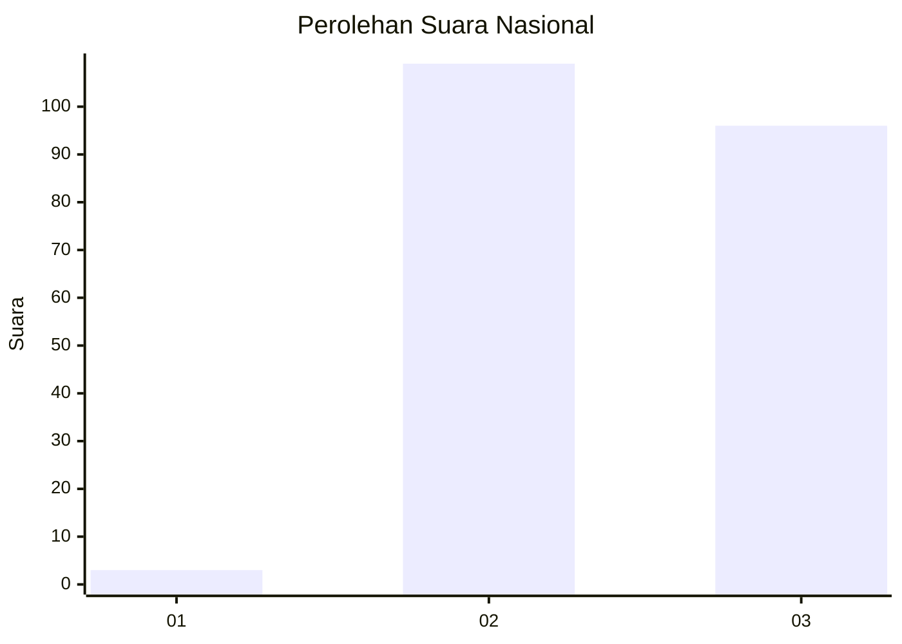
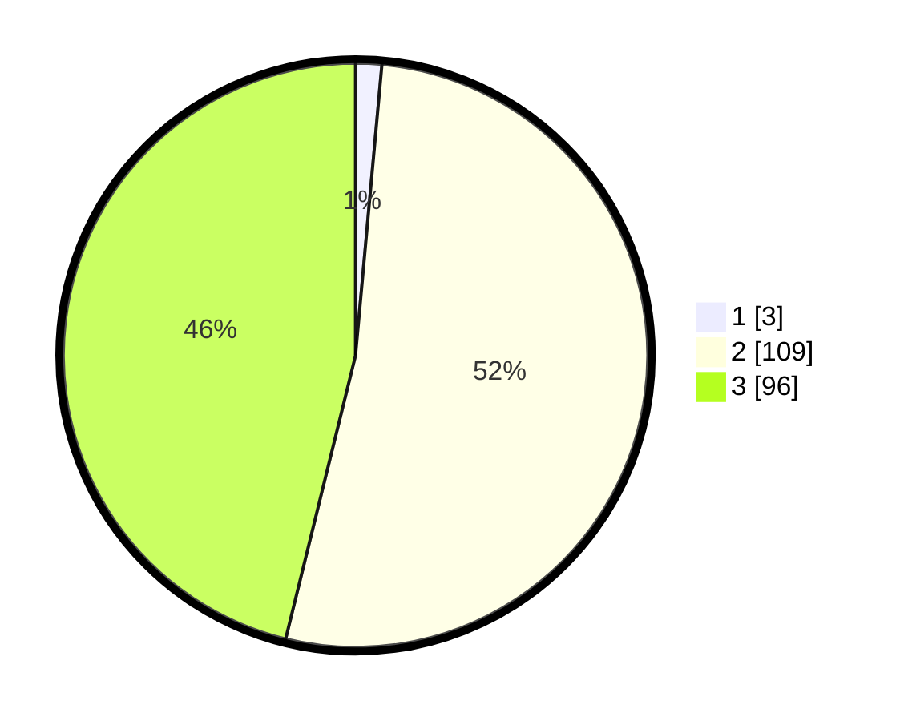

# Hasil

## Grafik

## Tabel

| No. | Nama Paslon    | Suara | Suara (raw) | Persentase |
|:--- |:-------------- | -----:| -----------:| ----------:|
| 1   | ANIES MUHAIMIN | 3     | [3][p-1]    | 1,44       |
| 2   | PRABOWO GIBRAN | 109   | [109][p-2]  | 52,40      |
| 3   | GANJAR MAHFUD  | 96    | [96][p-3]   | 46,15      |

[p-1]: https://github.com/gigit-pemilu/pemilu-2024/blob/main/pilpres/hitung-suara/sub/51-bali/sub/08-buleleng/sub/06-buleleng/sub/2028-penglatan/sub/003-tps/sub/paslon-1.txt
[p-2]: https://github.com/gigit-pemilu/pemilu-2024/blob/main/pilpres/hitung-suara/sub/51-bali/sub/08-buleleng/sub/06-buleleng/sub/2028-penglatan/sub/003-tps/sub/paslon-2.txt
[p-3]: https://github.com/gigit-pemilu/pemilu-2024/blob/main/pilpres/hitung-suara/sub/51-bali/sub/08-buleleng/sub/06-buleleng/sub/2028-penglatan/sub/003-tps/sub/paslon-3.txt

## Foto C Plano

https://sirekap-obj-formc.kpu.go.id/4fb9/pemilu/ppwp/51/08/06/20/28/5108062028003-20240214-233455--8d40be13-b87c-4ba3-82f2-733ff02b51cc.jpg

https://sirekap-obj-formc.kpu.go.id/4fb9/pemilu/ppwp/51/08/06/20/28/5108062028003-20240214-233659--36607bf1-9496-4eaf-8e31-f2f16708aaed.jpg

https://sirekap-obj-formc.kpu.go.id/4fb9/pemilu/ppwp/51/08/06/20/28/5108062028003-20240214-233824--02a93c61-44ac-43e9-b270-6724b1ba84f2.jpg

## Metadata

| Key        | Value               |
| ---------- | ------------------- |
| Time Stamp | 2024-02-24 22:31:28 |

