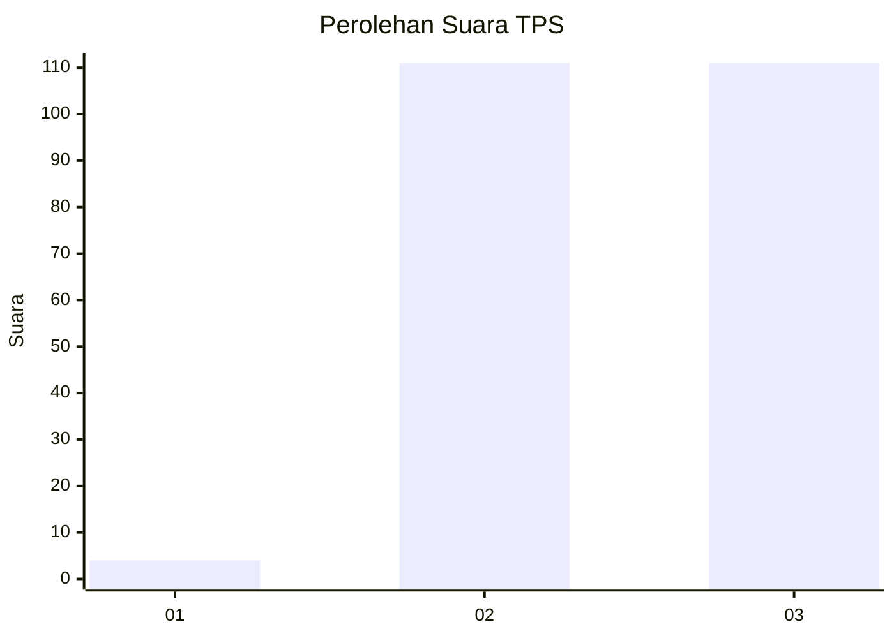
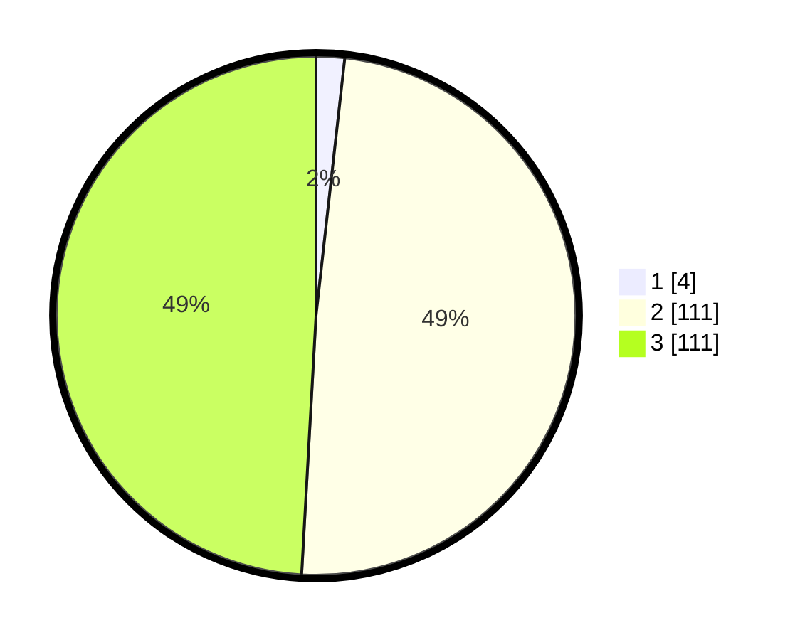

# Hasil

## Grafik

## Tabel

| No. | Nama Paslon    | Suara | Suara (raw) | Persentase |
|:--- |:-------------- | -----:| -----------:| ----------:|
| 1   | ANIES MUHAIMIN | 4     | [4][p-1]    | 1,77       |
| 2   | PRABOWO GIBRAN | 111   | [111][p-2]  | 49,12      |
| 3   | GANJAR MAHFUD  | 111   | [111][p-3]  | 49,12      |

[p-1]: https://github.com/gigit-pemilu/pemilu-2024-51-bali/blob/main/pilpres/hitung-suara/sub/51-bali/sub/08-buleleng/sub/06-buleleng/sub/2028-penglatan/sub/005-tps/sub/paslon-1.txt
[p-2]: https://github.com/gigit-pemilu/pemilu-2024-51-bali/blob/main/pilpres/hitung-suara/sub/51-bali/sub/08-buleleng/sub/06-buleleng/sub/2028-penglatan/sub/005-tps/sub/paslon-2.txt
[p-3]: https://github.com/gigit-pemilu/pemilu-2024-51-bali/blob/main/pilpres/hitung-suara/sub/51-bali/sub/08-buleleng/sub/06-buleleng/sub/2028-penglatan/sub/005-tps/sub/paslon-3.txt

## Foto C Plano

https://sirekap-obj-formc.kpu.go.id/090e/pemilu/ppwp/51/08/06/20/28/5108062028005-20240214-191857--14ae89f7-1be0-4a88-943f-10a97ffa47c5.jpg

https://sirekap-obj-formc.kpu.go.id/090e/pemilu/ppwp/51/08/06/20/28/5108062028005-20240215-001444--90f5d864-e777-44bb-aab3-45f9d2282b48.jpg

https://sirekap-obj-formc.kpu.go.id/090e/pemilu/ppwp/51/08/06/20/28/5108062028005-20240214-192500--8fdbcfa9-092e-4499-9b08-44a9ed8d879e.jpg

## Metadata

| Key        | Value               |
| ---------- | ------------------- |
| Time Stamp | 2024-02-24 22:31:28 |

