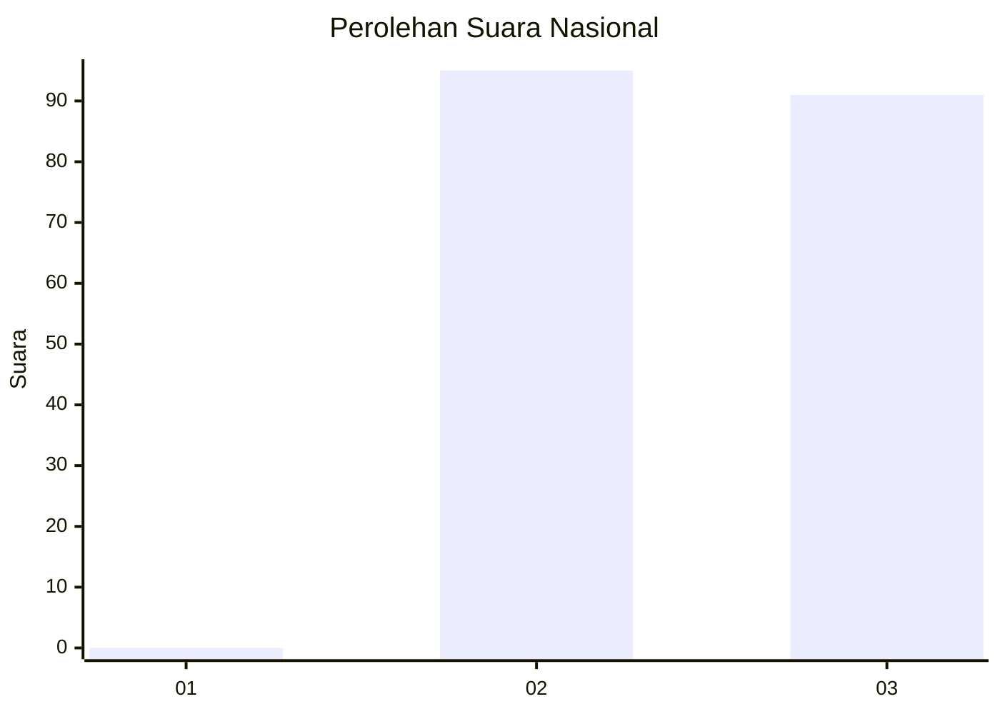
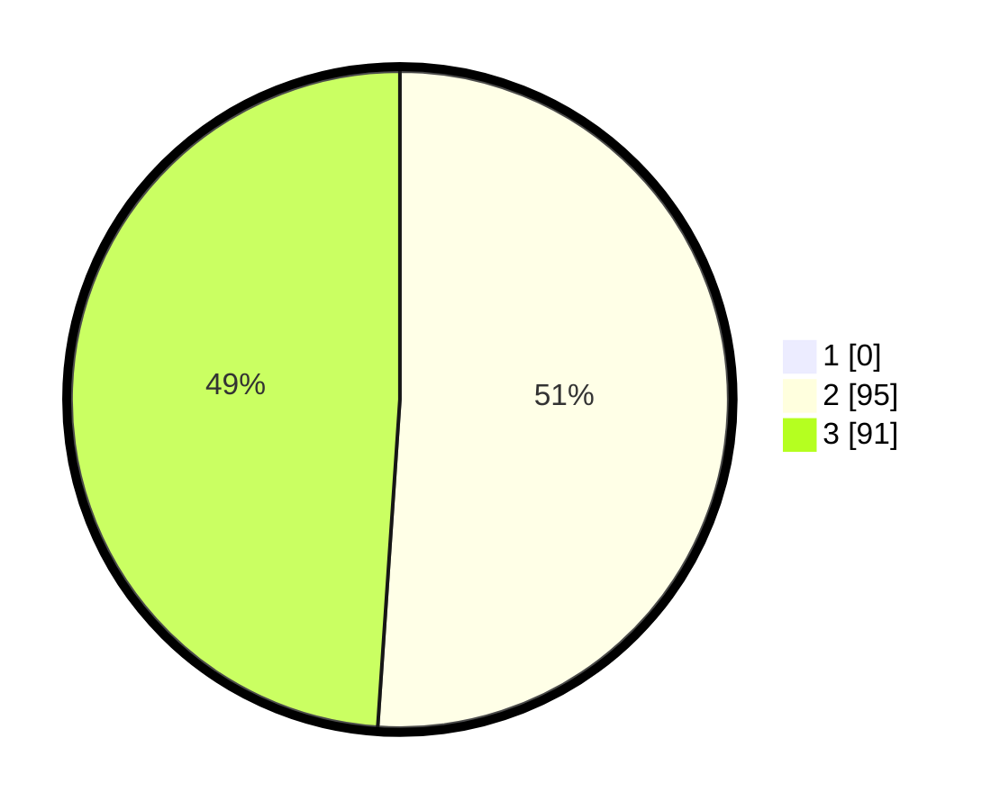

# Hasil

## Grafik

## Tabel

| No. | Nama Paslon    | Suara | Suara (raw) | Persentase |
|:--- |:-------------- | -----:| -----------:| ----------:|
| 1   | ANIES MUHAIMIN | 0     | [0][p-1]    | 0,00       |
| 2   | PRABOWO GIBRAN | 95    | [95][p-2]   | 51,08      |
| 3   | GANJAR MAHFUD  | 91    | [91][p-3]   | 48,92      |

[p-1]: https://github.com/gigit-pemilu/pemilu-2024/blob/main/pilpres/hitung-suara/sub/51-bali/sub/08-buleleng/sub/06-buleleng/sub/2028-penglatan/sub/006-tps/sub/paslon-1.txt
[p-2]: https://github.com/gigit-pemilu/pemilu-2024/blob/main/pilpres/hitung-suara/sub/51-bali/sub/08-buleleng/sub/06-buleleng/sub/2028-penglatan/sub/006-tps/sub/paslon-2.txt
[p-3]: https://github.com/gigit-pemilu/pemilu-2024/blob/main/pilpres/hitung-suara/sub/51-bali/sub/08-buleleng/sub/06-buleleng/sub/2028-penglatan/sub/006-tps/sub/paslon-3.txt

## Foto C Plano

https://sirekap-obj-formc.kpu.go.id/1bbb/pemilu/ppwp/51/08/06/20/28/5108062028006-20240214-211342--79fa00ad-dc4a-40e7-a36f-1200081a7c2b.jpg

https://sirekap-obj-formc.kpu.go.id/1bbb/pemilu/ppwp/51/08/06/20/28/5108062028006-20240214-211436--8a4dbe60-9414-40ab-adaf-bd792e668655.jpg

https://sirekap-obj-formc.kpu.go.id/1bbb/pemilu/ppwp/51/08/06/20/28/5108062028006-20240214-211526--24d9b7ae-50fb-42cf-bda8-39d265a3b88e.jpg

## Metadata

| Key        | Value               |
| ---------- | ------------------- |
| Time Stamp | 2024-02-24 22:31:28 |

