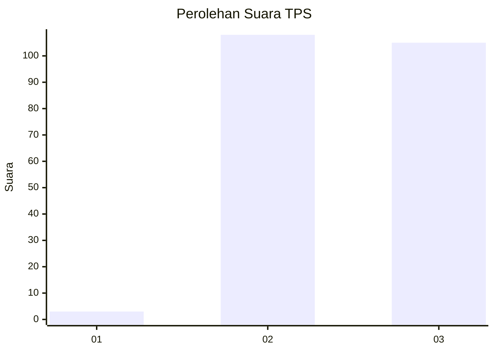
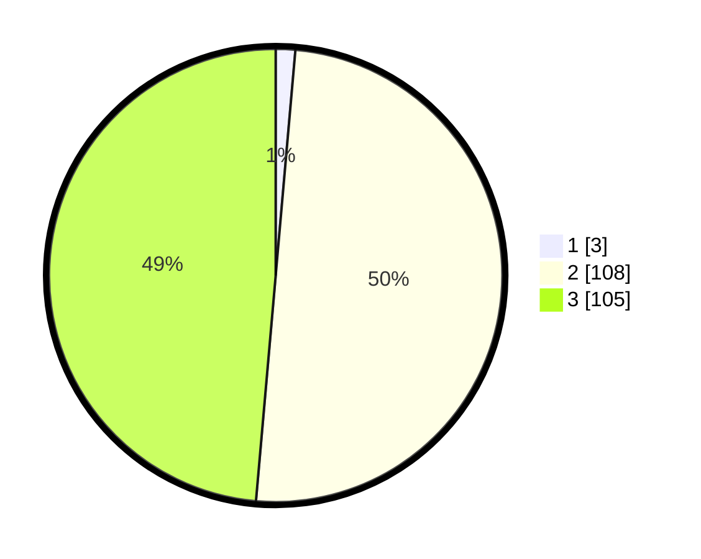

# Hasil

## Grafik

## Tabel

| No. | Nama Paslon    | Suara | Suara (raw) | Persentase |
|:--- |:-------------- | -----:| -----------:| ----------:|
| 1   | ANIES MUHAIMIN | 3     | [3][p-1]    | 1,39       |
| 2   | PRABOWO GIBRAN | 108   | [108][p-2]  | 50,00      |
| 3   | GANJAR MAHFUD  | 105   | [105][p-3]  | 48,61      |

[p-1]: https://github.com/gigit-pemilu/pemilu-2024-51-bali/blob/main/pilpres/hitung-suara/sub/51-bali/sub/08-buleleng/sub/07-sawan/sub/2001-lemukih/sub/001-tps/sub/paslon-1.txt
[p-2]: https://github.com/gigit-pemilu/pemilu-2024-51-bali/blob/main/pilpres/hitung-suara/sub/51-bali/sub/08-buleleng/sub/07-sawan/sub/2001-lemukih/sub/001-tps/sub/paslon-2.txt
[p-3]: https://github.com/gigit-pemilu/pemilu-2024-51-bali/blob/main/pilpres/hitung-suara/sub/51-bali/sub/08-buleleng/sub/07-sawan/sub/2001-lemukih/sub/001-tps/sub/paslon-3.txt

## Foto C Plano

https://sirekap-obj-formc.kpu.go.id/2b32/pemilu/ppwp/51/08/07/20/01/5108072001001-20240214-233052--d1d6c523-12f1-4922-8ecb-a82bf80e6285.jpg

https://sirekap-obj-formc.kpu.go.id/2b32/pemilu/ppwp/51/08/07/20/01/5108072001001-20240214-225527--2b67b524-061d-4b69-b040-881551992562.jpg

https://sirekap-obj-formc.kpu.go.id/2b32/pemilu/ppwp/51/08/07/20/01/5108072001001-20240214-233228--a2a246dd-c7ae-47b5-95ee-9f79c74bb144.jpg

## Metadata

| Key        | Value               |
| ---------- | ------------------- |
| Time Stamp | 2024-02-24 22:31:28 |

