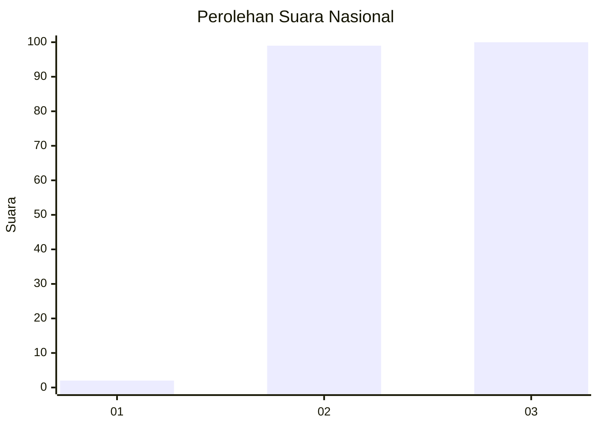
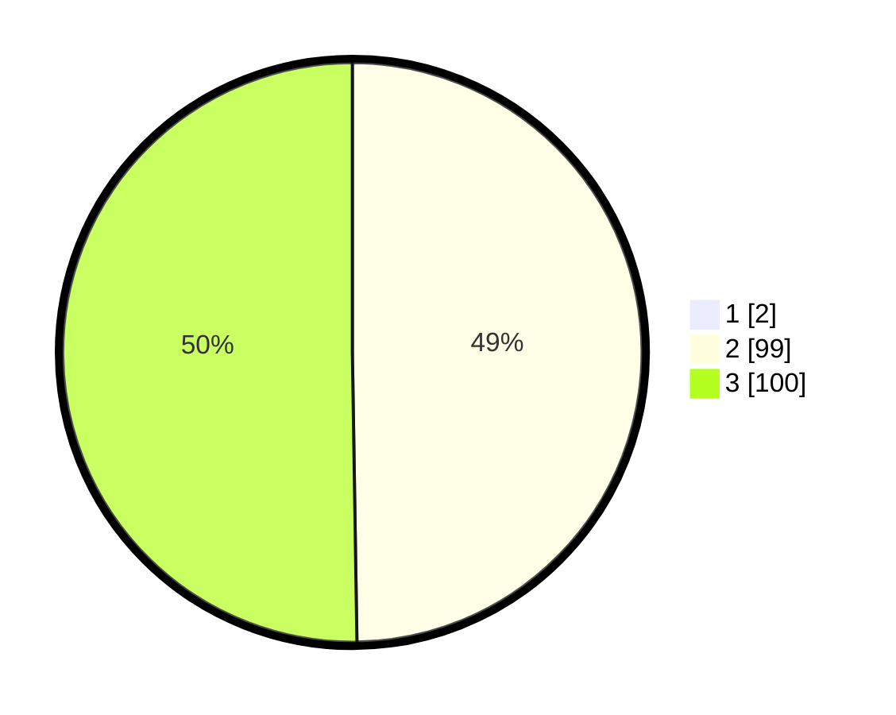

# Hasil

## Grafik

## Tabel

| No. | Nama Paslon    | Suara | Suara (raw) | Persentase |
|:--- |:-------------- | -----:| -----------:| ----------:|
| 1   | ANIES MUHAIMIN | 2     | [2][p-1]    | 1,00       |
| 2   | PRABOWO GIBRAN | 99    | [99][p-2]   | 49,25      |
| 3   | GANJAR MAHFUD  | 100   | [100][p-3]  | 49,75      |

[p-1]: https://github.com/gigit-pemilu/pemilu-2024/blob/main/pilpres/hitung-suara/sub/51-bali/sub/08-buleleng/sub/07-sawan/sub/2001-lemukih/sub/006-tps/sub/paslon-1.txt
[p-2]: https://github.com/gigit-pemilu/pemilu-2024/blob/main/pilpres/hitung-suara/sub/51-bali/sub/08-buleleng/sub/07-sawan/sub/2001-lemukih/sub/006-tps/sub/paslon-2.txt
[p-3]: https://github.com/gigit-pemilu/pemilu-2024/blob/main/pilpres/hitung-suara/sub/51-bali/sub/08-buleleng/sub/07-sawan/sub/2001-lemukih/sub/006-tps/sub/paslon-3.txt

## Foto C Plano

https://sirekap-obj-formc.kpu.go.id/69cd/pemilu/ppwp/51/08/07/20/01/5108072001006-20240214-221241--aff1a16d-fc96-4a7d-a314-656c071383d3.jpg

https://sirekap-obj-formc.kpu.go.id/69cd/pemilu/ppwp/51/08/07/20/01/5108072001006-20240214-221450--f3c9362b-11dd-4db7-96a1-82a322a07f94.jpg

https://sirekap-obj-formc.kpu.go.id/69cd/pemilu/ppwp/51/08/07/20/01/5108072001006-20240214-221554--64a371f9-735a-4e49-8de0-fca571a9a2aa.jpg

## Metadata

| Key        | Value               |
| ---------- | ------------------- |
| Time Stamp | 2024-02-25 17:00:00 |

