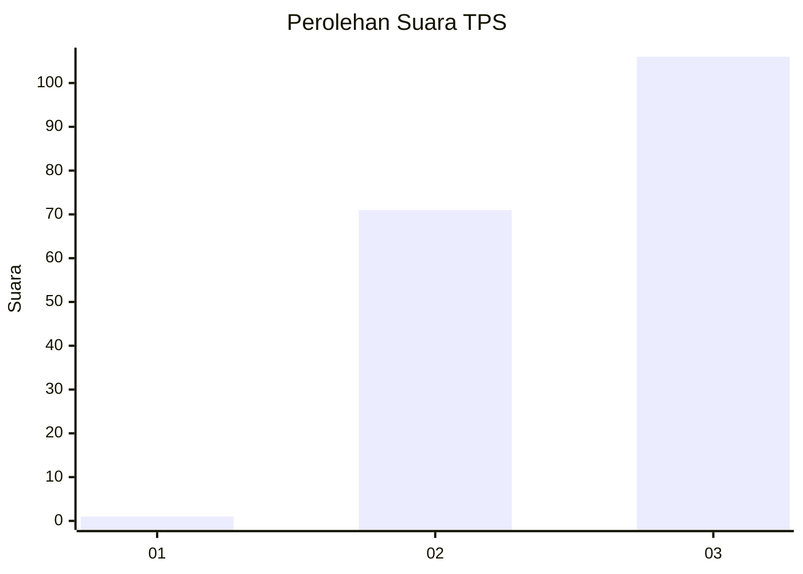
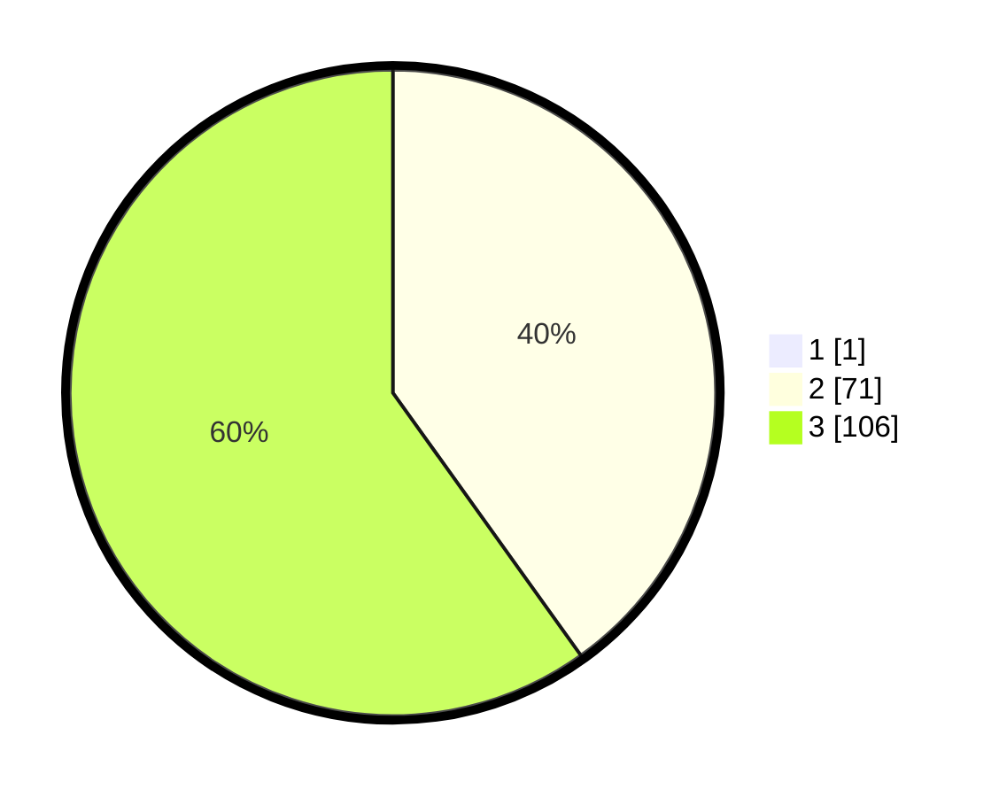

# Hasil

## Grafik

## Tabel

| No. | Nama Paslon    | Suara | Suara (raw) | Persentase |
|:--- |:-------------- | -----:| -----------:| ----------:|
| 1   | ANIES MUHAIMIN | 1     | [1][p-1]    | 0,56       |
| 2   | PRABOWO GIBRAN | 71    | [71][p-2]   | 39,89      |
| 3   | GANJAR MAHFUD  | 106   | [106][p-3]  | 59,55      |

[p-1]: https://github.com/gigit-pemilu/pemilu-2024-51-bali/blob/main/pilpres/hitung-suara/sub/51-bali/sub/08-buleleng/sub/07-sawan/sub/2001-lemukih/sub/008-tps/sub/paslon-1.txt
[p-2]: https://github.com/gigit-pemilu/pemilu-2024-51-bali/blob/main/pilpres/hitung-suara/sub/51-bali/sub/08-buleleng/sub/07-sawan/sub/2001-lemukih/sub/008-tps/sub/paslon-2.txt
[p-3]: https://github.com/gigit-pemilu/pemilu-2024-51-bali/blob/main/pilpres/hitung-suara/sub/51-bali/sub/08-buleleng/sub/07-sawan/sub/2001-lemukih/sub/008-tps/sub/paslon-3.txt

## Foto C Plano

https://sirekap-obj-formc.kpu.go.id/de82/pemilu/ppwp/51/08/07/20/01/5108072001008-20240214-195039--a5ce1924-b48a-4fd6-bcbf-00a1f3427e5a.jpg

https://sirekap-obj-formc.kpu.go.id/de82/pemilu/ppwp/51/08/07/20/01/5108072001008-20240214-195126--a358ed97-966d-4d22-abba-9059820447d1.jpg

https://sirekap-obj-formc.kpu.go.id/de82/pemilu/ppwp/51/08/07/20/01/5108072001008-20240214-195205--581c8761-e12f-4e03-8ce6-d37baacc1bce.jpg

## Metadata

| Key        | Value               |
| ---------- | ------------------- |
| Time Stamp | 2024-02-24 22:31:28 |

