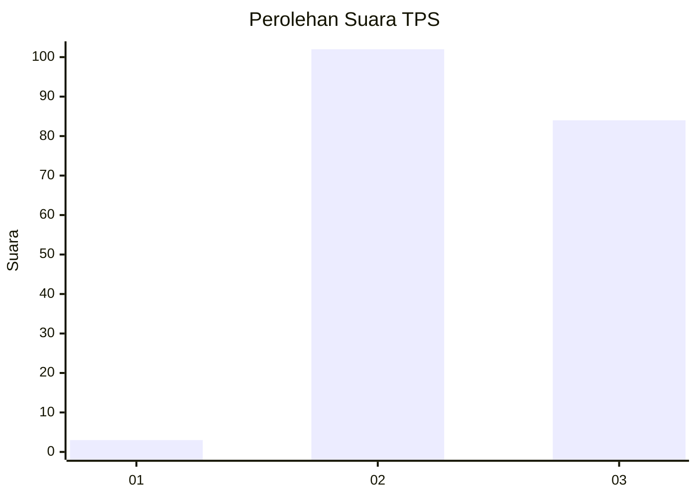
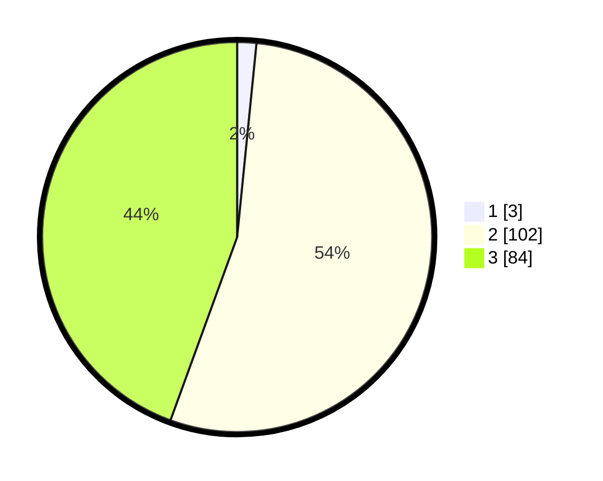

# Hasil

## Grafik

## Tabel

| No. | Nama Paslon    | Suara | Suara (raw) | Persentase |
|:--- |:-------------- | -----:| -----------:| ----------:|
| 1   | ANIES MUHAIMIN | 3     | [3][p-1]    | 1,59       |
| 2   | PRABOWO GIBRAN | 102   | [102][p-2]  | 53,97      |
| 3   | GANJAR MAHFUD  | 84    | [84][p-3]   | 44,44      |

[p-1]: https://github.com/gigit-pemilu/pemilu-2024-51-bali/blob/main/pilpres/hitung-suara/sub/51-bali/sub/08-buleleng/sub/07-sawan/sub/2001-lemukih/sub/009-tps/sub/paslon-1.txt
[p-2]: https://github.com/gigit-pemilu/pemilu-2024-51-bali/blob/main/pilpres/hitung-suara/sub/51-bali/sub/08-buleleng/sub/07-sawan/sub/2001-lemukih/sub/009-tps/sub/paslon-2.txt
[p-3]: https://github.com/gigit-pemilu/pemilu-2024-51-bali/blob/main/pilpres/hitung-suara/sub/51-bali/sub/08-buleleng/sub/07-sawan/sub/2001-lemukih/sub/009-tps/sub/paslon-3.txt

## Foto C Plano

https://sirekap-obj-formc.kpu.go.id/0bea/pemilu/ppwp/51/08/07/20/01/5108072001009-20240214-222043--fcd23015-cf54-4aad-8c8e-c7ecf442e0d1.jpg

https://sirekap-obj-formc.kpu.go.id/0bea/pemilu/ppwp/51/08/07/20/01/5108072001009-20240214-222303--c2488d5e-b693-4b3e-aff7-920977c87fed.jpg

https://sirekap-obj-formc.kpu.go.id/0bea/pemilu/ppwp/51/08/07/20/01/5108072001009-20240214-222521--0f5149d1-61ea-454c-a68a-899a08628cfb.jpg

## Metadata

| Key        | Value               |
| ---------- | ------------------- |
| Time Stamp | 2024-02-24 22:31:28 |

