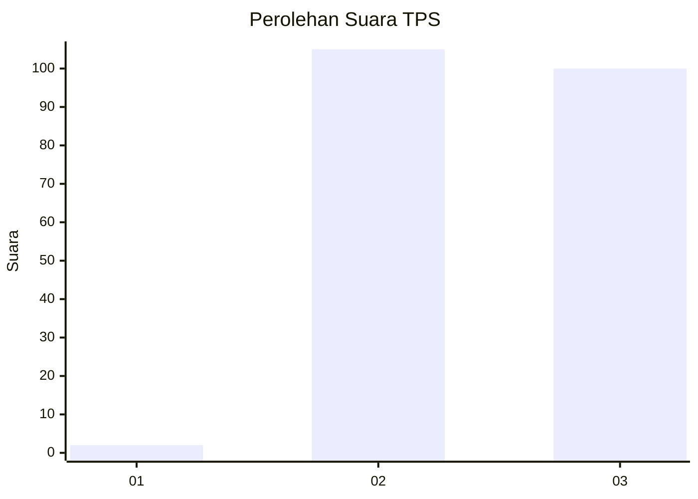
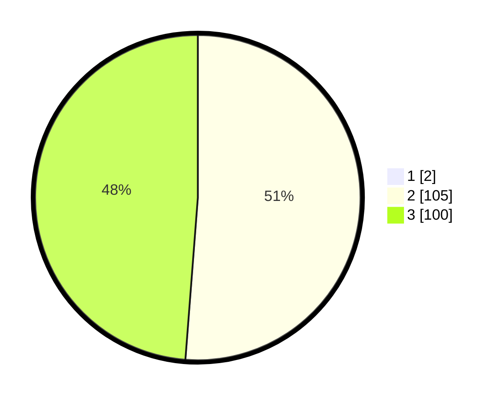

# Hasil

## Grafik

## Tabel

| No. | Nama Paslon    | Suara | Suara (raw) | Persentase |
|:--- |:-------------- | -----:| -----------:| ----------:|
| 1   | ANIES MUHAIMIN | 2     | [2][p-1]    | 0,97       |
| 2   | PRABOWO GIBRAN | 105   | [105][p-2]  | 50,72      |
| 3   | GANJAR MAHFUD  | 100   | [100][p-3]  | 48,31      |

[p-1]: https://github.com/gigit-pemilu/pemilu-2024-51-bali/blob/main/pilpres/hitung-suara/sub/51-bali/sub/08-buleleng/sub/07-sawan/sub/2002-galungan/sub/002-tps/sub/paslon-1.txt
[p-2]: https://github.com/gigit-pemilu/pemilu-2024-51-bali/blob/main/pilpres/hitung-suara/sub/51-bali/sub/08-buleleng/sub/07-sawan/sub/2002-galungan/sub/002-tps/sub/paslon-2.txt
[p-3]: https://github.com/gigit-pemilu/pemilu-2024-51-bali/blob/main/pilpres/hitung-suara/sub/51-bali/sub/08-buleleng/sub/07-sawan/sub/2002-galungan/sub/002-tps/sub/paslon-3.txt

## Foto C Plano

https://sirekap-obj-formc.kpu.go.id/ee20/pemilu/ppwp/51/08/07/20/02/5108072002002-20240214-213433--d0367aab-57c1-4517-9e86-fe1b657be45b.jpg

https://sirekap-obj-formc.kpu.go.id/ee20/pemilu/ppwp/51/08/07/20/02/5108072002002-20240214-213828--8332d69e-e5f7-45ca-b32a-38633b50b700.jpg

https://sirekap-obj-formc.kpu.go.id/ee20/pemilu/ppwp/51/08/07/20/02/5108072002002-20240214-213950--d09c82aa-c903-47a3-9538-1a1f8afd011a.jpg

## Metadata

| Key        | Value               |
| ---------- | ------------------- |
| Time Stamp | 2024-02-24 22:31:28 |

