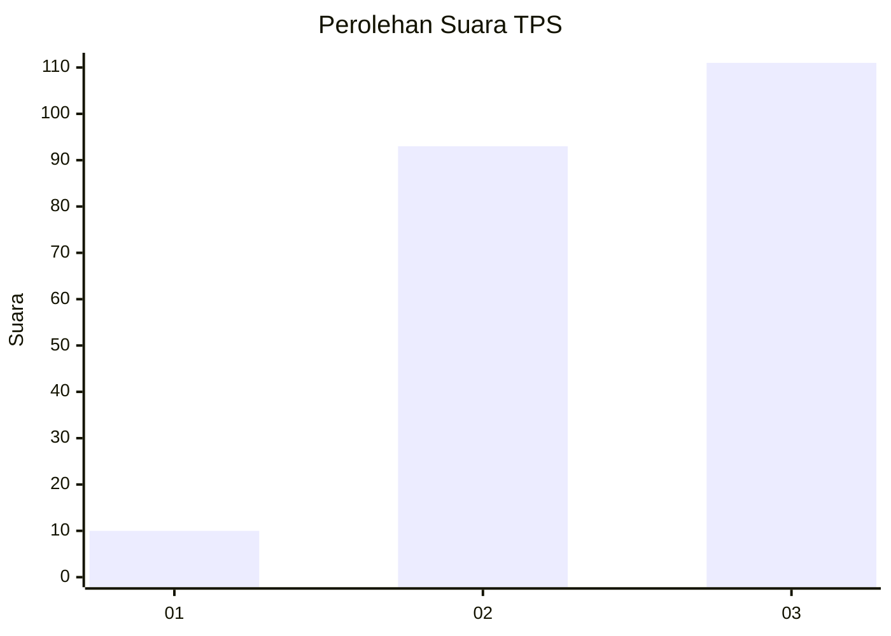
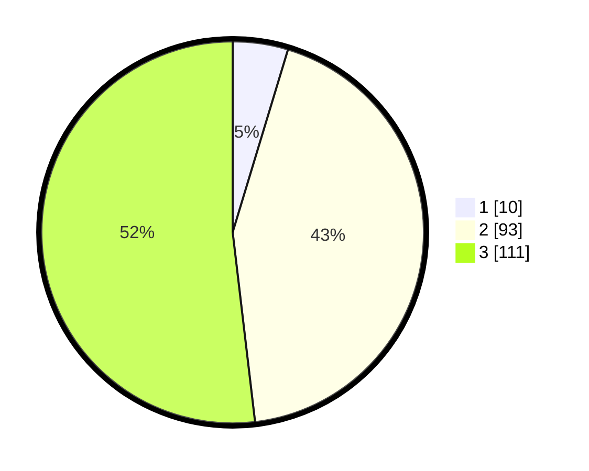

# Hasil

## Grafik

## Tabel

| No. | Nama Paslon    | Suara | Suara (raw) | Persentase |
|:--- |:-------------- | -----:| -----------:| ----------:|
| 1   | ANIES MUHAIMIN | 10    | [10][p-1]   | 4,67       |
| 2   | PRABOWO GIBRAN | 93    | [93][p-2]   | 43,46      |
| 3   | GANJAR MAHFUD  | 111   | [111][p-3]  | 51,87      |

[p-1]: https://github.com/gigit-pemilu/pemilu-2024-51-bali/blob/main/pilpres/hitung-suara/sub/51-bali/sub/08-buleleng/sub/07-sawan/sub/2002-galungan/sub/003-tps/sub/paslon-1.txt
[p-2]: https://github.com/gigit-pemilu/pemilu-2024-51-bali/blob/main/pilpres/hitung-suara/sub/51-bali/sub/08-buleleng/sub/07-sawan/sub/2002-galungan/sub/003-tps/sub/paslon-2.txt
[p-3]: https://github.com/gigit-pemilu/pemilu-2024-51-bali/blob/main/pilpres/hitung-suara/sub/51-bali/sub/08-buleleng/sub/07-sawan/sub/2002-galungan/sub/003-tps/sub/paslon-3.txt

## Foto C Plano

https://sirekap-obj-formc.kpu.go.id/388a/pemilu/ppwp/51/08/07/20/02/5108072002003-20240214-221330--2b203ee8-c4e2-422e-87e0-ec6dcdb226f8.jpg

https://sirekap-obj-formc.kpu.go.id/388a/pemilu/ppwp/51/08/07/20/02/5108072002003-20240214-221354--38fe8c76-447c-4add-9fa8-071f95f202d6.jpg

https://sirekap-obj-formc.kpu.go.id/388a/pemilu/ppwp/51/08/07/20/02/5108072002003-20240214-221402--1a647bf2-6dbd-482f-bf9d-2b408ed89a36.jpg

## Metadata

| Key        | Value               |
| ---------- | ------------------- |
| Time Stamp | 2024-02-24 22:31:28 |

