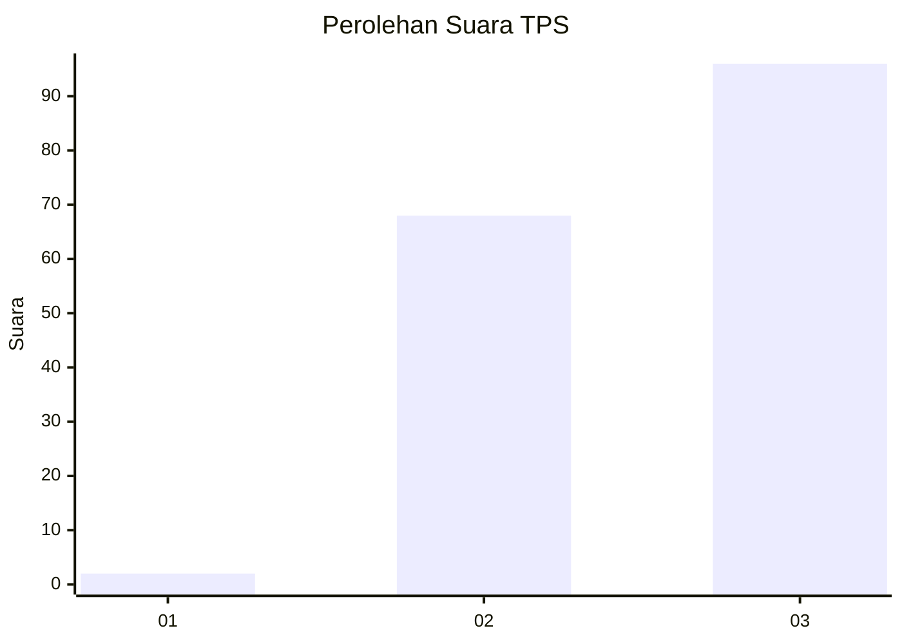
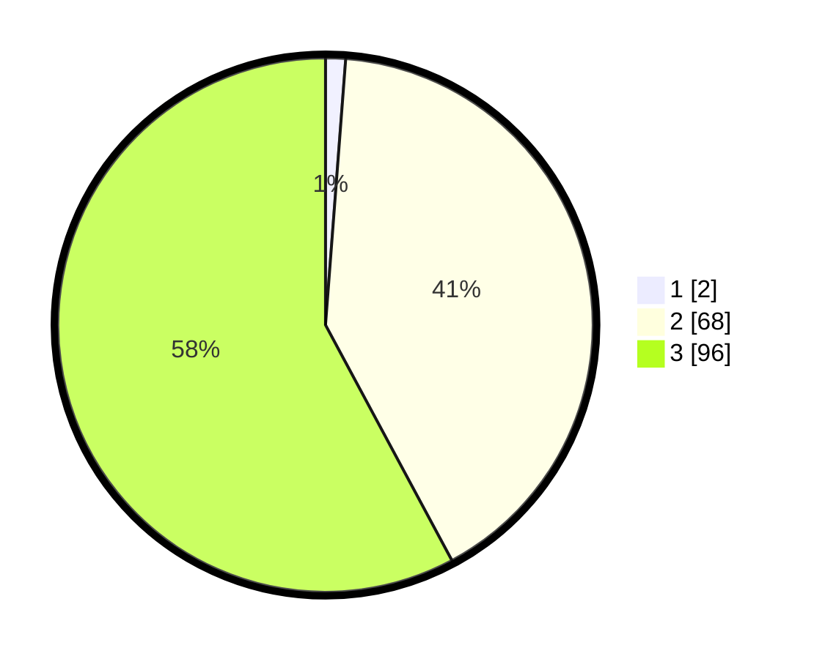

# Hasil

## Grafik

## Tabel

| No. | Nama Paslon    | Suara | Suara (raw) | Persentase |
|:--- |:-------------- | -----:| -----------:| ----------:|
| 1   | ANIES MUHAIMIN | 2     | [2][p-1]    | 1,20       |
| 2   | PRABOWO GIBRAN | 68    | [68][p-2]   | 40,96      |
| 3   | GANJAR MAHFUD  | 96    | [96][p-3]   | 57,83      |

[p-1]: https://github.com/gigit-pemilu/pemilu-2024-51-bali/blob/main/pilpres/hitung-suara/sub/51-bali/sub/08-buleleng/sub/07-sawan/sub/2002-galungan/sub/005-tps/sub/paslon-1.txt
[p-2]: https://github.com/gigit-pemilu/pemilu-2024-51-bali/blob/main/pilpres/hitung-suara/sub/51-bali/sub/08-buleleng/sub/07-sawan/sub/2002-galungan/sub/005-tps/sub/paslon-2.txt
[p-3]: https://github.com/gigit-pemilu/pemilu-2024-51-bali/blob/main/pilpres/hitung-suara/sub/51-bali/sub/08-buleleng/sub/07-sawan/sub/2002-galungan/sub/005-tps/sub/paslon-3.txt

## Foto C Plano

https://sirekap-obj-formc.kpu.go.id/4772/pemilu/ppwp/51/08/07/20/02/5108072002005-20240214-222425--0e63f3c6-20d6-40eb-84f7-ed5acd860686.jpg

https://sirekap-obj-formc.kpu.go.id/4772/pemilu/ppwp/51/08/07/20/02/5108072002005-20240214-222516--fbd8ae8e-f6e9-442b-853e-0d03d94aaee9.jpg

https://sirekap-obj-formc.kpu.go.id/4772/pemilu/ppwp/51/08/07/20/02/5108072002005-20240214-222547--80d5278a-34d0-4cd1-b369-f94bcfa1f026.jpg

## Metadata

| Key        | Value               |
| ---------- | ------------------- |
| Time Stamp | 2024-02-24 22:31:28 |

