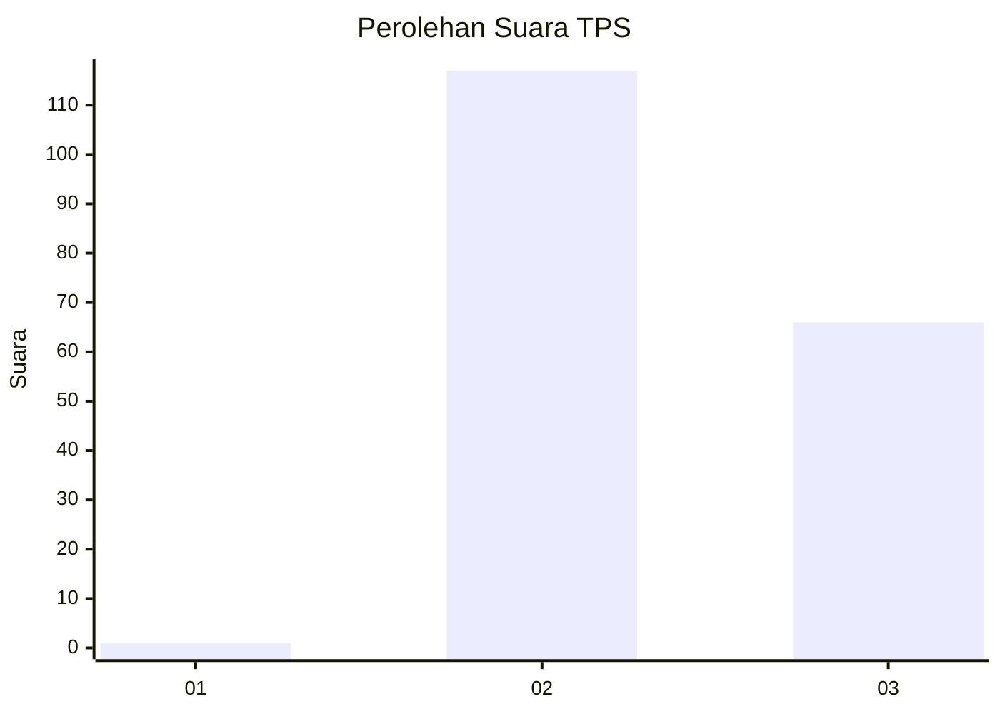
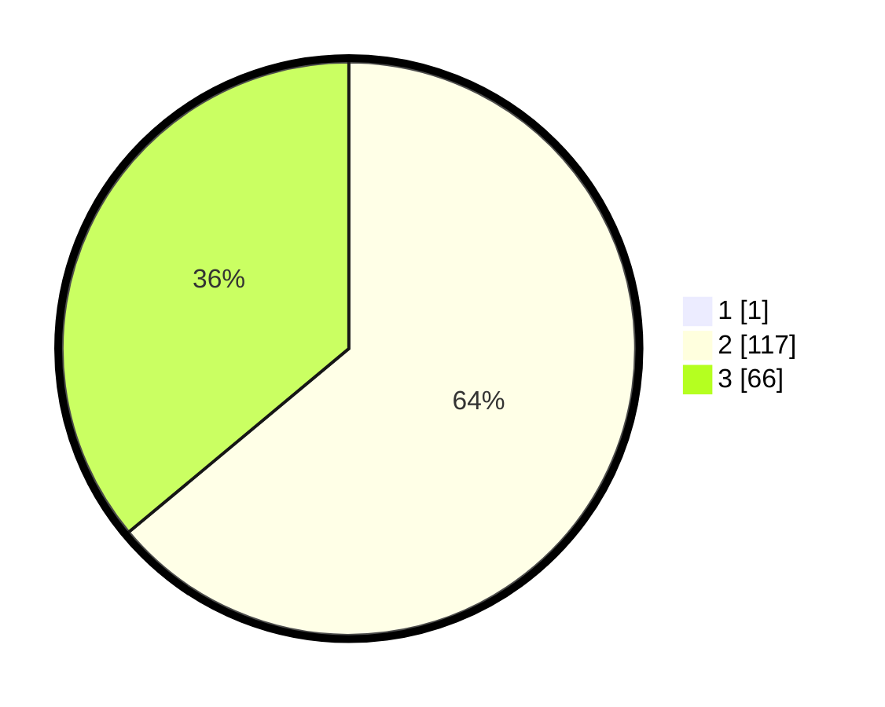

# Hasil

## Grafik

## Tabel

| No. | Nama Paslon    | Suara | Suara (raw) | Persentase |
|:--- |:-------------- | -----:| -----------:| ----------:|
| 1   | ANIES MUHAIMIN | 1     | [1][p-1]    | 0,54       |
| 2   | PRABOWO GIBRAN | 117   | [117][p-2]  | 63,59      |
| 3   | GANJAR MAHFUD  | 66    | [66][p-3]   | 35,87      |

[p-1]: https://github.com/gigit-pemilu/pemilu-2024-51-bali/blob/main/pilpres/hitung-suara/sub/51-bali/sub/08-buleleng/sub/07-sawan/sub/2004-bebetin/sub/005-tps/sub/paslon-1.txt
[p-2]: https://github.com/gigit-pemilu/pemilu-2024-51-bali/blob/main/pilpres/hitung-suara/sub/51-bali/sub/08-buleleng/sub/07-sawan/sub/2004-bebetin/sub/005-tps/sub/paslon-2.txt
[p-3]: https://github.com/gigit-pemilu/pemilu-2024-51-bali/blob/main/pilpres/hitung-suara/sub/51-bali/sub/08-buleleng/sub/07-sawan/sub/2004-bebetin/sub/005-tps/sub/paslon-3.txt

## Foto C Plano

https://sirekap-obj-formc.kpu.go.id/fdf5/pemilu/ppwp/51/08/07/20/04/5108072004005-20240214-220538--c4dc47c8-7855-45ab-9287-81b184f6a996.jpg

https://sirekap-obj-formc.kpu.go.id/fdf5/pemilu/ppwp/51/08/07/20/04/5108072004005-20240214-220742--997dd96e-c53b-423c-99a9-4895c5b8ede0.jpg

https://sirekap-obj-formc.kpu.go.id/fdf5/pemilu/ppwp/51/08/07/20/04/5108072004005-20240214-220923--a0e81457-23be-468e-8a6d-9ea4498c5216.jpg

## Metadata

| Key        | Value               |
| ---------- | ------------------- |
| Time Stamp | 2024-02-15 09:00:24 |

