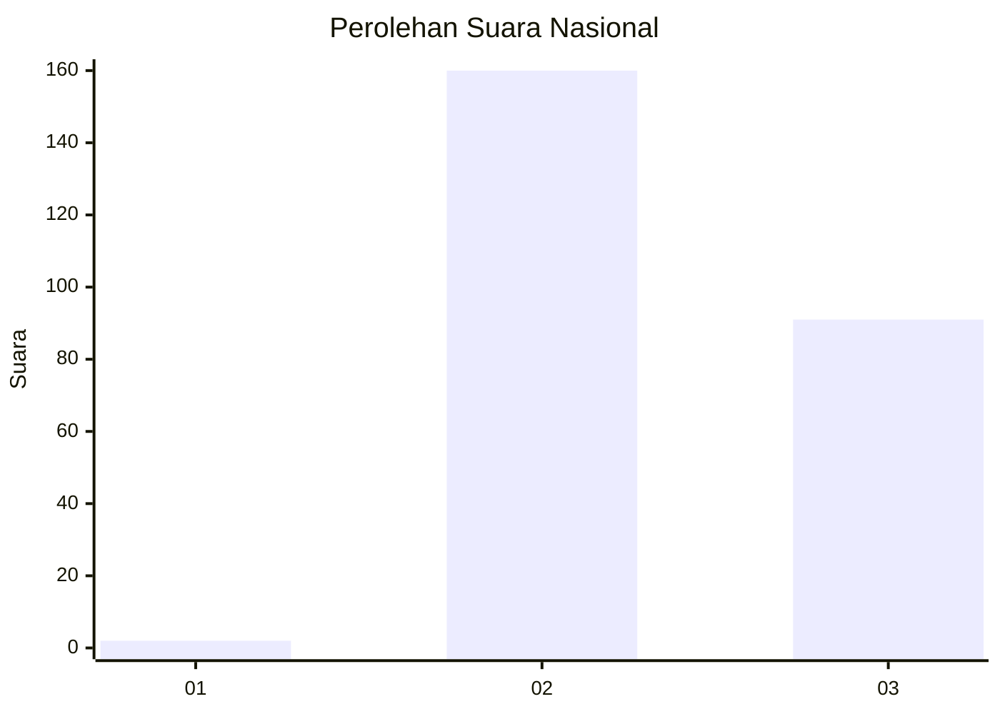
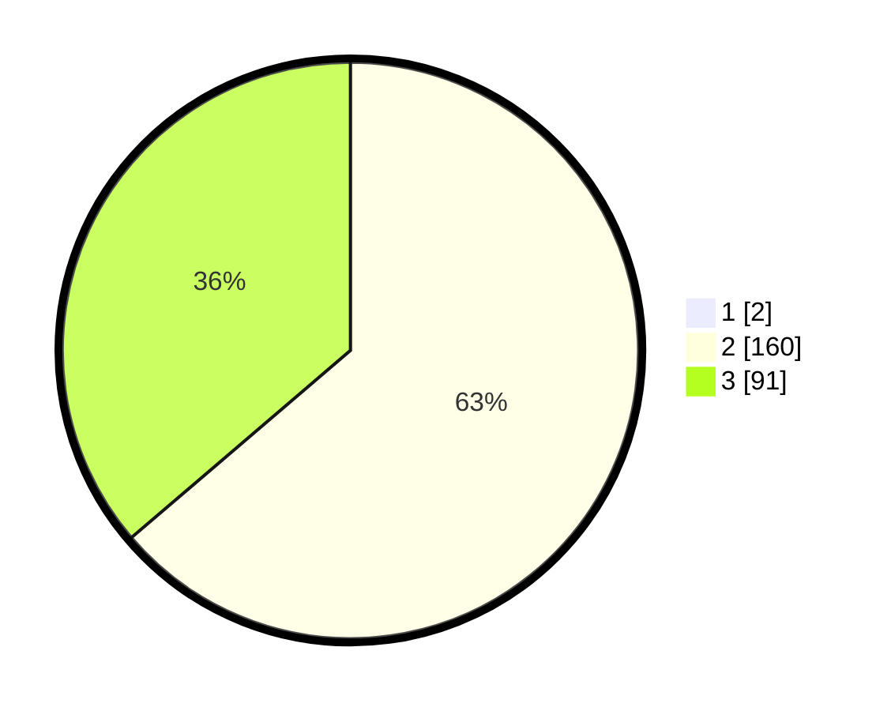

# Hasil

## Grafik

## Tabel

| No. | Nama Paslon    | Suara | Suara (raw) | Persentase |
|:--- |:-------------- | -----:| -----------:| ----------:|
| 1   | ANIES MUHAIMIN | 2     | [2][p-1]    | 0,79       |
| 2   | PRABOWO GIBRAN | 160   | [160][p-2]  | 63,24      |
| 3   | GANJAR MAHFUD  | 91    | [91][p-3]   | 35,97      |

[p-1]: https://github.com/gigit-pemilu/pemilu-2024/blob/main/pilpres/hitung-suara/sub/51-bali/sub/08-buleleng/sub/07-sawan/sub/2004-bebetin/sub/007-tps/sub/paslon-1.txt
[p-2]: https://github.com/gigit-pemilu/pemilu-2024/blob/main/pilpres/hitung-suara/sub/51-bali/sub/08-buleleng/sub/07-sawan/sub/2004-bebetin/sub/007-tps/sub/paslon-2.txt
[p-3]: https://github.com/gigit-pemilu/pemilu-2024/blob/main/pilpres/hitung-suara/sub/51-bali/sub/08-buleleng/sub/07-sawan/sub/2004-bebetin/sub/007-tps/sub/paslon-3.txt

## Foto C Plano

https://sirekap-obj-formc.kpu.go.id/a311/pemilu/ppwp/51/08/07/20/04/5108072004007-20240214-212430--e378be7a-47ad-42ec-a5c5-7075a674e59b.jpg

https://sirekap-obj-formc.kpu.go.id/a311/pemilu/ppwp/51/08/07/20/04/5108072004007-20240214-212754--671d8a9d-e409-4f7c-962d-80ad350339fc.jpg

https://sirekap-obj-formc.kpu.go.id/a311/pemilu/ppwp/51/08/07/20/04/5108072004007-20240214-213057--c27762f3-6b95-4b49-a21f-78869c89d0c1.jpg

## Metadata

| Key        | Value               |
| ---------- | ------------------- |
| Time Stamp | 2024-02-24 22:31:28 |

