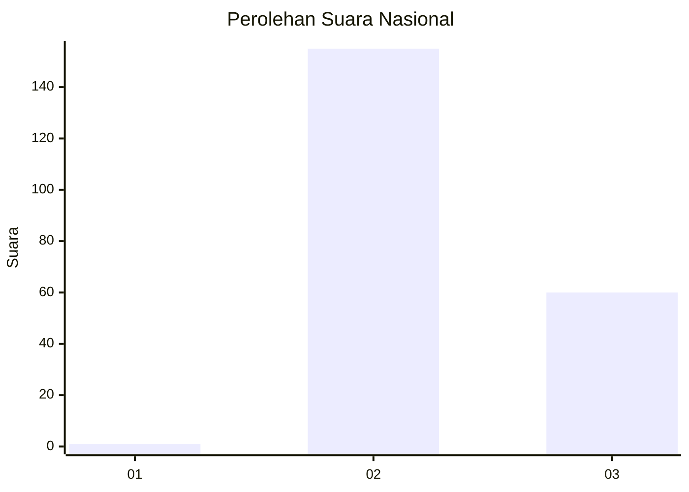
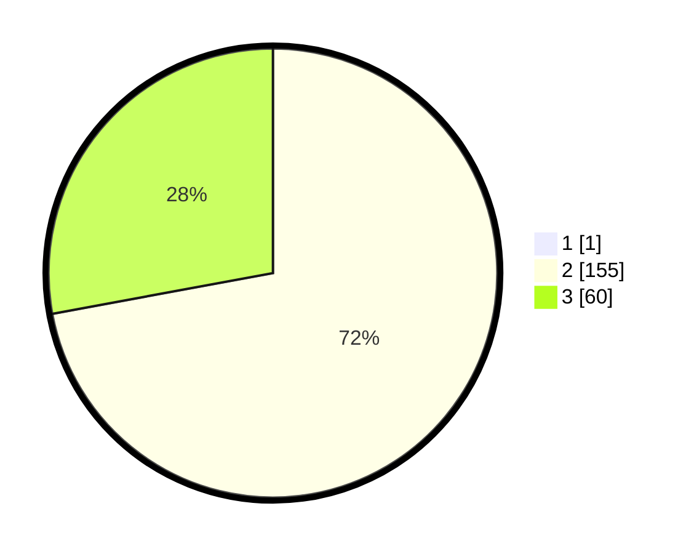

# Hasil

## Grafik

## Tabel

| No. | Nama Paslon    | Suara | Suara (raw) | Persentase |
|:--- |:-------------- | -----:| -----------:| ----------:|
| 1   | ANIES MUHAIMIN | 1     | [1][p-1]    | 0,46       |
| 2   | PRABOWO GIBRAN | 155   | [155][p-2]  | 71,76      |
| 3   | GANJAR MAHFUD  | 60    | [60][p-3]   | 27,78      |

[p-1]: https://github.com/gigit-pemilu/pemilu-2024/blob/main/pilpres/hitung-suara/sub/51-bali/sub/08-buleleng/sub/07-sawan/sub/2004-bebetin/sub/008-tps/sub/paslon-1.txt
[p-2]: https://github.com/gigit-pemilu/pemilu-2024/blob/main/pilpres/hitung-suara/sub/51-bali/sub/08-buleleng/sub/07-sawan/sub/2004-bebetin/sub/008-tps/sub/paslon-2.txt
[p-3]: https://github.com/gigit-pemilu/pemilu-2024/blob/main/pilpres/hitung-suara/sub/51-bali/sub/08-buleleng/sub/07-sawan/sub/2004-bebetin/sub/008-tps/sub/paslon-3.txt

## Foto C Plano

https://sirekap-obj-formc.kpu.go.id/4087/pemilu/ppwp/51/08/07/20/04/5108072004008-20240214-141214--fddb6f0b-5f10-47fb-86f6-105754fe2132.jpg

https://sirekap-obj-formc.kpu.go.id/4087/pemilu/ppwp/51/08/07/20/04/5108072004008-20240214-141401--cd722af0-9abb-4c0f-bd90-2ebeb87aa93c.jpg

https://sirekap-obj-formc.kpu.go.id/4087/pemilu/ppwp/51/08/07/20/04/5108072004008-20240214-215055--8929a321-c981-491f-8472-92d2ea3baf39.jpg

## Metadata

| Key        | Value               |
| ---------- | ------------------- |
| Time Stamp | 2024-02-15 04:00:24 |

