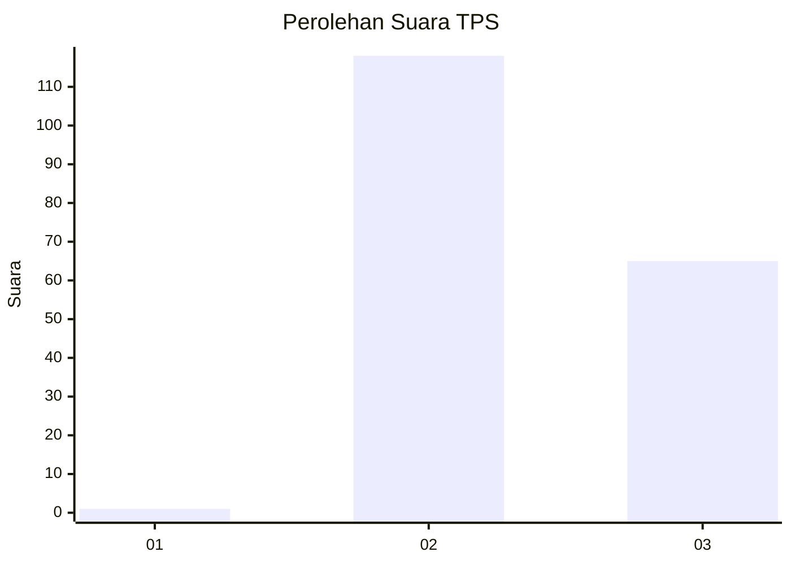
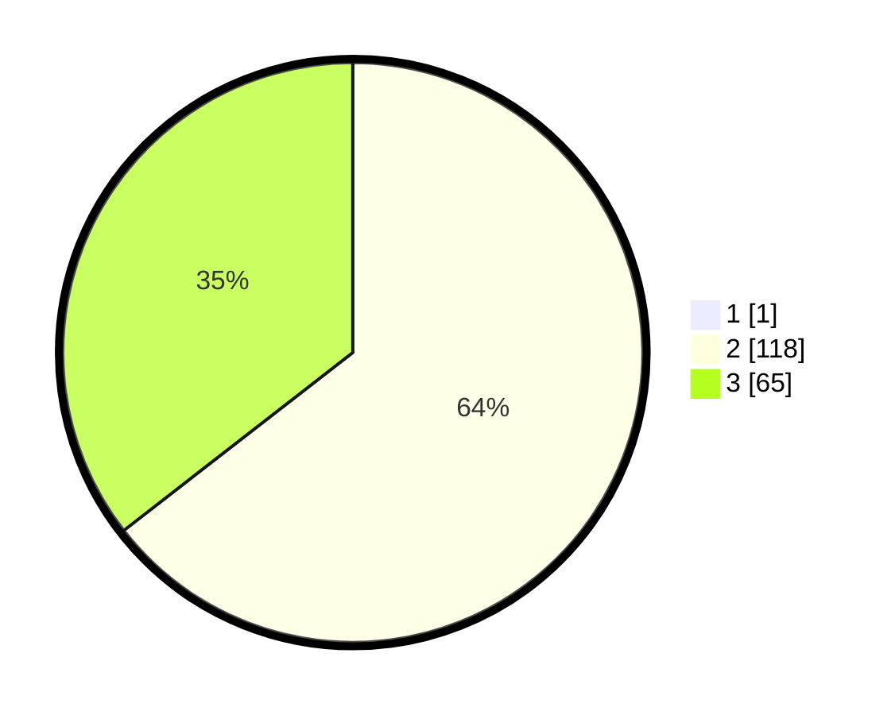

# Hasil

## Grafik

## Tabel

| No. | Nama Paslon    | Suara | Suara (raw) | Persentase |
|:--- |:-------------- | -----:| -----------:| ----------:|
| 1   | ANIES MUHAIMIN | 1     | [1][p-1]    | 0,54       |
| 2   | PRABOWO GIBRAN | 118   | [118][p-2]  | 64,13      |
| 3   | GANJAR MAHFUD  | 65    | [65][p-3]   | 35,33      |

[p-1]: https://github.com/gigit-pemilu/pemilu-2024-51-bali/blob/main/pilpres/hitung-suara/sub/51-bali/sub/08-buleleng/sub/07-sawan/sub/2004-bebetin/sub/010-tps/sub/paslon-1.txt
[p-2]: https://github.com/gigit-pemilu/pemilu-2024-51-bali/blob/main/pilpres/hitung-suara/sub/51-bali/sub/08-buleleng/sub/07-sawan/sub/2004-bebetin/sub/010-tps/sub/paslon-2.txt
[p-3]: https://github.com/gigit-pemilu/pemilu-2024-51-bali/blob/main/pilpres/hitung-suara/sub/51-bali/sub/08-buleleng/sub/07-sawan/sub/2004-bebetin/sub/010-tps/sub/paslon-3.txt

## Foto C Plano

https://sirekap-obj-formc.kpu.go.id/60d1/pemilu/ppwp/51/08/07/20/04/5108072004010-20240214-202116--45ac85bc-db6c-492c-bccb-7b5fa5ea8267.jpg

https://sirekap-obj-formc.kpu.go.id/60d1/pemilu/ppwp/51/08/07/20/04/5108072004010-20240214-225059--3c14ce17-de3b-4afe-be9a-a967c226437a.jpg

https://sirekap-obj-formc.kpu.go.id/60d1/pemilu/ppwp/51/08/07/20/04/5108072004010-20240214-202350--144fceb6-c87f-4841-9640-aacaf237f4d4.jpg

## Metadata

| Key        | Value               |
| ---------- | ------------------- |
| Time Stamp | 2024-02-24 22:31:28 |

