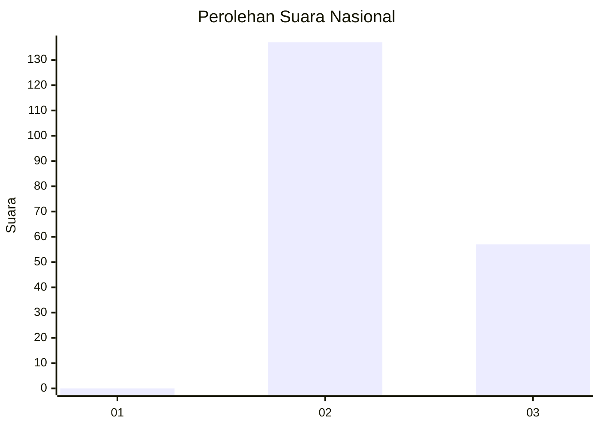
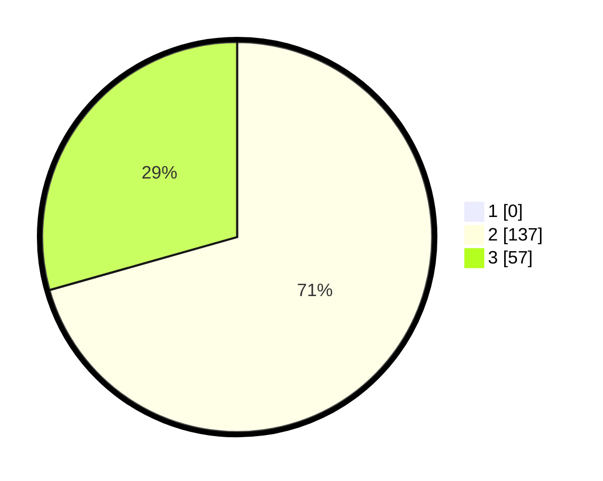

# Hasil

## Grafik

## Tabel

| No. | Nama Paslon    | Suara | Suara (raw) | Persentase |
|:--- |:-------------- | -----:| -----------:| ----------:|
| 1   | ANIES MUHAIMIN | 0     | [0][p-1]    | 0,00       |
| 2   | PRABOWO GIBRAN | 137   | [137][p-2]  | 70,62      |
| 3   | GANJAR MAHFUD  | 57    | [57][p-3]   | 29,38      |

[p-1]: https://github.com/gigit-pemilu/pemilu-2024/blob/main/pilpres/hitung-suara/sub/51-bali/sub/08-buleleng/sub/07-sawan/sub/2004-bebetin/sub/011-tps/sub/paslon-1.txt
[p-2]: https://github.com/gigit-pemilu/pemilu-2024/blob/main/pilpres/hitung-suara/sub/51-bali/sub/08-buleleng/sub/07-sawan/sub/2004-bebetin/sub/011-tps/sub/paslon-2.txt
[p-3]: https://github.com/gigit-pemilu/pemilu-2024/blob/main/pilpres/hitung-suara/sub/51-bali/sub/08-buleleng/sub/07-sawan/sub/2004-bebetin/sub/011-tps/sub/paslon-3.txt

## Foto C Plano

https://sirekap-obj-formc.kpu.go.id/4d1a/pemilu/ppwp/51/08/07/20/04/5108072004011-20240214-214402--d10781b0-c166-4c51-a33f-c2d1fd6bbdfe.jpg

https://sirekap-obj-formc.kpu.go.id/4d1a/pemilu/ppwp/51/08/07/20/04/5108072004011-20240214-214415--91991529-43be-4484-a1fb-ea8981b979ba.jpg

https://sirekap-obj-formc.kpu.go.id/4d1a/pemilu/ppwp/51/08/07/20/04/5108072004011-20240214-214420--dedf169a-8d06-481f-a1dd-0850310c4a6c.jpg

## Metadata

| Key        | Value               |
| ---------- | ------------------- |
| Time Stamp | 2024-02-24 22:31:28 |

