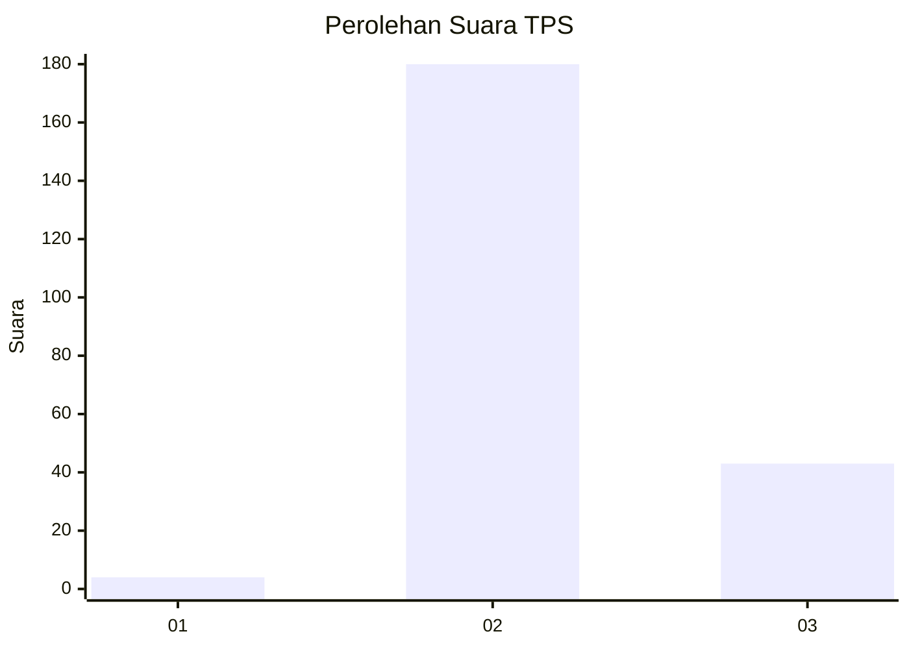
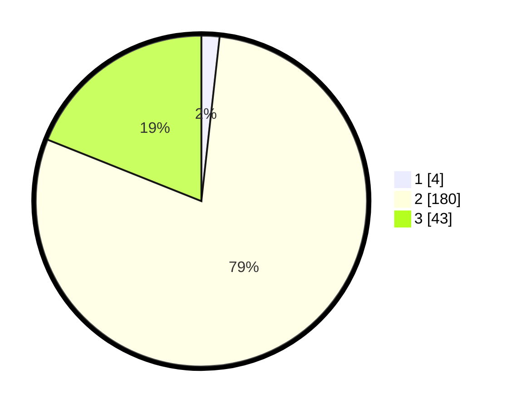

# Hasil

## Grafik

## Tabel

| No. | Nama Paslon    | Suara | Suara (raw) | Persentase |
|:--- |:-------------- | -----:| -----------:| ----------:|
| 1   | ANIES MUHAIMIN | 4     | [4][p-1]    | 1,76       |
| 2   | PRABOWO GIBRAN | 180   | [180][p-2]  | 79,30      |
| 3   | GANJAR MAHFUD  | 43    | [43][p-3]   | 18,94      |

[p-1]: https://github.com/gigit-pemilu/pemilu-2024-51-bali/blob/main/pilpres/hitung-suara/sub/51-bali/sub/08-buleleng/sub/07-sawan/sub/2004-bebetin/sub/014-tps/sub/paslon-1.txt
[p-2]: https://github.com/gigit-pemilu/pemilu-2024-51-bali/blob/main/pilpres/hitung-suara/sub/51-bali/sub/08-buleleng/sub/07-sawan/sub/2004-bebetin/sub/014-tps/sub/paslon-2.txt
[p-3]: https://github.com/gigit-pemilu/pemilu-2024-51-bali/blob/main/pilpres/hitung-suara/sub/51-bali/sub/08-buleleng/sub/07-sawan/sub/2004-bebetin/sub/014-tps/sub/paslon-3.txt

## Foto C Plano

https://sirekap-obj-formc.kpu.go.id/4a74/pemilu/ppwp/51/08/07/20/04/5108072004014-20240214-190639--40d98de6-94ec-4cca-b981-ed136d650ef0.jpg

https://sirekap-obj-formc.kpu.go.id/4a74/pemilu/ppwp/51/08/07/20/04/5108072004014-20240214-190646--290dde70-1177-44ba-b530-b818c7b3d975.jpg

https://sirekap-obj-formc.kpu.go.id/4a74/pemilu/ppwp/51/08/07/20/04/5108072004014-20240214-190651--02f9e271-a1e2-48e5-8a6f-bc61eb4c65d8.jpg

## Metadata

| Key        | Value               |
| ---------- | ------------------- |
| Time Stamp | 2024-02-24 22:31:28 |

