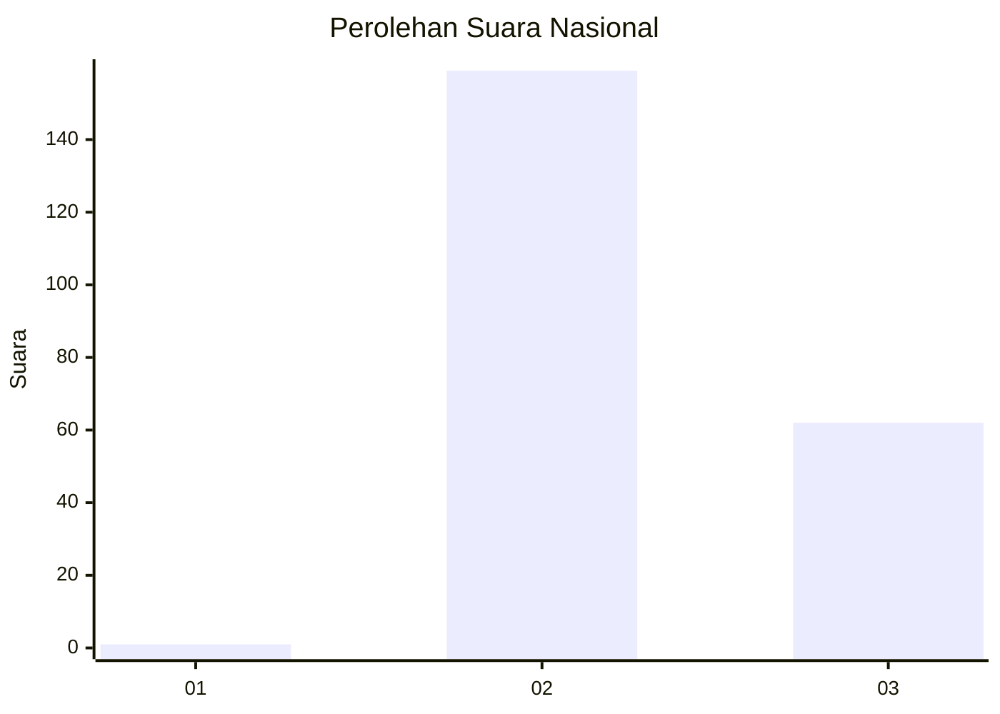
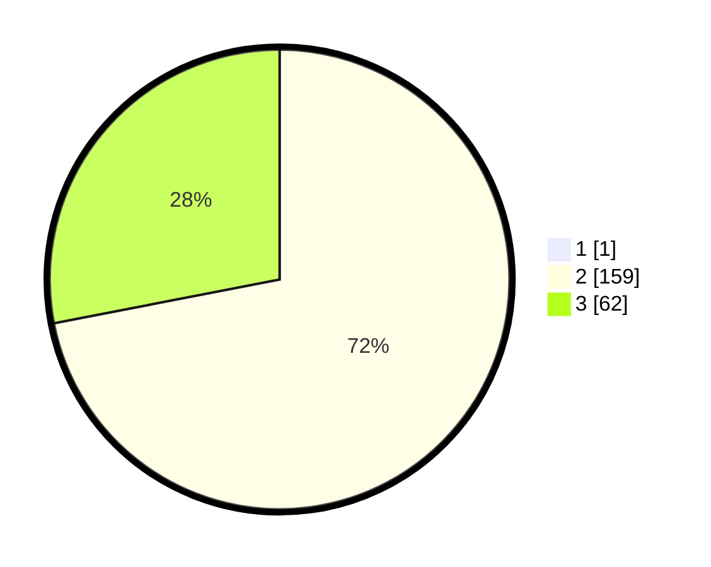

# Hasil

## Grafik

## Tabel

| No. | Nama Paslon    | Suara | Suara (raw) | Persentase |
|:--- |:-------------- | -----:| -----------:| ----------:|
| 1   | ANIES MUHAIMIN | 1     | [1][p-1]    | 0,45       |
| 2   | PRABOWO GIBRAN | 159   | [159][p-2]  | 71,62      |
| 3   | GANJAR MAHFUD  | 62    | [62][p-3]   | 27,93      |

[p-1]: https://github.com/gigit-pemilu/pemilu-2024/blob/main/pilpres/hitung-suara/sub/51-bali/sub/08-buleleng/sub/07-sawan/sub/2004-bebetin/sub/016-tps/sub/paslon-1.txt
[p-2]: https://github.com/gigit-pemilu/pemilu-2024/blob/main/pilpres/hitung-suara/sub/51-bali/sub/08-buleleng/sub/07-sawan/sub/2004-bebetin/sub/016-tps/sub/paslon-2.txt
[p-3]: https://github.com/gigit-pemilu/pemilu-2024/blob/main/pilpres/hitung-suara/sub/51-bali/sub/08-buleleng/sub/07-sawan/sub/2004-bebetin/sub/016-tps/sub/paslon-3.txt

## Foto C Plano

https://sirekap-obj-formc.kpu.go.id/e031/pemilu/ppwp/51/08/07/20/04/5108072004016-20240214-205106--ce8d2cbe-a23c-4bd9-ab20-62b9606e24fa.jpg

https://sirekap-obj-formc.kpu.go.id/e031/pemilu/ppwp/51/08/07/20/04/5108072004016-20240214-195921--f8c41108-c0bb-4754-b67d-380cf82ea8f5.jpg

https://sirekap-obj-formc.kpu.go.id/e031/pemilu/ppwp/51/08/07/20/04/5108072004016-20240214-200021--3e0f68df-9c57-4b87-b3c6-795b59cb2f44.jpg

## Metadata

| Key        | Value               |
| ---------- | ------------------- |
| Time Stamp | 2024-02-15 20:30:46 |

