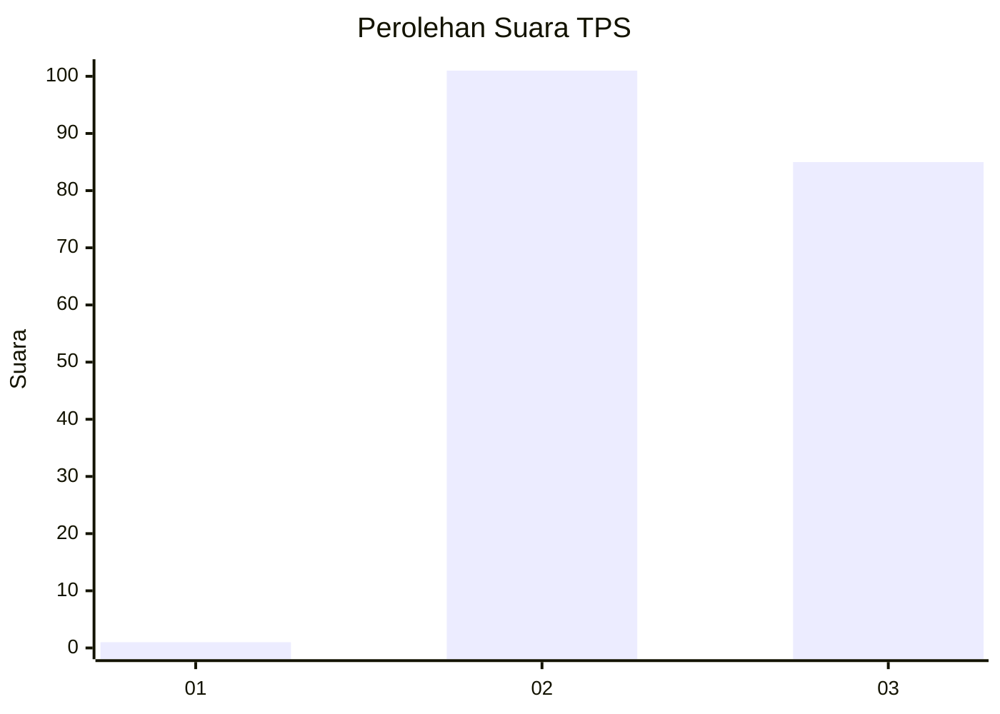
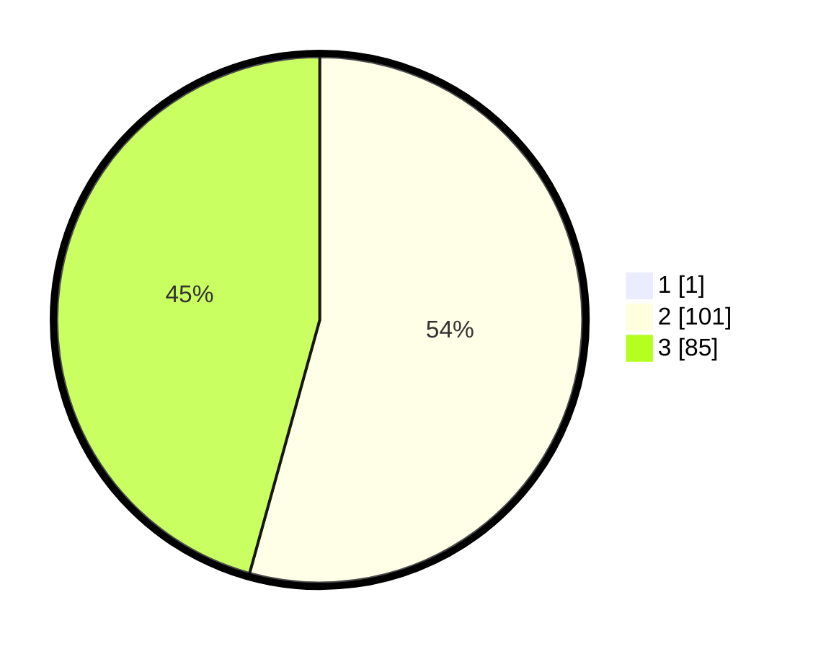

# Hasil

## Grafik

## Tabel

| No. | Nama Paslon    | Suara | Suara (raw) | Persentase |
|:--- |:-------------- | -----:| -----------:| ----------:|
| 1   | ANIES MUHAIMIN | 1     | [1][p-1]    | 0,53       |
| 2   | PRABOWO GIBRAN | 101   | [101][p-2]  | 54,01      |
| 3   | GANJAR MAHFUD  | 85    | [85][p-3]   | 45,45      |

[p-1]: https://github.com/gigit-pemilu/pemilu-2024-51-bali/blob/main/pilpres/hitung-suara/sub/51-bali/sub/08-buleleng/sub/07-sawan/sub/2005-sudaji/sub/001-tps/sub/paslon-1.txt
[p-2]: https://github.com/gigit-pemilu/pemilu-2024-51-bali/blob/main/pilpres/hitung-suara/sub/51-bali/sub/08-buleleng/sub/07-sawan/sub/2005-sudaji/sub/001-tps/sub/paslon-2.txt
[p-3]: https://github.com/gigit-pemilu/pemilu-2024-51-bali/blob/main/pilpres/hitung-suara/sub/51-bali/sub/08-buleleng/sub/07-sawan/sub/2005-sudaji/sub/001-tps/sub/paslon-3.txt

## Foto C Plano

https://sirekap-obj-formc.kpu.go.id/3bc8/pemilu/ppwp/51/08/07/20/05/5108072005001-20240214-213735--e35ab2d6-2b5d-4cda-86a9-a3d7b05e83a8.jpg

https://sirekap-obj-formc.kpu.go.id/3bc8/pemilu/ppwp/51/08/07/20/05/5108072005001-20240214-213839--49b5a2f2-4dd8-4ae1-9147-92a5bddb650c.jpg

https://sirekap-obj-formc.kpu.go.id/3bc8/pemilu/ppwp/51/08/07/20/05/5108072005001-20240214-213931--e8027d8c-267d-4e9b-9ce6-3c5d055560d7.jpg

## Metadata

| Key        | Value               |
| ---------- | ------------------- |
| Time Stamp | 2024-02-24 22:31:28 |

