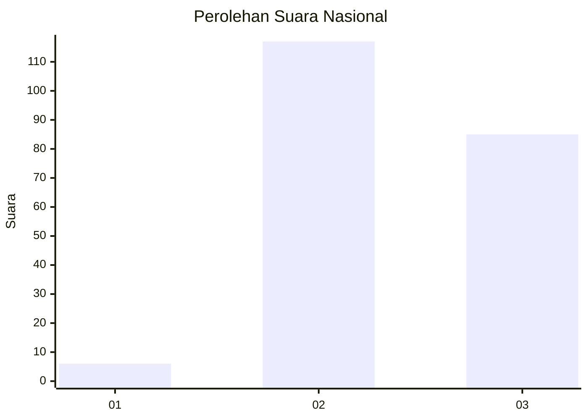
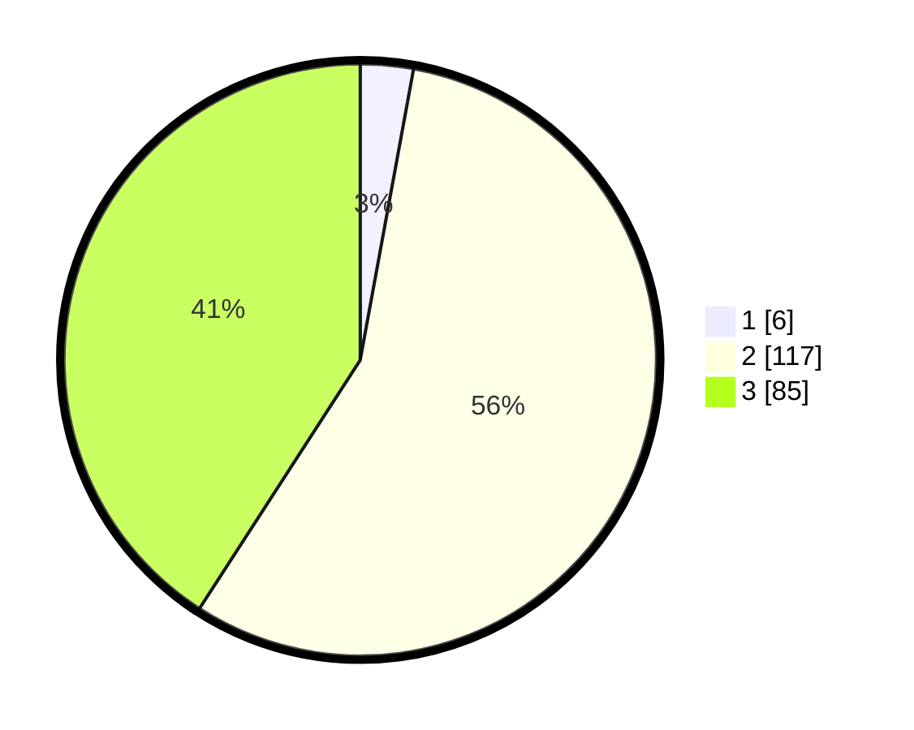

# Hasil

## Grafik

## Tabel

| No. | Nama Paslon    | Suara | Suara (raw) | Persentase |
|:--- |:-------------- | -----:| -----------:| ----------:|
| 1   | ANIES MUHAIMIN | 6     | [6][p-1]    | 2,88       |
| 2   | PRABOWO GIBRAN | 117   | [117][p-2]  | 56,25      |
| 3   | GANJAR MAHFUD  | 85    | [85][p-3]   | 40,87      |

[p-1]: https://github.com/gigit-pemilu/pemilu-2024/blob/main/pilpres/hitung-suara/sub/51-bali/sub/08-buleleng/sub/07-sawan/sub/2005-sudaji/sub/002-tps/sub/paslon-1.txt
[p-2]: https://github.com/gigit-pemilu/pemilu-2024/blob/main/pilpres/hitung-suara/sub/51-bali/sub/08-buleleng/sub/07-sawan/sub/2005-sudaji/sub/002-tps/sub/paslon-2.txt
[p-3]: https://github.com/gigit-pemilu/pemilu-2024/blob/main/pilpres/hitung-suara/sub/51-bali/sub/08-buleleng/sub/07-sawan/sub/2005-sudaji/sub/002-tps/sub/paslon-3.txt

## Foto C Plano

https://sirekap-obj-formc.kpu.go.id/d82e/pemilu/ppwp/51/08/07/20/05/5108072005002-20240214-222854--ce0ca41f-1b38-49d7-98b2-ab5dab8b06ef.jpg

https://sirekap-obj-formc.kpu.go.id/d82e/pemilu/ppwp/51/08/07/20/05/5108072005002-20240214-223043--7807449a-feed-4b79-bb0e-1860673022e1.jpg

https://sirekap-obj-formc.kpu.go.id/d82e/pemilu/ppwp/51/08/07/20/05/5108072005002-20240214-223226--111783d1-602f-41ae-8215-717d73a2ca9e.jpg

## Metadata

| Key        | Value               |
| ---------- | ------------------- |
| Time Stamp | 2024-02-24 22:31:28 |

