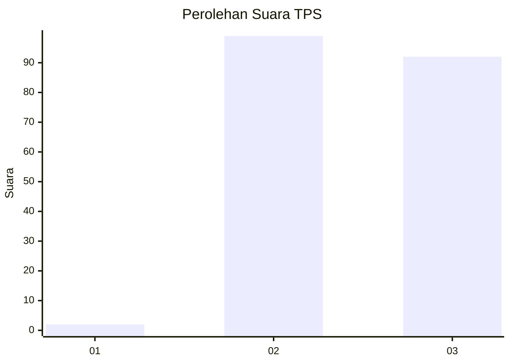
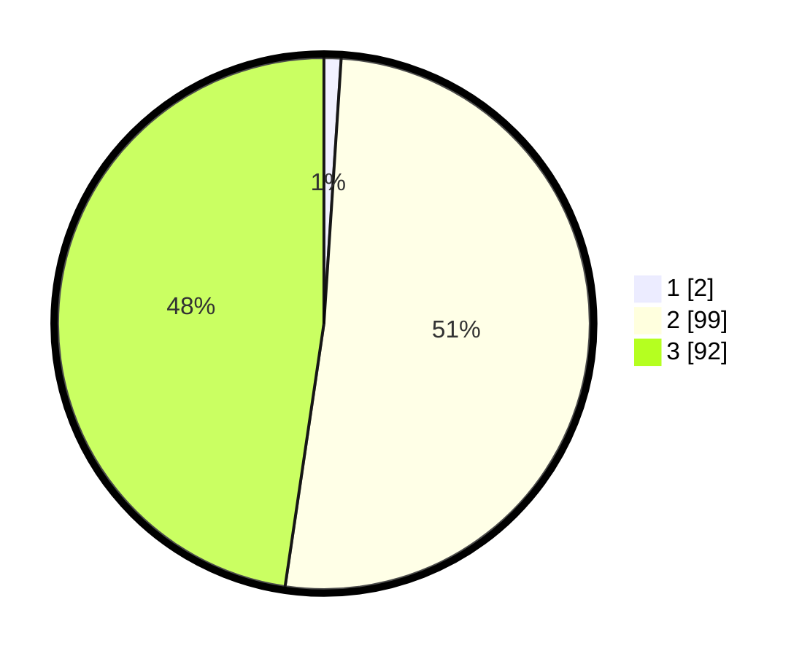

# Hasil

## Grafik

## Tabel

| No. | Nama Paslon    | Suara | Suara (raw) | Persentase |
|:--- |:-------------- | -----:| -----------:| ----------:|
| 1   | ANIES MUHAIMIN | 2     | [2][p-1]    | 1,04       |
| 2   | PRABOWO GIBRAN | 99    | [99][p-2]   | 51,30      |
| 3   | GANJAR MAHFUD  | 92    | [92][p-3]   | 47,67      |

[p-1]: https://github.com/gigit-pemilu/pemilu-2024-51-bali/blob/main/pilpres/hitung-suara/sub/51-bali/sub/08-buleleng/sub/07-sawan/sub/2005-sudaji/sub/006-tps/sub/paslon-1.txt
[p-2]: https://github.com/gigit-pemilu/pemilu-2024-51-bali/blob/main/pilpres/hitung-suara/sub/51-bali/sub/08-buleleng/sub/07-sawan/sub/2005-sudaji/sub/006-tps/sub/paslon-2.txt
[p-3]: https://github.com/gigit-pemilu/pemilu-2024-51-bali/blob/main/pilpres/hitung-suara/sub/51-bali/sub/08-buleleng/sub/07-sawan/sub/2005-sudaji/sub/006-tps/sub/paslon-3.txt

## Foto C Plano

https://sirekap-obj-formc.kpu.go.id/dbf5/pemilu/ppwp/51/08/07/20/05/5108072005006-20240214-222144--bd646973-e78e-4f38-9ad7-5f3c7f9f7f0a.jpg

https://sirekap-obj-formc.kpu.go.id/dbf5/pemilu/ppwp/51/08/07/20/05/5108072005006-20240214-195404--ed042928-093a-424c-add8-8baeb441f90e.jpg

https://sirekap-obj-formc.kpu.go.id/dbf5/pemilu/ppwp/51/08/07/20/05/5108072005006-20240214-195504--fc9d9b40-fd0e-4094-a542-1e092c04ee5b.jpg

## Metadata

| Key        | Value               |
| ---------- | ------------------- |
| Time Stamp | 2024-02-24 22:31:28 |

