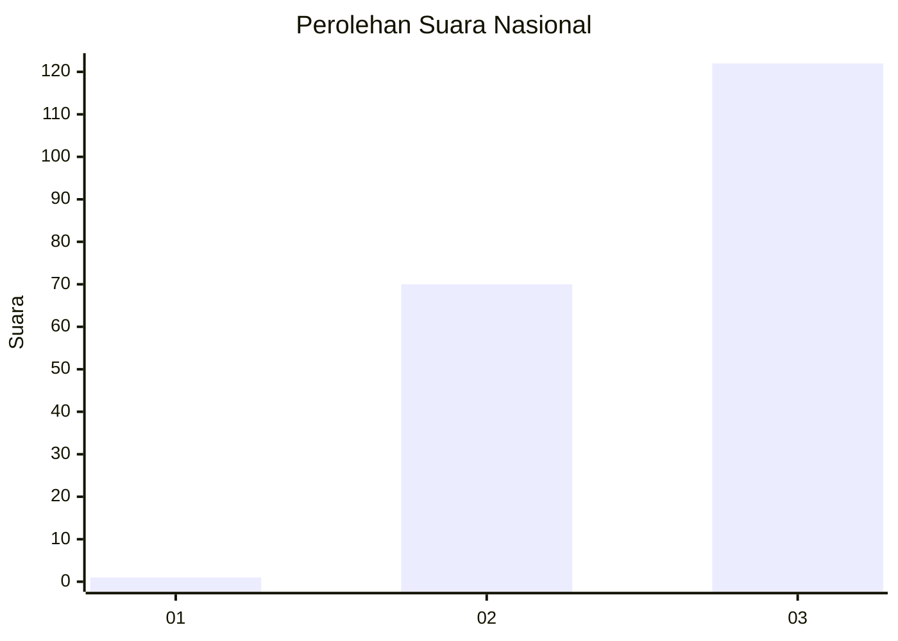
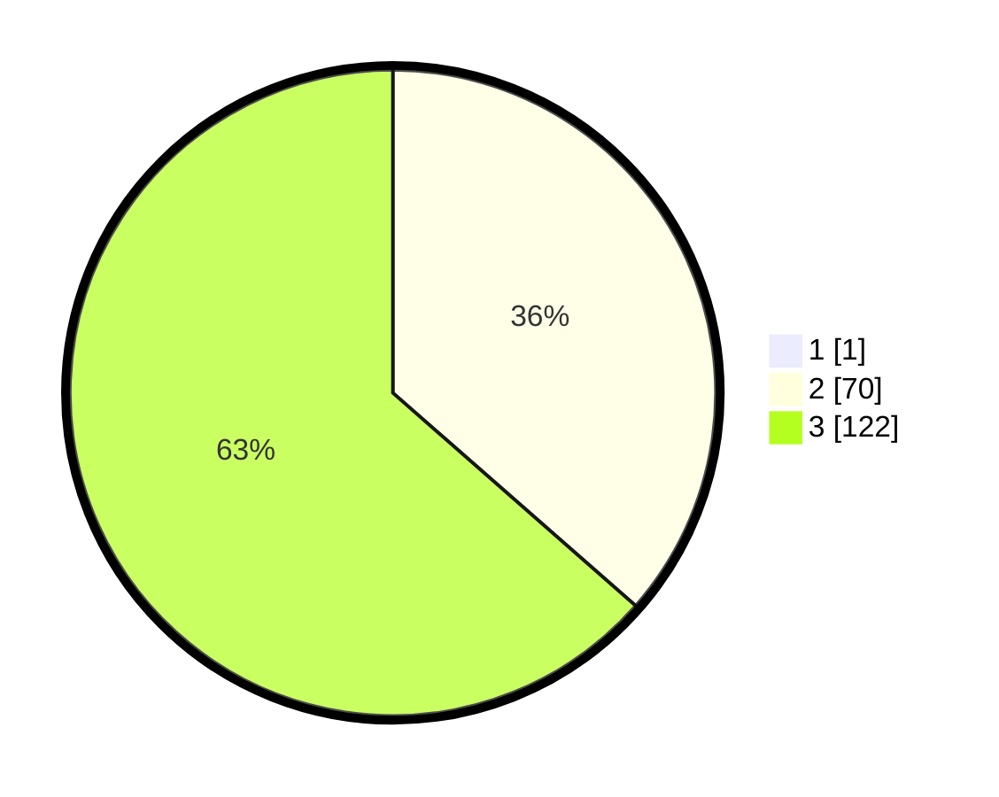

# Hasil

## Grafik

## Tabel

| No. | Nama Paslon    | Suara | Suara (raw) | Persentase |
|:--- |:-------------- | -----:| -----------:| ----------:|
| 1   | ANIES MUHAIMIN | 1     | [1][p-1]    | 0,52       |
| 2   | PRABOWO GIBRAN | 70    | [70][p-2]   | 36,27      |
| 3   | GANJAR MAHFUD  | 122   | [122][p-3]  | 63,21      |

[p-1]: https://github.com/gigit-pemilu/pemilu-2024/blob/main/pilpres/hitung-suara/sub/51-bali/sub/08-buleleng/sub/07-sawan/sub/2005-sudaji/sub/008-tps/sub/paslon-1.txt
[p-2]: https://github.com/gigit-pemilu/pemilu-2024/blob/main/pilpres/hitung-suara/sub/51-bali/sub/08-buleleng/sub/07-sawan/sub/2005-sudaji/sub/008-tps/sub/paslon-2.txt
[p-3]: https://github.com/gigit-pemilu/pemilu-2024/blob/main/pilpres/hitung-suara/sub/51-bali/sub/08-buleleng/sub/07-sawan/sub/2005-sudaji/sub/008-tps/sub/paslon-3.txt

## Foto C Plano

https://sirekap-obj-formc.kpu.go.id/28e3/pemilu/ppwp/51/08/07/20/05/5108072005008-20240214-213937--1c6d963d-6eaf-48d9-85c6-961f0eab0e41.jpg

https://sirekap-obj-formc.kpu.go.id/28e3/pemilu/ppwp/51/08/07/20/05/5108072005008-20240214-214005--4c08c995-6e37-4b03-bf9f-614b607140d4.jpg

https://sirekap-obj-formc.kpu.go.id/28e3/pemilu/ppwp/51/08/07/20/05/5108072005008-20240214-214105--57170a19-d90a-439a-ac7d-b00d65902101.jpg

## Metadata

| Key        | Value               |
| ---------- | ------------------- |
| Time Stamp | 2024-02-25 15:00:00 |

