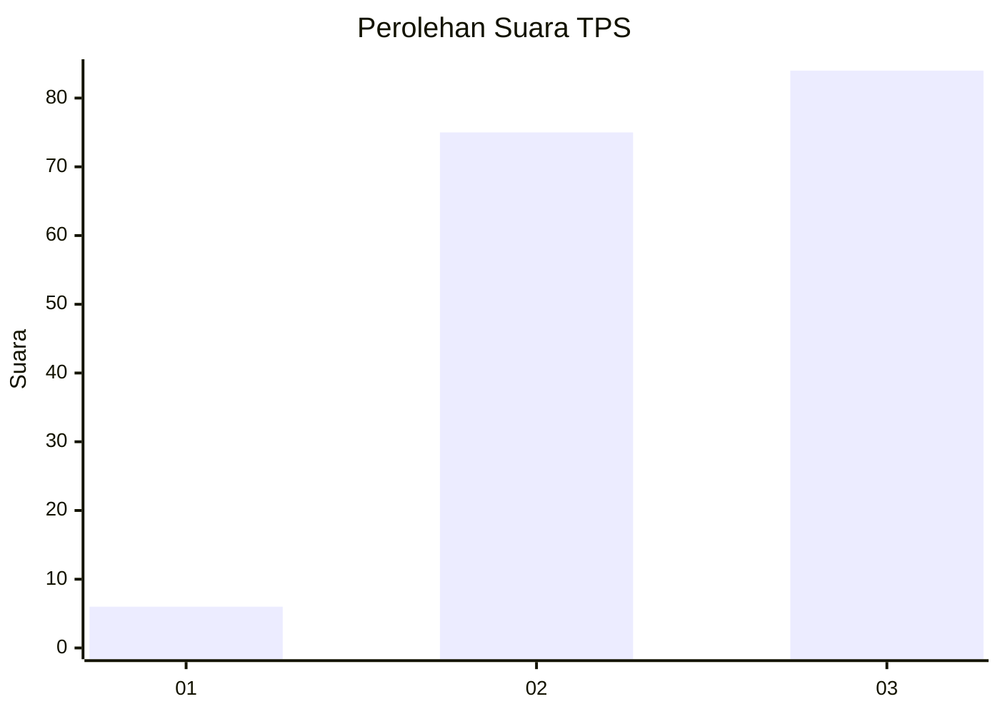
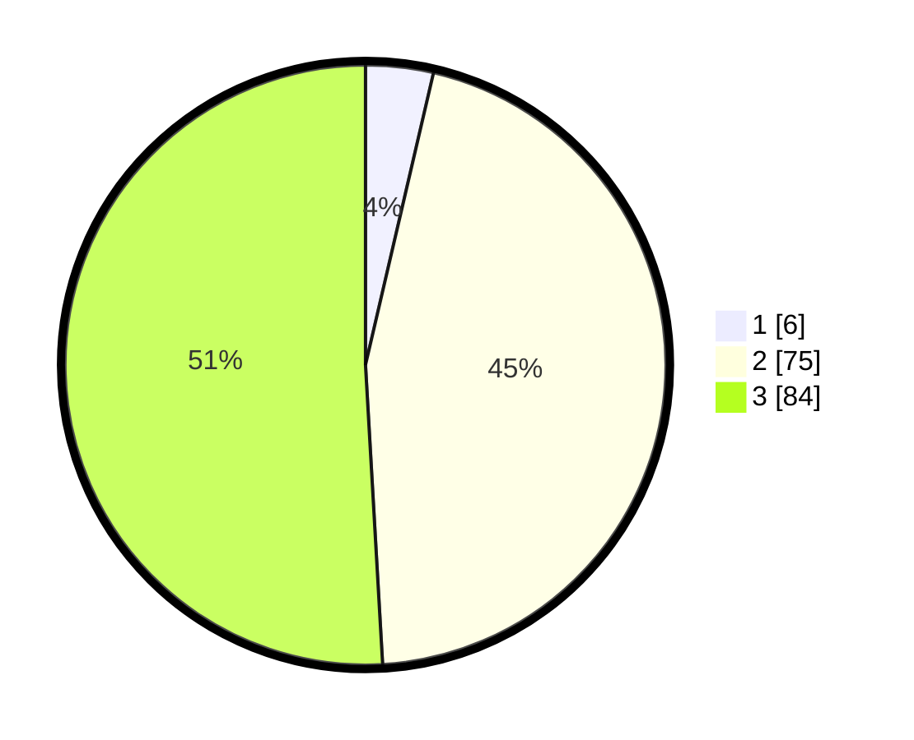

# Hasil

## Grafik

## Tabel

| No. | Nama Paslon    | Suara | Suara (raw) | Persentase |
|:--- |:-------------- | -----:| -----------:| ----------:|
| 1   | ANIES MUHAIMIN | 6     | [6][p-1]    | 3,64       |
| 2   | PRABOWO GIBRAN | 75    | [75][p-2]   | 45,45      |
| 3   | GANJAR MAHFUD  | 84    | [84][p-3]   | 50,91      |

[p-1]: https://github.com/gigit-pemilu/pemilu-2024-51-bali/blob/main/pilpres/hitung-suara/sub/51-bali/sub/08-buleleng/sub/07-sawan/sub/2005-sudaji/sub/009-tps/sub/paslon-1.txt
[p-2]: https://github.com/gigit-pemilu/pemilu-2024-51-bali/blob/main/pilpres/hitung-suara/sub/51-bali/sub/08-buleleng/sub/07-sawan/sub/2005-sudaji/sub/009-tps/sub/paslon-2.txt
[p-3]: https://github.com/gigit-pemilu/pemilu-2024-51-bali/blob/main/pilpres/hitung-suara/sub/51-bali/sub/08-buleleng/sub/07-sawan/sub/2005-sudaji/sub/009-tps/sub/paslon-3.txt

## Foto C Plano

https://sirekap-obj-formc.kpu.go.id/f479/pemilu/ppwp/51/08/07/20/05/5108072005009-20240214-225305--f83d9486-e5bd-4cb7-9e22-fd9b98c59552.jpg

https://sirekap-obj-formc.kpu.go.id/f479/pemilu/ppwp/51/08/07/20/05/5108072005009-20240214-225606--6fe379a2-ed18-4c6f-bbe9-e0abdcf21b95.jpg

https://sirekap-obj-formc.kpu.go.id/f479/pemilu/ppwp/51/08/07/20/05/5108072005009-20240214-230001--e10a4b30-76a9-4fd4-a749-1b5561164de3.jpg

## Metadata

| Key        | Value               |
| ---------- | ------------------- |
| Time Stamp | 2024-02-24 22:31:28 |

