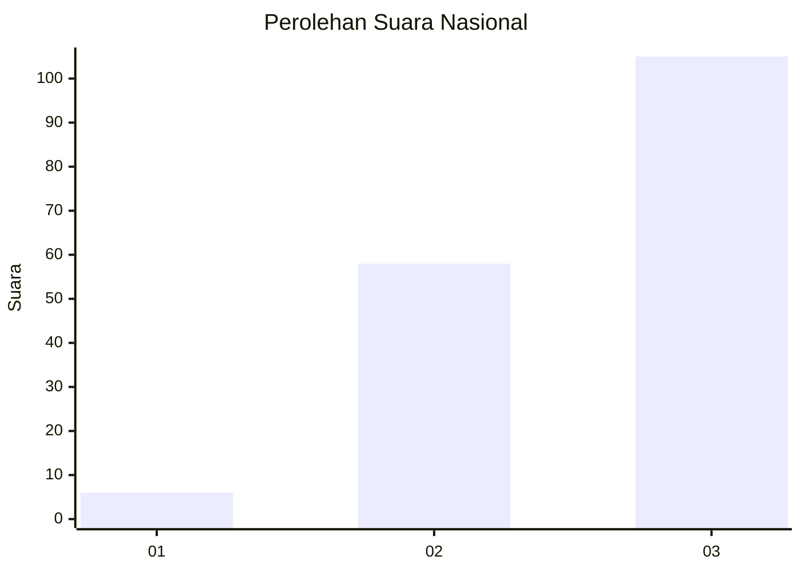
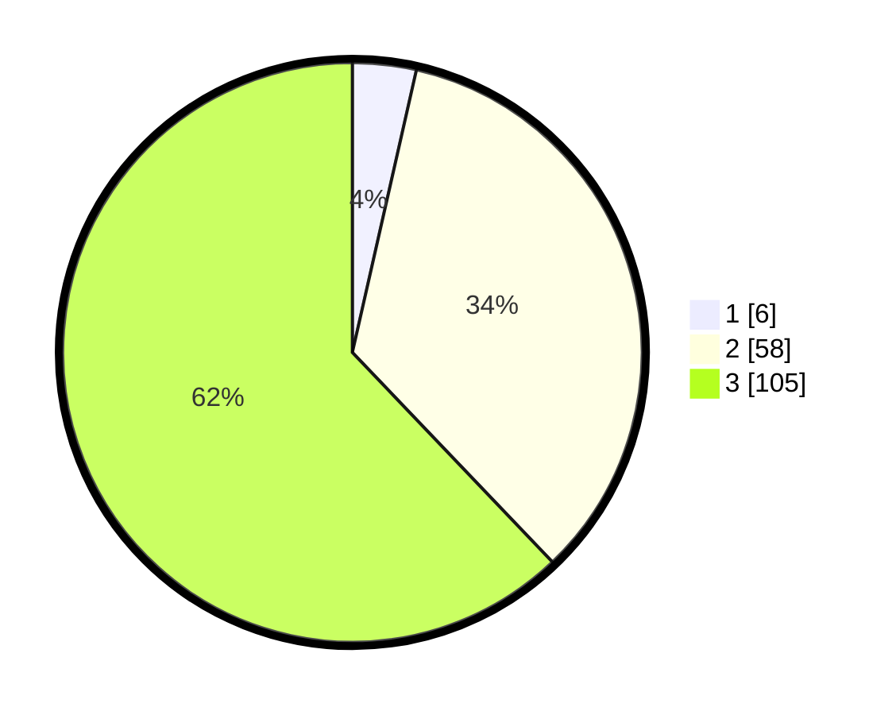

# Hasil

## Grafik

## Tabel

| No. | Nama Paslon    | Suara | Suara (raw) | Persentase |
|:--- |:-------------- | -----:| -----------:| ----------:|
| 1   | ANIES MUHAIMIN | 6     | [6][p-1]    | 3,55       |
| 2   | PRABOWO GIBRAN | 58    | [58][p-2]   | 34,32      |
| 3   | GANJAR MAHFUD  | 105   | [105][p-3]  | 62,13      |

[p-1]: https://github.com/gigit-pemilu/pemilu-2024/blob/main/pilpres/hitung-suara/sub/51-bali/sub/08-buleleng/sub/07-sawan/sub/2005-sudaji/sub/012-tps/sub/paslon-1.txt
[p-2]: https://github.com/gigit-pemilu/pemilu-2024/blob/main/pilpres/hitung-suara/sub/51-bali/sub/08-buleleng/sub/07-sawan/sub/2005-sudaji/sub/012-tps/sub/paslon-2.txt
[p-3]: https://github.com/gigit-pemilu/pemilu-2024/blob/main/pilpres/hitung-suara/sub/51-bali/sub/08-buleleng/sub/07-sawan/sub/2005-sudaji/sub/012-tps/sub/paslon-3.txt

## Foto C Plano

https://sirekap-obj-formc.kpu.go.id/46c2/pemilu/ppwp/51/08/07/20/05/5108072005012-20240215-000047--c43db402-848d-4210-badc-1f2077ee4f4a.jpg

https://sirekap-obj-formc.kpu.go.id/46c2/pemilu/ppwp/51/08/07/20/05/5108072005012-20240215-000849--8ede4950-29c5-4bb2-9a07-2477cb208ed9.jpg

https://sirekap-obj-formc.kpu.go.id/46c2/pemilu/ppwp/51/08/07/20/05/5108072005012-20240215-001557--8145b500-24b9-44a0-8051-a2eda9df6ce0.jpg

## Metadata

| Key        | Value               |
| ---------- | ------------------- |
| Time Stamp | 2024-02-24 22:31:28 |

