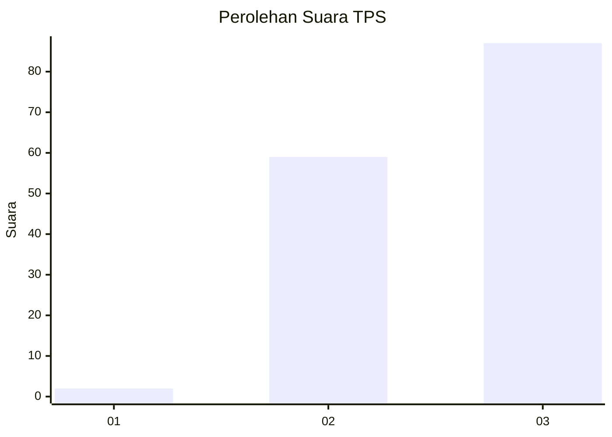
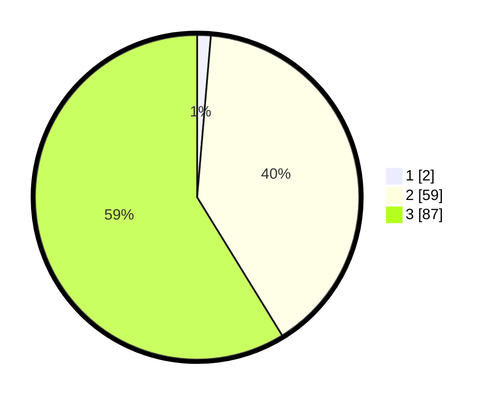

# Hasil

## Grafik

## Tabel

| No. | Nama Paslon    | Suara | Suara (raw) | Persentase |
|:--- |:-------------- | -----:| -----------:| ----------:|
| 1   | ANIES MUHAIMIN | 2     | [2][p-1]    | 1,35       |
| 2   | PRABOWO GIBRAN | 59    | [59][p-2]   | 39,86      |
| 3   | GANJAR MAHFUD  | 87    | [87][p-3]   | 58,78      |

[p-1]: https://github.com/gigit-pemilu/pemilu-2024-51-bali/blob/main/pilpres/hitung-suara/sub/51-bali/sub/08-buleleng/sub/07-sawan/sub/2005-sudaji/sub/013-tps/sub/paslon-1.txt
[p-2]: https://github.com/gigit-pemilu/pemilu-2024-51-bali/blob/main/pilpres/hitung-suara/sub/51-bali/sub/08-buleleng/sub/07-sawan/sub/2005-sudaji/sub/013-tps/sub/paslon-2.txt
[p-3]: https://github.com/gigit-pemilu/pemilu-2024-51-bali/blob/main/pilpres/hitung-suara/sub/51-bali/sub/08-buleleng/sub/07-sawan/sub/2005-sudaji/sub/013-tps/sub/paslon-3.txt

## Foto C Plano

https://sirekap-obj-formc.kpu.go.id/c46c/pemilu/ppwp/51/08/07/20/05/5108072005013-20240215-010525--610666d2-25fa-42e0-bd99-20ce6dc5b8a0.jpg

https://sirekap-obj-formc.kpu.go.id/c46c/pemilu/ppwp/51/08/07/20/05/5108072005013-20240215-010613--ef1bb350-7e3e-4195-ba1c-4e3b95bd2997.jpg

https://sirekap-obj-formc.kpu.go.id/c46c/pemilu/ppwp/51/08/07/20/05/5108072005013-20240215-010707--ffef1379-f0f9-4c2c-8a6e-828af48f5b64.jpg

## Metadata

| Key        | Value               |
| ---------- | ------------------- |
| Time Stamp | 2024-02-24 22:31:28 |

