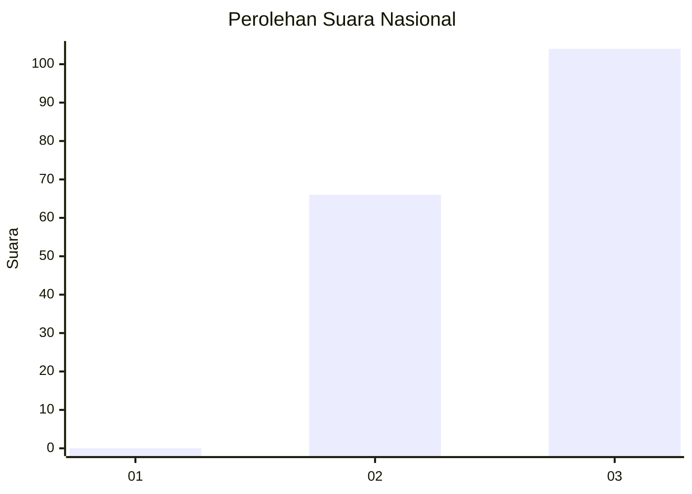
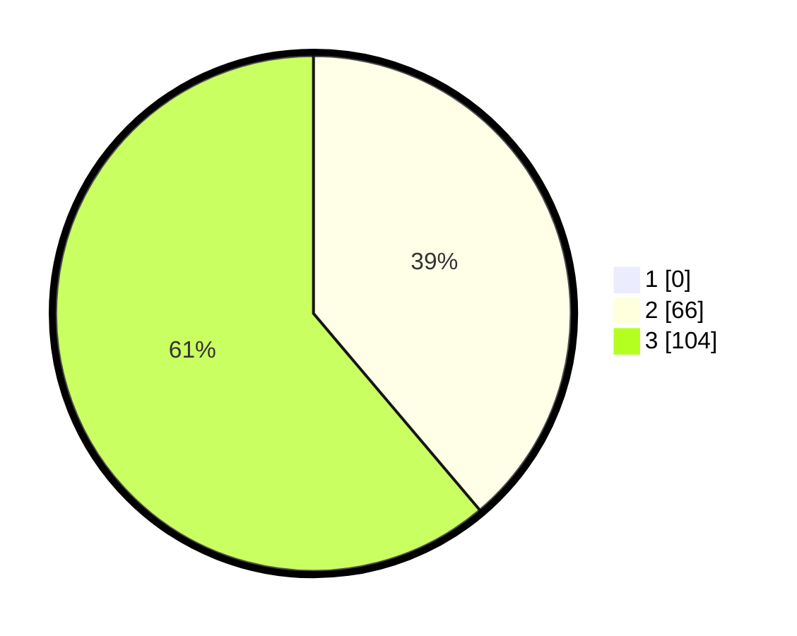

# Hasil

## Grafik

## Tabel

| No. | Nama Paslon    | Suara | Suara (raw) | Persentase |
|:--- |:-------------- | -----:| -----------:| ----------:|
| 1   | ANIES MUHAIMIN | 0     | [0][p-1]    | 0,00       |
| 2   | PRABOWO GIBRAN | 66    | [66][p-2]   | 38,82      |
| 3   | GANJAR MAHFUD  | 104   | [104][p-3]  | 61,18      |

[p-1]: https://github.com/gigit-pemilu/pemilu-2024/blob/main/pilpres/hitung-suara/sub/51-bali/sub/08-buleleng/sub/07-sawan/sub/2005-sudaji/sub/016-tps/sub/paslon-1.txt
[p-2]: https://github.com/gigit-pemilu/pemilu-2024/blob/main/pilpres/hitung-suara/sub/51-bali/sub/08-buleleng/sub/07-sawan/sub/2005-sudaji/sub/016-tps/sub/paslon-2.txt
[p-3]: https://github.com/gigit-pemilu/pemilu-2024/blob/main/pilpres/hitung-suara/sub/51-bali/sub/08-buleleng/sub/07-sawan/sub/2005-sudaji/sub/016-tps/sub/paslon-3.txt

## Foto C Plano

https://sirekap-obj-formc.kpu.go.id/9abb/pemilu/ppwp/51/08/07/20/05/5108072005016-20240215-011413--9aef275d-3301-408b-9ee6-13ec54c9fb44.jpg

https://sirekap-obj-formc.kpu.go.id/9abb/pemilu/ppwp/51/08/07/20/05/5108072005016-20240215-011549--81346ee8-66af-4145-9da5-857b2af475ba.jpg

https://sirekap-obj-formc.kpu.go.id/9abb/pemilu/ppwp/51/08/07/20/05/5108072005016-20240215-011755--8056981a-3d3f-4204-bc57-8d04a54ce5b6.jpg

## Metadata

| Key        | Value               |
| ---------- | ------------------- |
| Time Stamp | 2024-02-25 15:00:00 |

