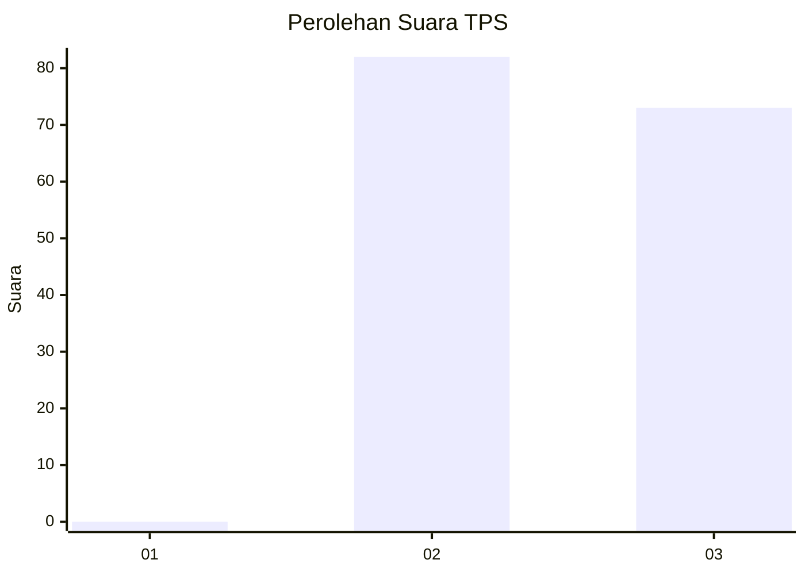
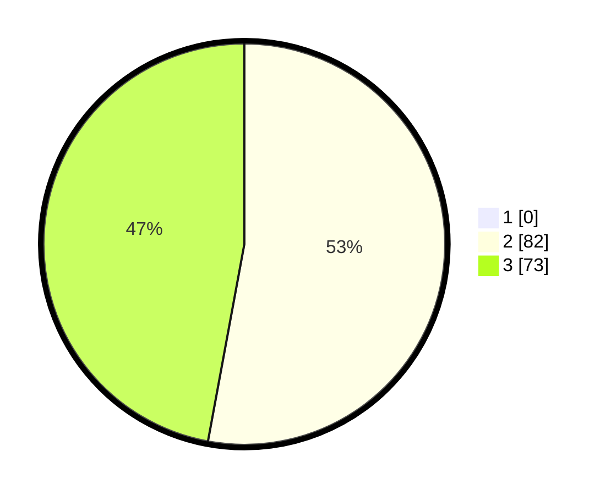

# Hasil

## Grafik

## Tabel

| No. | Nama Paslon    | Suara | Suara (raw) | Persentase |
|:--- |:-------------- | -----:| -----------:| ----------:|
| 1   | ANIES MUHAIMIN | 0     | [0][p-1]    | 0,00       |
| 2   | PRABOWO GIBRAN | 82    | [82][p-2]   | 52,90      |
| 3   | GANJAR MAHFUD  | 73    | [73][p-3]   | 47,10      |

[p-1]: https://github.com/gigit-pemilu/pemilu-2024-51-bali/blob/main/pilpres/hitung-suara/sub/51-bali/sub/08-buleleng/sub/07-sawan/sub/2005-sudaji/sub/017-tps/sub/paslon-1.txt
[p-2]: https://github.com/gigit-pemilu/pemilu-2024-51-bali/blob/main/pilpres/hitung-suara/sub/51-bali/sub/08-buleleng/sub/07-sawan/sub/2005-sudaji/sub/017-tps/sub/paslon-2.txt
[p-3]: https://github.com/gigit-pemilu/pemilu-2024-51-bali/blob/main/pilpres/hitung-suara/sub/51-bali/sub/08-buleleng/sub/07-sawan/sub/2005-sudaji/sub/017-tps/sub/paslon-3.txt

## Foto C Plano

https://sirekap-obj-formc.kpu.go.id/5b46/pemilu/ppwp/51/08/07/20/05/5108072005017-20240214-235650--ce12595f-f042-4c93-8690-ca0595ea83f4.jpg

https://sirekap-obj-formc.kpu.go.id/5b46/pemilu/ppwp/51/08/07/20/05/5108072005017-20240214-235328--37d3afc3-65a9-432a-b088-2de4945de734.jpg

https://sirekap-obj-formc.kpu.go.id/5b46/pemilu/ppwp/51/08/07/20/05/5108072005017-20240215-000512--7e1ee52e-8a7a-4907-b6a3-4eadaa33f2aa.jpg

## Metadata

| Key        | Value               |
| ---------- | ------------------- |
| Time Stamp | 2024-02-24 22:31:28 |

