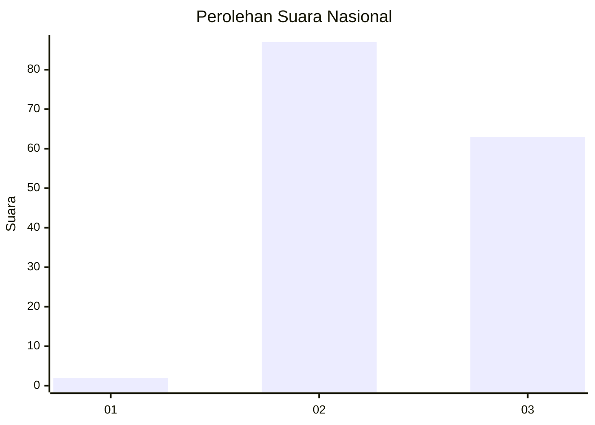
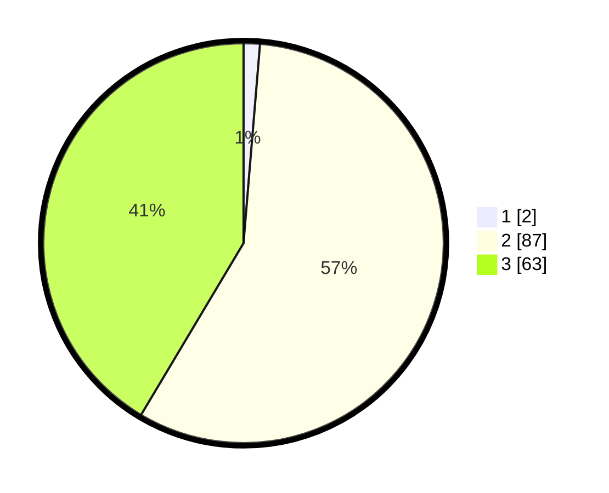

# Hasil

## Grafik

## Tabel

| No. | Nama Paslon    | Suara | Suara (raw) | Persentase |
|:--- |:-------------- | -----:| -----------:| ----------:|
| 1   | ANIES MUHAIMIN | 2     | [2][p-1]    | 1,32       |
| 2   | PRABOWO GIBRAN | 87    | [87][p-2]   | 57,24      |
| 3   | GANJAR MAHFUD  | 63    | [63][p-3]   | 41,45      |

[p-1]: https://github.com/gigit-pemilu/pemilu-2024/blob/main/pilpres/hitung-suara/sub/51-bali/sub/08-buleleng/sub/07-sawan/sub/2005-sudaji/sub/018-tps/sub/paslon-1.txt
[p-2]: https://github.com/gigit-pemilu/pemilu-2024/blob/main/pilpres/hitung-suara/sub/51-bali/sub/08-buleleng/sub/07-sawan/sub/2005-sudaji/sub/018-tps/sub/paslon-2.txt
[p-3]: https://github.com/gigit-pemilu/pemilu-2024/blob/main/pilpres/hitung-suara/sub/51-bali/sub/08-buleleng/sub/07-sawan/sub/2005-sudaji/sub/018-tps/sub/paslon-3.txt

## Foto C Plano

https://sirekap-obj-formc.kpu.go.id/c0dd/pemilu/ppwp/51/08/07/20/05/5108072005018-20240214-234603--58982754-9517-4a4d-afc1-57a782266208.jpg

https://sirekap-obj-formc.kpu.go.id/c0dd/pemilu/ppwp/51/08/07/20/05/5108072005018-20240214-131605--a860dd86-0ee6-4463-aa20-3052646aad5f.jpg

https://sirekap-obj-formc.kpu.go.id/c0dd/pemilu/ppwp/51/08/07/20/05/5108072005018-20240214-131703--17f997b5-bef9-4616-a3ac-d067b277c078.jpg

## Metadata

| Key        | Value               |
| ---------- | ------------------- |
| Time Stamp | 2024-02-24 22:31:28 |

