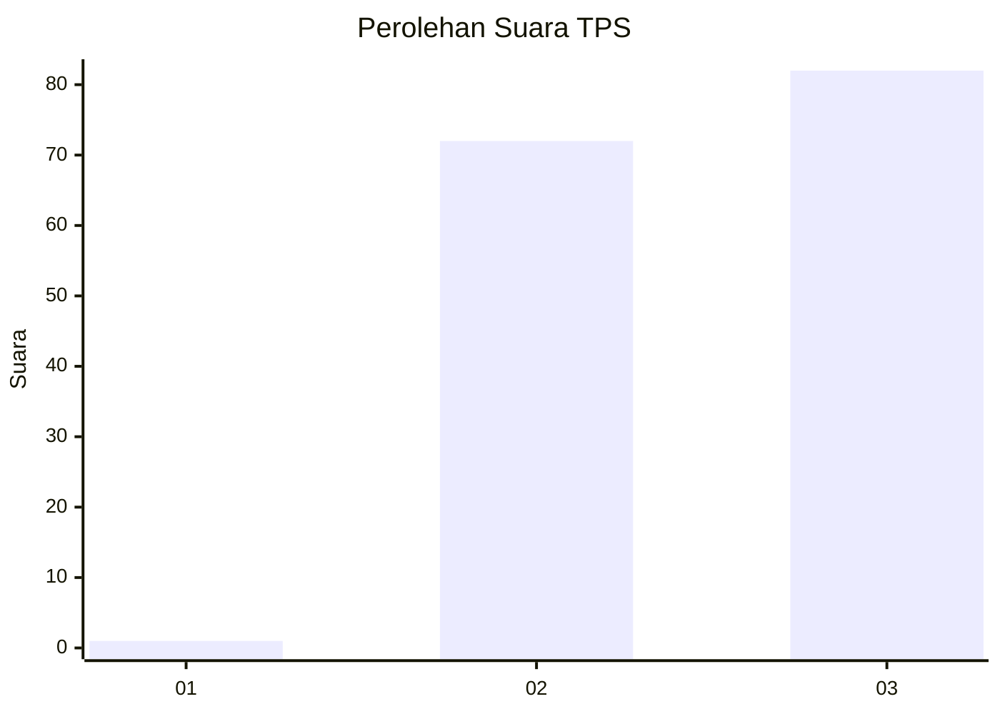
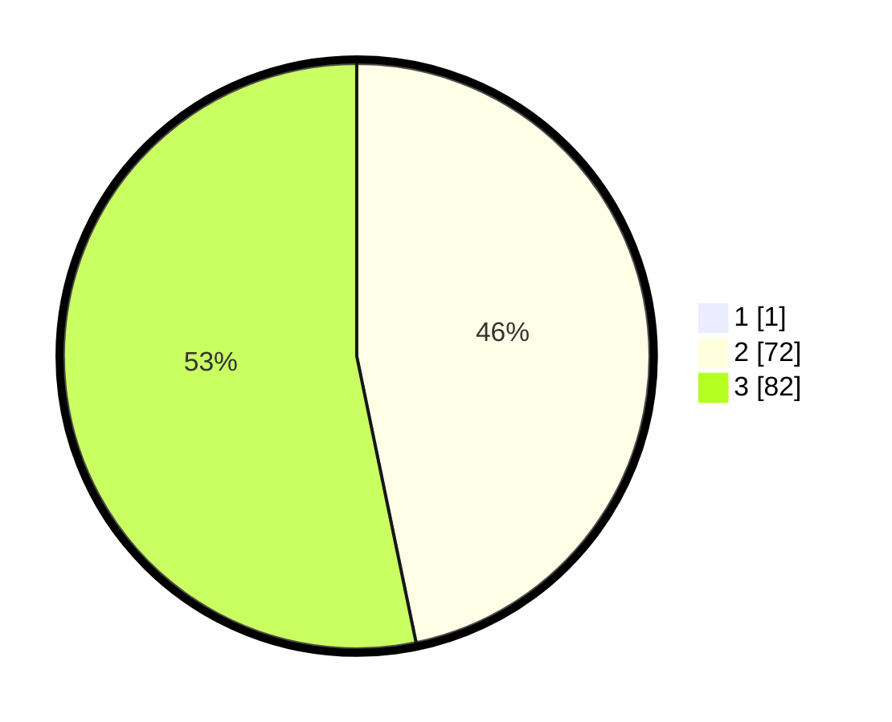

# Hasil

## Grafik

## Tabel

| No. | Nama Paslon    | Suara | Suara (raw) | Persentase |
|:--- |:-------------- | -----:| -----------:| ----------:|
| 1   | ANIES MUHAIMIN | 1     | [1][p-1]    | 0,65       |
| 2   | PRABOWO GIBRAN | 72    | [72][p-2]   | 46,45      |
| 3   | GANJAR MAHFUD  | 82    | [82][p-3]   | 52,90      |

[p-1]: https://github.com/gigit-pemilu/pemilu-2024-51-bali/blob/main/pilpres/hitung-suara/sub/51-bali/sub/08-buleleng/sub/07-sawan/sub/2005-sudaji/sub/019-tps/sub/paslon-1.txt
[p-2]: https://github.com/gigit-pemilu/pemilu-2024-51-bali/blob/main/pilpres/hitung-suara/sub/51-bali/sub/08-buleleng/sub/07-sawan/sub/2005-sudaji/sub/019-tps/sub/paslon-2.txt
[p-3]: https://github.com/gigit-pemilu/pemilu-2024-51-bali/blob/main/pilpres/hitung-suara/sub/51-bali/sub/08-buleleng/sub/07-sawan/sub/2005-sudaji/sub/019-tps/sub/paslon-3.txt

## Foto C Plano

https://sirekap-obj-formc.kpu.go.id/4c2f/pemilu/ppwp/51/08/07/20/05/5108072005019-20240214-231647--a2d2eaf6-790a-46e7-a47f-b643827333b9.jpg

https://sirekap-obj-formc.kpu.go.id/4c2f/pemilu/ppwp/51/08/07/20/05/5108072005019-20240214-231943--8e47ad0f-d505-40dc-b994-7a96e49864a0.jpg

https://sirekap-obj-formc.kpu.go.id/4c2f/pemilu/ppwp/51/08/07/20/05/5108072005019-20240214-232116--c803b5f4-f5dd-4003-adc9-4d54b5bf36ad.jpg

## Metadata

| Key        | Value               |
| ---------- | ------------------- |
| Time Stamp | 2024-02-25 14:00:00 |

