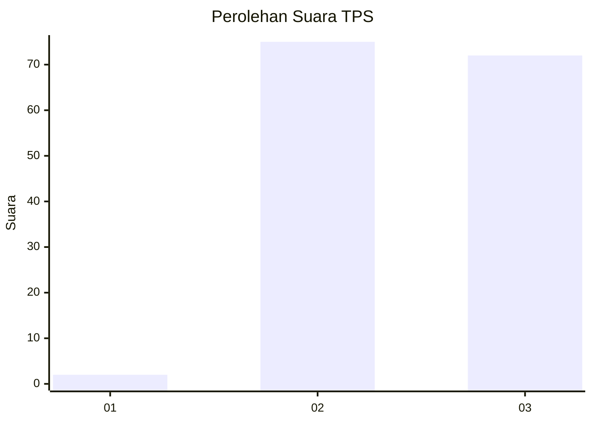
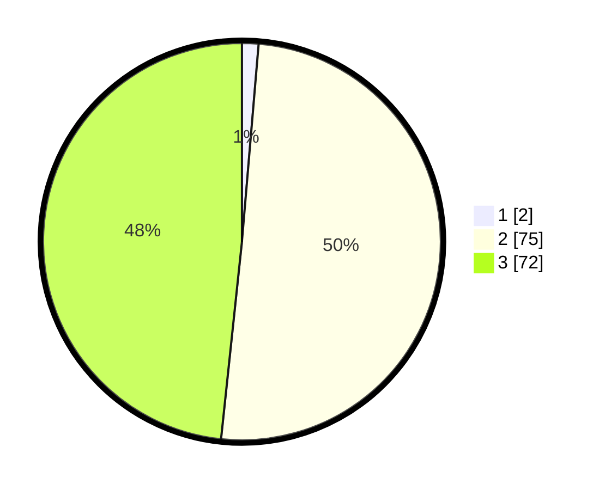

# Hasil

## Grafik

## Tabel

| No. | Nama Paslon    | Suara | Suara (raw) | Persentase |
|:--- |:-------------- | -----:| -----------:| ----------:|
| 1   | ANIES MUHAIMIN | 2     | [2][p-1]    | 1,34       |
| 2   | PRABOWO GIBRAN | 75    | [75][p-2]   | 50,34      |
| 3   | GANJAR MAHFUD  | 72    | [72][p-3]   | 48,32      |

[p-1]: https://github.com/gigit-pemilu/pemilu-2024-51-bali/blob/main/pilpres/hitung-suara/sub/51-bali/sub/08-buleleng/sub/07-sawan/sub/2005-sudaji/sub/020-tps/sub/paslon-1.txt
[p-2]: https://github.com/gigit-pemilu/pemilu-2024-51-bali/blob/main/pilpres/hitung-suara/sub/51-bali/sub/08-buleleng/sub/07-sawan/sub/2005-sudaji/sub/020-tps/sub/paslon-2.txt
[p-3]: https://github.com/gigit-pemilu/pemilu-2024-51-bali/blob/main/pilpres/hitung-suara/sub/51-bali/sub/08-buleleng/sub/07-sawan/sub/2005-sudaji/sub/020-tps/sub/paslon-3.txt

## Foto C Plano

https://sirekap-obj-formc.kpu.go.id/deb6/pemilu/ppwp/51/08/07/20/05/5108072005020-20240214-223815--7da54a3c-23a9-4f6e-a895-dd6bb69aaa6d.jpg

https://sirekap-obj-formc.kpu.go.id/deb6/pemilu/ppwp/51/08/07/20/05/5108072005020-20240214-205736--7fbc7541-1a04-4fbc-b0c0-bf7697c0e8a3.jpg

https://sirekap-obj-formc.kpu.go.id/deb6/pemilu/ppwp/51/08/07/20/05/5108072005020-20240214-223923--f98ee747-901f-41bd-831e-5a1731737273.jpg

## Metadata

| Key        | Value               |
| ---------- | ------------------- |
| Time Stamp | 2024-02-15 12:00:28 |

